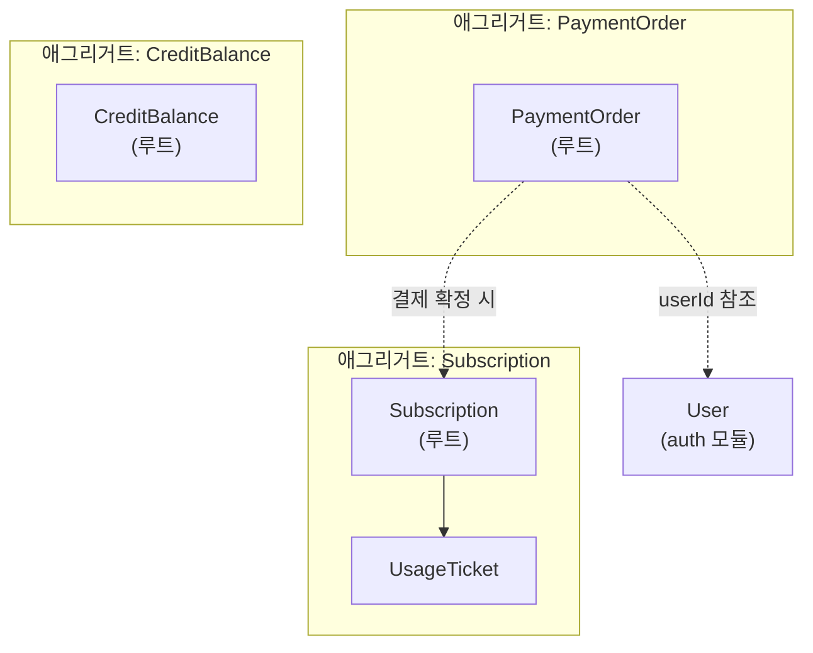
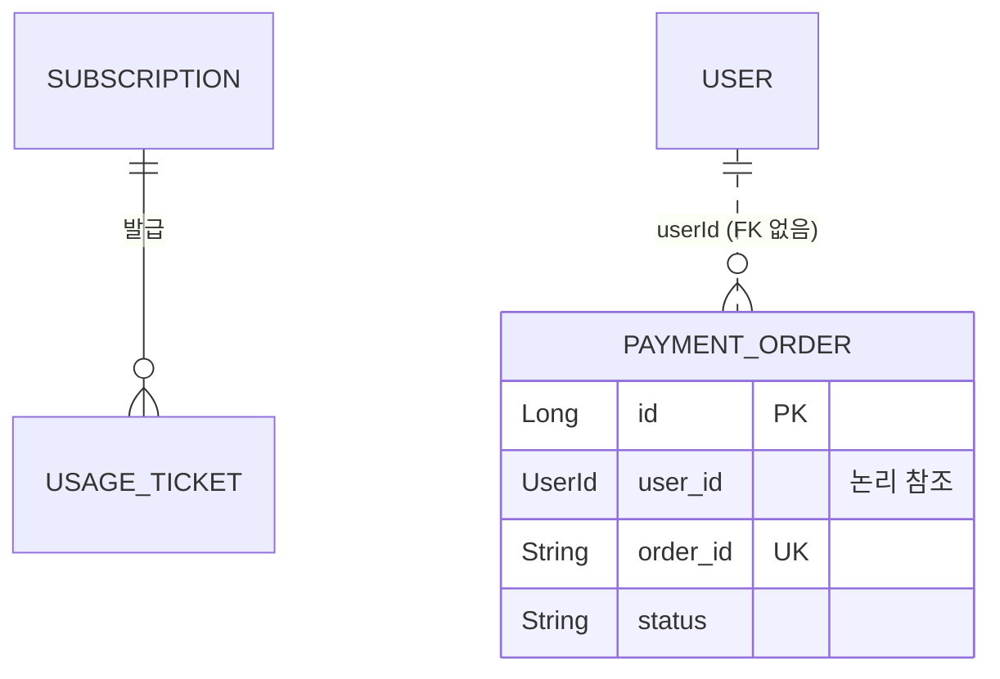
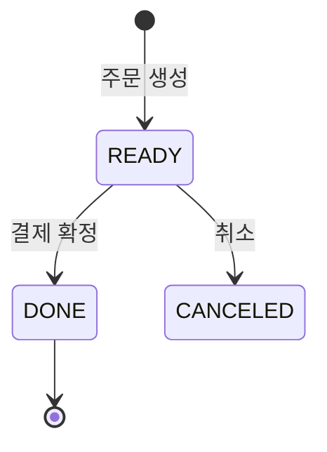
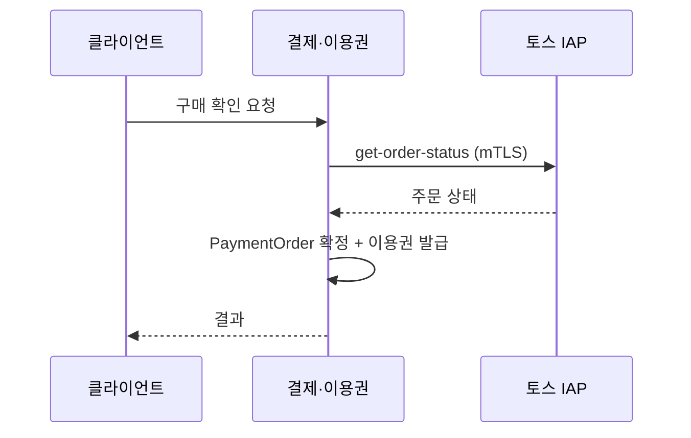

# 도메인 모델 문서 양식 · Mermaid 규약

`backend/docs/model/{module}.md` 의 양식이다. 섹션 번호를 바꾸지 않는다.

---

## Mermaid 작성 규약 (전 섹션 공통)

### 렌더링 안전 규칙

| 규칙 | 이유 |
|---|---|
| 코드펜스는 반드시 ` ```mermaid ` | GitHub·VS Code 가 이걸로 판별한다 |
| `flowchart` 노드 라벨에 한글·`·`·`(` 가 들면 **따옴표로 감싼다** — `A["결제·이용권"]` | 따옴표 없으면 파서가 끊는다 |
| 반대로 `sequenceDiagram` 의 `participant X as 결제·이용권` 은 **따옴표를 쓰지 않는다** | 별칭은 줄 끝까지 자유 문자열이라 따옴표가 그대로 출력된다 |
| `erDiagram` 엔티티명은 **영문 대문자 + 언더스코어** | 하이픈·점은 파싱 실패 |
| 노드 30개를 넘기지 않는다 | 자동 레이아웃이 무너진다. 넘으면 다이어그램을 쪼갠다 |
| 주석은 다이어그램 밖에 쓴다 | Mermaid 주석(`%%`)은 렌더러마다 다르게 처리된다 |

### 관계선 규약 — **이 프로젝트 전용**

이 프로젝트는 **물리 FK 를 쓰지 않는다**. 그래서 선을 두 종류로 나눈다.

| 표기 | 의미 | 언제 |
|---|---|---|
| `\|\|--o{` (실선) | **애그리거트 내부** 관계 — 같은 트랜잭션에서 함께 산다 | 루트와 그 구성 엔티티 |
| `\|\|..o{` (점선) | **애그리거트 경계를 넘는 ID 참조** — 물리 FK 없음, JOIN 하지 않음 | 다른 애그리거트/모듈을 가리킬 때 |

> 점선을 실선으로 잘못 그리면 "JOIN 해도 된다"는 오해를 낳는다. **선 종류가 곧 규칙이다.**

---

## 문서 양식

````markdown
# {표시명} 모듈 도메인 모델

> **근거 커밋** `{7자리 해시}` · **갱신** {YYYY-MM-DD} · **작성** /domain-model
> 요구 [{module}.md](../domain/{module}.md) · 설계 [{module}-design.md](../domain/{module}-design.md)
>
> ⚠️ 수기 문서다. 코드가 바뀌면 자동으로 따라오지 않는다 — 엔티티·경계가 바뀌면
> `/domain-model {module}` 로 갱신한다.

## §1 이 모듈은 무엇을 책임지는가

{2~4줄. 무엇을 지키는 모듈인지. 기능 나열이 아니라 책임 서술.}

- **모듈 타입** `{CLOSED | OPEN}`
- **의존 허용** `{allowedDependencies 원문}`
- **밖에 노출한 것** `{Port·DTO 목록}`

## §2 애그리거트 지도

{경계가 곧 트랜잭션 단위이자 동시성 단위다. 이 그림이 이 문서의 핵심이다.}



| 애그리거트 | 루트 | 구성 | 트랜잭션 경계 근거 |
|---|---|---|---|
| … | … | … | {어느 서비스 메서드가 함께 쓰는지} |

**경계 규칙**
- 경계를 넘는 참조는 **ID 값**이다. 객체 참조·JPA 연관을 만들지 않는다
- 한 트랜잭션은 **애그리거트 하나만** 수정한다. 여러 개가 필요하면 이벤트로 나눈다
- {이 모듈 고유의 규칙}

## §3 엔티티 관계 (ERD)



- 실선 = 애그리거트 내부 / 점선 = 경계 넘는 ID 참조 (물리 FK 없음)
- 컬럼은 **식별자·상태·불변식에 관여하는 것만** 적는다. 전 컬럼 나열 금지 — DDL 이 정본이다
- DDL 정본: `backend/deploy/sql/`

## §4 엔티티 책임

{필드 나열이 아니라 "이 엔티티가 무엇을 지키는가"를 쓴다.}

| 엔티티 | 소속 애그리거트 | 책임 (한 줄) | 불변식 | 상태 |
|---|---|---|---|---|
| `PaymentOrder` | PaymentOrder(루트) | 토스 주문 1건의 생애를 대변한다 | `orderId` 는 전역 유일 · 확정 후 금액 불변 | `status` |
| `RefreshToken` | RefreshToken(루트) | 원문 없이 토큰 유효성의 근거를 남긴다 | 원문 미저장 · 폐기 행을 지우지 않는다(재사용 감지 근거) | `revokedAt` |

**불변식 칸에는 "코드가 실제로 강제하는 것"을 쓴다.** 희망사항이면 🔶 로 §8 에.

## §5 상태 전이

{상태 필드가 있는 엔티티만. 없으면 이 절을 통째로 생략한다.}



| 전이 | 트리거 | 부수효과 |
|---|---|---|
| `READY → DONE` | {어느 API/이벤트} | {이용권 발급 등} |

## §6 다른 모듈과의 상호작용

{핵심 흐름 1~2개만. 전 API 를 그리지 않는다 — 그건 api-spec 몫이다.}



| 상대 | 방향 | 수단 | 왜 이 방식인가 |
|---|---|---|---|
| `auth` | → | 직접 호출(`allowedDependencies`) | {이유} |
| `{x}` | ← | 이벤트 | {이유} |

## §7 이 모듈을 건드릴 때 지켜야 할 것

{코드 리뷰에서 반복해서 지적할 만한 것들. 3~6개.}

- {예: `UsageTicket` 을 `Subscription` 없이 단독 생성하지 않는다}
- {예: `CreditBalance` 갱신은 낙관적 락 재시도 경로를 통한다}

## §8 미확정 · 불일치 🔶

| 항목 | 상태 | 비고 |
|---|---|---|
| {애그리거트 경계 미확정 건} | 🔶 확인 필요 | {양쪽 해석} |
| {설계서와 코드 불일치} | ⚠️ 불일치 | 설계서 §{n} 은 X, 코드는 Y |

없으면 "없음"이라고 쓴다. 절을 지우지 않는다 — 빈 칸이 곧 "확인했다"는 기록이다.
````

---

## 자주 하는 실수

| 실수 | 왜 문제인가 |
|---|---|
| 전 컬럼을 ERD 에 옮겨 적음 | DDL 과 이중 관리 → 반드시 어긋난다. 식별자·상태만 |
| 애그리거트 경계를 실선으로 그림 | JOIN 해도 되는 것처럼 읽힌다 |
| 책임 칸에 "결제 정보를 저장한다" | 클래스명 반복이다. **무엇을 지키는가**를 써야 한다 |
| 모듈 여러 개를 한 문서에 | 갱신 시점이 달라 전부 낡는다. 모듈당 한 문서 |
| API 요청/응답 JSON 을 옮겨 적음 | api-spec 이 정본. 링크만 |
| 🔶 를 임의로 확정 | CLAUDE.md 위반. 사용자에게 묻는다 |
