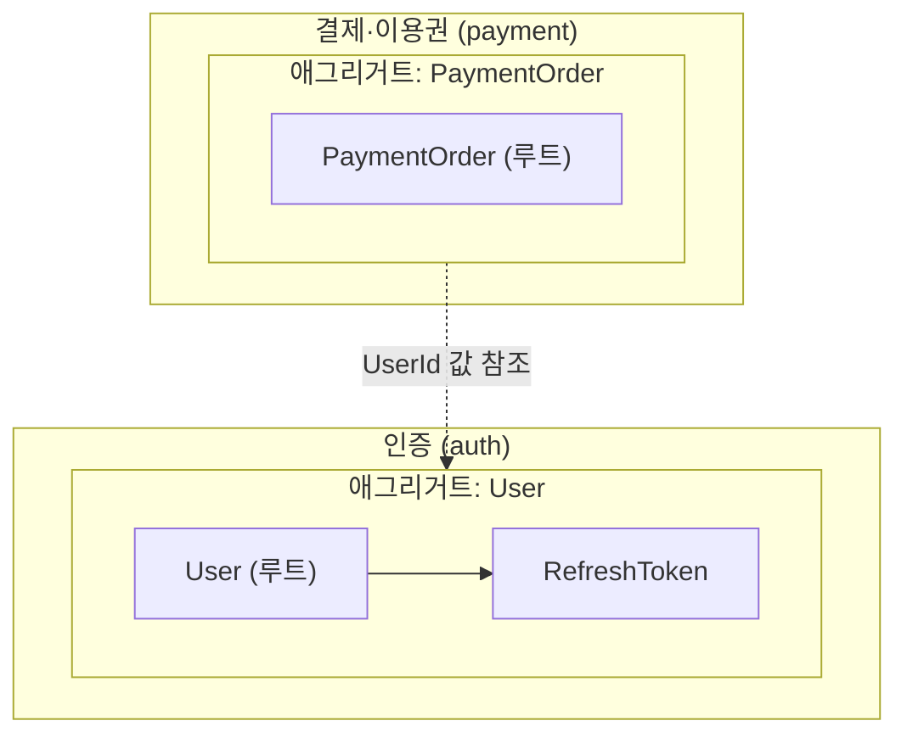
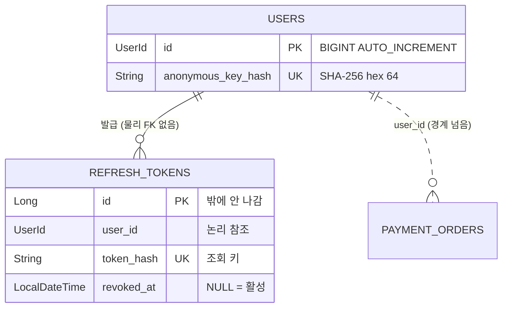
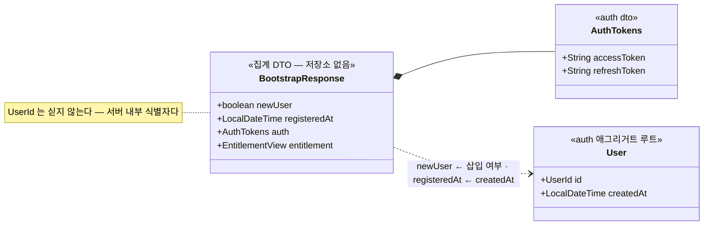
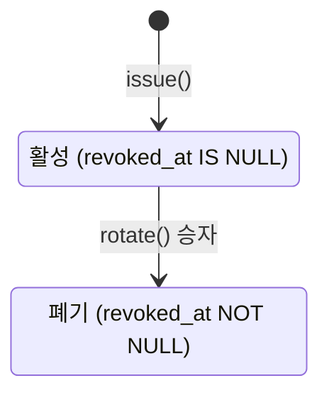
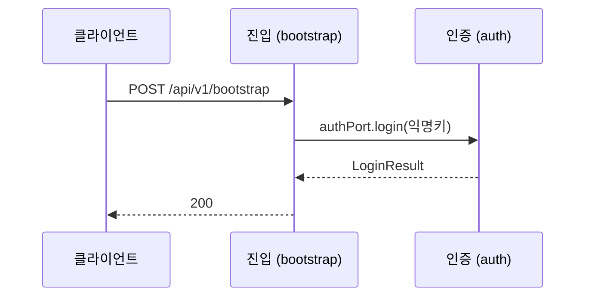

# 파일별 양식 · Mermaid 규약

```
backend/docs/model/
├── master.md              전 모듈 통합 다이어그램 — Mermaid 전용   ← 기본 산출물
│
│   ↓ 아래는 사용자가 명시적으로 요청할 때만 만든다
├── {module}-notes.md      책임·불변식·경계 규칙·주의사항·미확정
├── {module}-state.md      상태 전이
└── {module}-flow.md       모듈 간 상호작용 흐름
```

**기본 산출물은 `master.md` 하나다.** 아래 부연 문서 양식은 **요청받았을 때만** 쓴다.

`master.md` 에 그렸는데 "이건 설명이 필요한데" 싶은 것은 **말로 보고한다** — 파일로 먼저
만들지 않는다. 사용자가 "남겨줘"라고 하면 그때 해당 양식을 쓴다.
**그림과 말을 갈라놓는 것이 이 구조의 전부다.**

---

## Mermaid 작성 규약 (전 파일 공통)

### 렌더링 안전 규칙

| 규칙 | 이유 |
|---|---|
| 코드펜스는 반드시 ` ```mermaid ` | GitHub·VS Code 가 이걸로 판별한다 |
| `flowchart` 노드 라벨에 한글·`·`·`(` 가 들면 **따옴표로 감싼다** — `A["결제·이용권"]` | 따옴표 없으면 파서가 끊는다 |
| 반대로 `sequenceDiagram` 의 `participant X as 결제·이용권` 은 **따옴표를 쓰지 않는다** | 별칭은 줄 끝까지 자유 문자열이라 따옴표가 그대로 출력된다 |
| `stateDiagram-v2` 의 상태 id 는 **ASCII**, 한글은 `state "활성" as ACTIVE` 로 | 비ASCII id 는 렌더러마다 처리가 다르다 |
| `erDiagram` 엔티티명은 **영문 대문자 + 언더스코어** | 하이픈·점은 파싱 실패 |
| 다이어그램 하나에 노드 30개를 넘기지 않는다 | 자동 레이아웃이 무너진다. 넘으면 쪼갠다 |

### 관계선 규약 — **이 프로젝트 전용**

이 프로젝트는 **물리 FK 를 쓰지 않는다**. 그래서 선을 두 종류로 나눈다.

| 표기 | 의미 | 언제 |
|---|---|---|
| `\|\|--o{` (실선) | **애그리거트 내부** 관계 — 같은 트랜잭션에서 함께 산다 | 루트와 그 구성 엔티티 |
| `\|\|..o{` (점선) | **애그리거트·모듈 경계를 넘는 ID 참조** — 물리 FK 없음, JOIN 하지 않음 | 다른 애그리거트를 가리킬 때 |

> 점선을 실선으로 잘못 그리면 "JOIN 해도 된다"는 오해를 낳는다. **선 종류가 곧 규칙이다.**

---

## `master.md` — 전 모듈 통합 다이어그램

### 절대 규칙

**Mermaid 코드블록과 HTML 주석(`<!-- -->`) 외에는 아무것도 쓰지 않는다.**
제목도, 한 줄 설명도, 표도, 링크도 안 된다. 열면 **그림만** 보여야 한다.

메타데이터(근거 커밋·갱신일·분리 문서 목록)는 **HTML 주석**에 넣는다 — 렌더링되지 않는다.

### 구성

| 블록 | 언제 |
|---|---|
| **① 애그리거트 지도** (`flowchart`) | 항상 — 전 모듈이 여기 모인다 |
| **② 통합 ERD** (`erDiagram`) | 도메인 모듈이 하나라도 있으면 |
| **③ 집계 DTO 구성도** (`classDiagram`) | 집계 컨텍스트가 있을 때. 집계 모듈마다 블록 하나 |

모듈 간 의존 그래프는 여기 그리지 않는다 — Modulith `Documenter` 몫이다.

**집계 컨텍스트는 ② 에 넣지 않는다.** 테이블이 없으므로 넣는 순간 거짓말이 된다.

### 양식

````markdown
<!--
  전 모듈 도메인 모델 — /domain-model 이 관리한다. 손으로 고쳐도 되지만 형식은 지킨다.

  ⚠️ 이 파일에는 Mermaid 코드블록과 이런 HTML 주석 외에 아무것도 쓰지 않는다.
     설명이 필요하면 {module}-notes.md 로 뺀다.

  구역별 근거 커밋 · 갱신일
    auth    : d2d5e26 · 2026-08-13
    payment : (미작성)

  분리 문서
    auth : auth-notes.md · auth-state.md · auth-flow.md
-->




````

**ERD 컬럼은 식별자·상태·불변식에 관여하는 것만.** 전 컬럼 나열 금지 — DDL(`backend/deploy/sql/`)이
정본이다. `createdAt`·`updatedAt` 같은 `BaseTimeEntity` 공통 필드는 생략한다.

---

## 집계 컨텍스트 그리기

**판정**: `@Entity` · 리포지토리가 **0개**이고 다른 모듈의 결과를 합치기만 하는 모듈 (`bootstrap`).

저장소를 갖지 않는 것이 **이 모듈의 정체성**이다. "엔티티가 없어서 못 그리는 모듈"로 취급하지 않는다.
여기에 엔티티가 생기면 그건 집계가 아니라 새 도메인이다 — **라벨이 그 경계를 지킨다.**

### ① 애그리거트 지도에 구역 추가

- subgraph 라벨에 **`— 집계 컨텍스트`** 를 붙인다
- 노드 라벨에 **`집계 DTO · 자기 저장소 없음`** 을 명시한다
- 다른 모듈에서 **무엇을 받아 오는지** 화살표 라벨에 적는다

```
    subgraph M_BOOT["진입 (bootstrap) — 집계 컨텍스트"]
        BR["BootstrapResponse<br/>집계 DTO · 자기 저장소 없음"]
    end

    AG_USER -.->|"LoginResult"| BR
    PAY -.->|"EntitlementView"| BR
```

### ② 집계 DTO 구성도

**집계 모듈에서는 DTO 가 곧 모델이다.** 그래서 여기서만 필드를 전부 적는다
(도메인 모듈 ERD 는 식별자·상태만 적는 것과 반대다 — DTO 는 프론트 계약이라 전부가 의미다).

````markdown

````

| 요소 | 규칙 |
|---|---|
| `<<...>>` | **출처 모듈**을 표시한다 — `<<auth dto>>` · `<<payment dto>>` · `<<auth 애그리거트 루트>>` |
| `*--` | 중첩 DTO (합성) |
| `..>` + 라벨 | **필드가 어디서 왔는가** — `registeredAt ← User.createdAt`. **이게 집계 그림의 핵심 정보다** |
| `note for` | 계약상 **일부러 뺀 필드** (내부 식별자 미노출 등) |

**참고용으로 끌어온 다른 도메인 엔티티는 필드를 다 적지 않는다** — 출처로 지목된 필드만.
그 엔티티의 전모는 ERD 가 정본이다.

⚠️ `classDiagram` 주의: `..>` 라벨은 **따옴표 없이** 쓴다(따옴표가 그대로 출력된다).
라벨 안에 `:` 를 넣지 않는다(구분자와 헷갈린다). `←`·`·` 는 안전하다.

---

## `{module}-notes.md` — 책임·불변식·주의사항 **(요청 시에만)**

`master.md` 의 그림이 **왜 그렇게 생겼는지**를 설명한다.
요청받지 않았으면 이 내용을 **보고로만** 전달하고 파일은 만들지 않는다.

````markdown
# {표시명}({module}) 모델 노트

> **근거 커밋** `{7자리}` · **갱신** {YYYY-MM-DD} · 그림 [master.md](master.md)
> 요구 [{module}.md](../domain/{module}.md) · 설계 [{module}-design.md](../domain/{module}-design.md)
>
> ⚠️ 수기 문서다. 엔티티·경계가 바뀌면 `/domain-model {module}` 로 갱신한다.

## 이 모듈은 무엇을 책임지는가

{2~4줄. 무엇을 지키는 모듈인지. 기능 나열이 아니라 책임 서술.}

- **모듈 타입** `{CLOSED | OPEN}`
- **의존 허용** `{allowedDependencies 원문}`
- **밖에 노출한 것** {포트·타입 ID·dto 표}

## 애그리거트 경계

| 애그리거트 | 루트 | 구성 | 경계 판단 근거 |
|---|---|---|---|
| … | … | … | {트랜잭션·리포지토리·수명 근거} |

**경계 규칙**
- 경계를 넘는 참조는 **ID 값**이다. 객체 참조·JPA 연관을 만들지 않는다
- {이 모듈 고유의 규칙}

**확정안과 코드의 이탈** (있을 때만)
> {무엇이 다른가} · {왜 그런가} · **고칠 것인가 예외인가**

## 엔티티 책임

| 엔티티 | 소속 | 책임 (한 줄) | 불변식 (코드가 강제) | 상태 |
|---|---|---|---|---|
| … | … | … | … | … |

**불변식 칸에는 "코드가 실제로 강제하는 것"만 쓴다.** 희망사항이면 아래 미확정으로.

## 건드릴 때 지켜야 할 것

{코드 리뷰에서 반복해 지적할 만한 것 3~6개. 명령형으로.}

- {예: `AuthService` 에 `@Transactional` 을 붙이지 마라 — 없는 것이 설계다}

## 미확정 · 불일치 🔶

| 항목 | 상태 | 비고 |
|---|---|---|
| … | 🔶 확인 필요 / ⚠️ 불일치 / ℹ️ 신규 | … |

없으면 "없음"이라고 쓴다. 절을 지우지 않는다 — 빈 칸이 곧 "확인했다"는 기록이다.
````

---

## `{module}-state.md` — 상태 전이 **(요청 시에만)**

**상태 필드가 있는 엔티티만.** 요청받았더라도 상태 필드가 없으면 그 사실을 알리고 만들지 않는다.

````markdown
# {표시명}({module}) 상태 전이

> **근거 커밋** `{7자리}` · **갱신** {YYYY-MM-DD} · 그림 [master.md](master.md) · 노트 [{module}-notes.md]({module}-notes.md)

## {엔티티명}



| 전이 | 트리거 | 부수효과 |
|---|---|---|
| … | {어느 API/이벤트} | … |

{상태가 아닌 축(만료 등)이 섞이기 쉬우면 여기서 명시적으로 갈라준다.}
````

**상태 필드에 저장된 사실**과 **시각 비교로 판정되는 것**(만료 등)은 다른 축이다. 섞지 않는다.

---

## `{module}-flow.md` — 모듈 간 상호작용 **(요청 시에만)**

**핵심 흐름 1~2개만.** 전 API 를 그리지 않는다 — 그건 api-spec 몫이다.

````markdown
# {표시명}({module}) 상호작용

> **근거 커밋** `{7자리}` · **갱신** {YYYY-MM-DD} · 그림 [master.md](master.md) · 노트 [{module}-notes.md]({module}-notes.md)

## 흐름 ① {이름}



{이 흐름의 함정·전제를 여기 적는다.}

## 상호작용 요약

| 상대 | 방향 | 수단 | 왜 이 방식인가 |
|---|---|---|---|
| … | → / ← | 직접 호출 / 이벤트 | … |
````

---

## 자주 하는 실수

| 실수 | 왜 문제인가 |
|---|---|
| `master.md` 에 제목·한 줄 설명을 넣음 | 한 줄이 두 줄 되고 결국 산문 문서가 된다. **예외를 만들지 마라** |
| `master.md` 의 다른 모듈 구역을 같이 손댐 | 근거 커밋이 어긋나 어느 그림이 최신인지 알 수 없게 된다 |
| 전 컬럼을 ERD 에 옮겨 적음 | DDL 과 이중 관리 → 반드시 어긋난다. 식별자·상태만 |
| 애그리거트 경계를 실선으로 그림 | JOIN 해도 되는 것처럼 읽힌다 |
| 책임 칸에 "결제 정보를 저장한다" | 클래스명 반복이다. **무엇을 지키는가**를 써야 한다 |
| 요청도 없이 부연 문서를 "겸사겸사" 만듦 | 기본 산출물은 `master.md` 하나다. 발견은 보고로 전달하고 제안까지만 |
| 집계 컨텍스트를 ERD 에 넣음 | 테이블이 없다. 있는 것처럼 보이면 거짓말이다 |
| 집계 모듈 라벨에서 "집계"를 뺌 | 저장소 없음이 그 모듈의 정체성이다. 라벨이 경계를 지킨다 |
| 집계 DTO 구성도에 필드 출처를 안 적음 | 출처가 빠지면 그냥 record 선언을 옮겨 적은 것에 불과하다 |
| 내용도 없이 `-state.md` 를 만듦 | 빈 껍데기가 늘면 아무도 안 읽는다 |
| API 요청/응답 JSON 을 옮겨 적음 | api-spec 이 정본. 링크만 |
| 🔶 를 임의로 확정 | CLAUDE.md 위반. 사용자에게 묻는다 |
