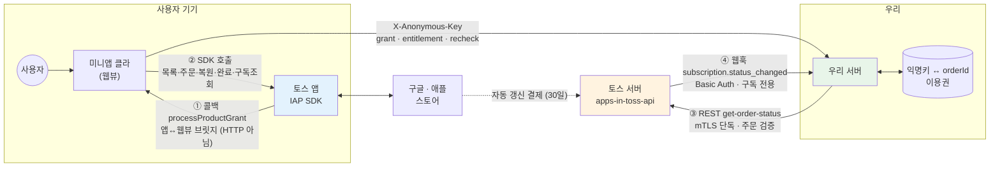
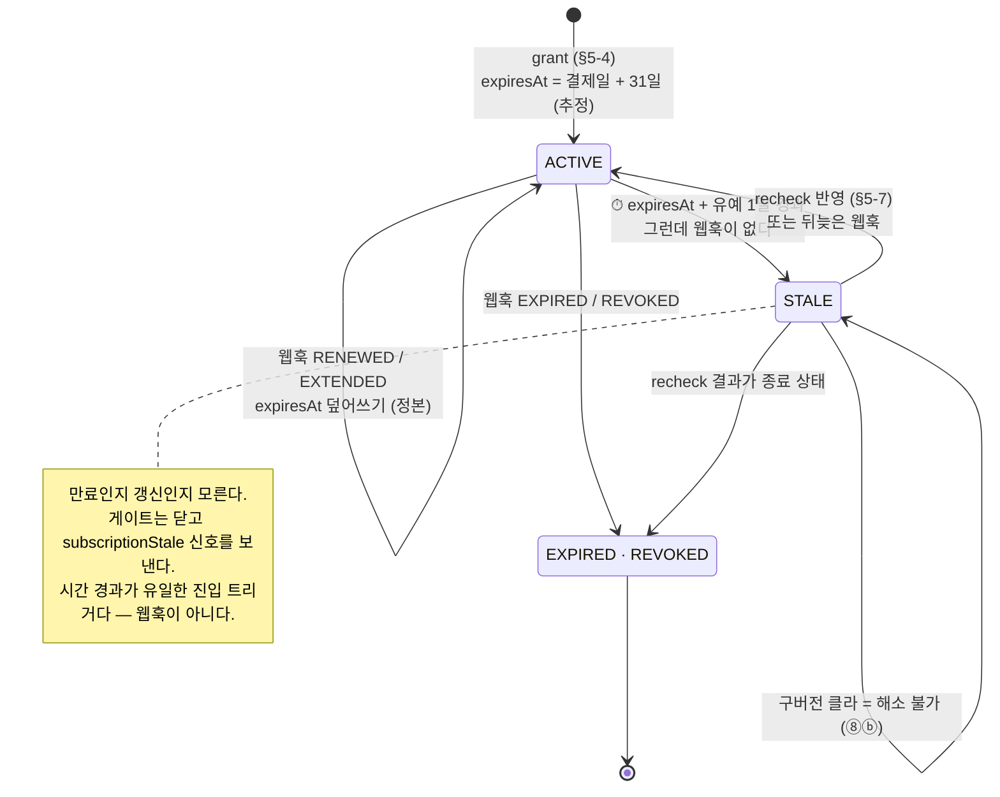
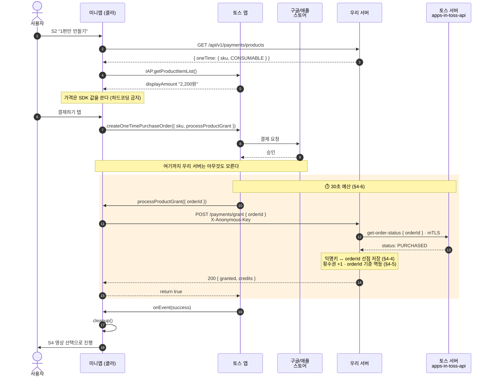
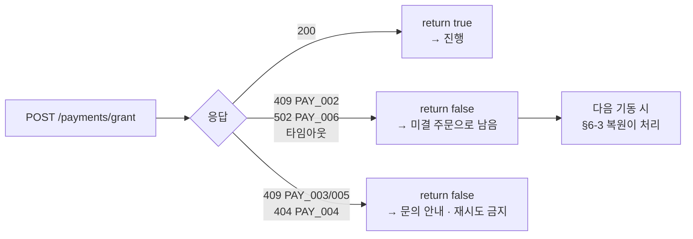
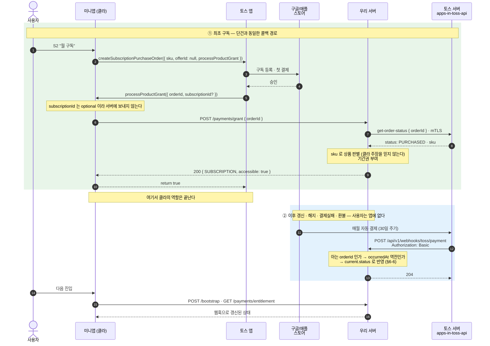
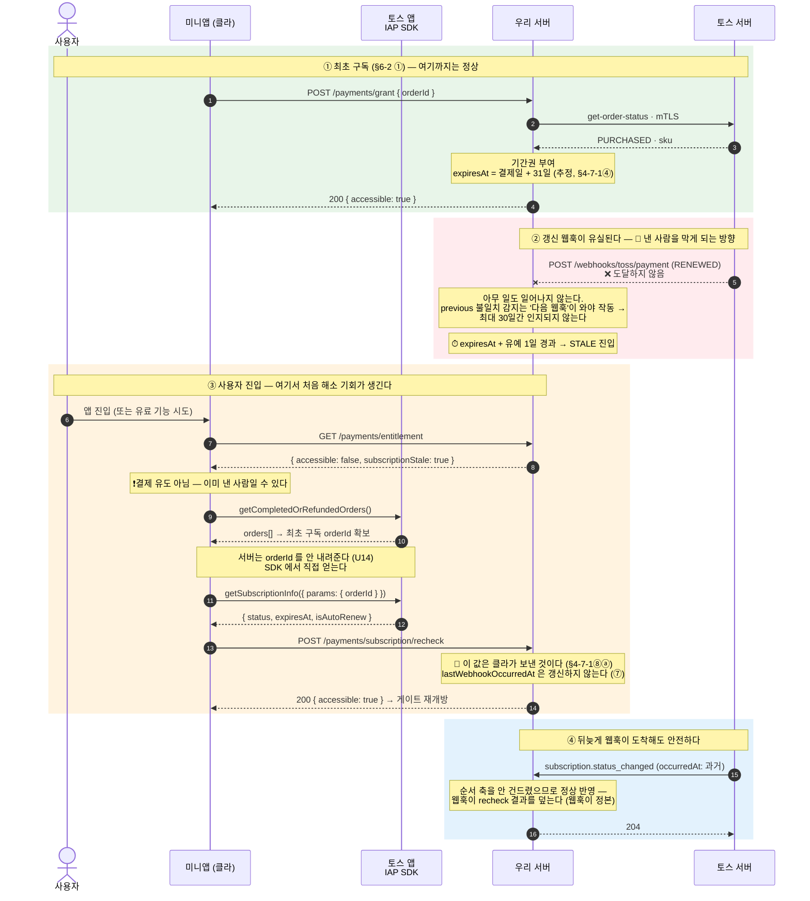

# 결제 · 이용권 — 비즈니스 요구사항 설계서 (payment 도메인)

> **한 줄**: 돈은 토스가 받고, **"누가 무엇을 쓸 수 있는가"는 우리가 기억한다.**
> 토스 로그인이 없으므로 우리 서버의 `익명키 ↔ orderId` 매핑이 소유권의 **유일한 정본**이고,
> 그것이 끊기면 사용자는 **돈을 내고 못 쓴다.**
>
> 요구사항: 2026-08-07 · **2026-08-09** 사용자 결정(§9-1) · 근거: [mvp-v1.md](../../../docs/planning/mvp-v1.md) 쟁점 1·3·4
> 플랫폼 사실 정본: **[iap-spec.md](../../../docs/platform/iap-spec.md)** · 개발 요약: [iap-essentials.md](../../../docs/platform/iap-essentials.md)
> 관련: [auth.md](./auth.md) · [toss-integration.md](../rule/toss-integration.md) · [error-handling.md](../rule/error-handling.md)
> 상태: **v1 — 2026-08-11 확정.** §9-1 결정 **17건 전부 확정(✅), 미확정 0건. 구현 착수 가능.**
> ⚠️ 확정은 "검증됐다"가 아니라 **"이 값으로 가고 결과를 감수한다"** 이다 — §9-1 의 ⚠️ 는 그대로 리스크다.

> 📌 `subscription.md` 를 개명한 문서다(이전 초안은 커밋 `1b947a9`). 초안이라 버전을 올리지 않았다.
> ⚠️ **auth.md 는 v2 확정본**이고 거기서 이 도메인을 옛 이름 `subscription` 으로 부른다 → §10-8.

> ⚠️ **외부 의존이 가장 큰 도메인이다.** mTLS · 토스 서버 API · 웹훅 3개에 걸쳐 있고,
> **구독은 샌드박스가 없어** 실결제 없이는 계약 준수를 증명할 수 없다(§4-9).

---

## 용어

| 용어 | 의미 |
|---|---|
| **이용권** | 유료 기능 사용 권리. 두 종류이고 **획득 경로도 소멸 방식도 다르다** |
| ├ **횟수권** | 단건 결제로 얻는 **1회 이용권**. 쓰면 소진. 토스 유형 `CONSUMABLE` |
| └ **기간권** | 구독으로 얻는 **기간 내 무제한**. 토스 유형 `SUBSCRIPTION` |
| 지급 (grant) | 결제된 주문을 **우리 이용권으로 바꾸는 행위** |
| 소모 (consume) | 횟수권 −1. **기간권에는 소모가 없다** |
| 미결 주문 | **결제됐는데 지급이 안 끝난** 주문. 정상 흐름에서도 발생한다(§4-5) |
| 이용 게이트 | 유료 기능 앞단의 "쓸 수 있는가" 판정 지점 |
| 선점 | 한 `orderId` 에 대해 **먼저 지급을 요청한 익명키가 소유자**가 되는 규칙(§4-4) |
| `orderId` | 토스 IAP 주문 식별자. **주문 단위** — 같은 `sku` 재구매 시 새 값 |

> ⚠️ **`processProductGrant`(주문 옵션의 콜백)와 `completeProductGrant`(별도 SDK 함수)는 다른 것이다.**

---

## 1. 배경 · 범위

**흐름은 `목록 → 결제 → 사용`이다.** 결제가 첫 관문이고 체험 구간이 없어 되돌릴 여지가 없다.

| 상품 | 가격 | 혜택 | 실수령(iOS/Android) |
|---|---|---|---|
| 단건 | **2,200원** | 1회 이용 | 1,749 / 1,779원 |
| 월 구독 | **3,960원** | 무제한 | 약 3,148 / 3,202원 |

**3,960 ÷ 2,200 = 1.8 → 월 2편부터 구독이 이득.** 이 비율이 가격 설계의 메시지이고 화면 문구도 여기서 나온다.

**로그인이 없다.** 그래서 이 도메인의 요구는 "결제를 연동한다"가 아니라
**"돈을 낸 사람이 언제·어떤 경로로 돌아와도 쓸 수 있게 한다"** 이다.
재진입·결제 직후 이탈·기기 변경·웹훅 유실 중 어디서든 소유권이 끊기면 **환불 요청이자 검수 반려 사유**다.

**핵심 훅은 없다.** 결제는 훅이 아니라 마찰이다. 잘 된 상태란 사용자가 **결제 이후 이용권을 의식하지 않는 것**이다.

### 범위

| 하는 것 | 안 하는 것 |
|---|---|
| 상품 정보 제공(`sku` 만, **가격 제외**) · 주문 검증 · 소유권 등록/보관 | 결제창 호출(클라 SDK) · 결제 수단·카드 정보 |
| 횟수권 잔량 관리 · 소모 판정(정책) · 지급 멱등 | 환불 **처리**(iOS Apple 전권 / Android 최종 Google Play) |
| 미결 주문 복원(서버 계약) · 이용권 상태 제공 · 이용 게이트 | 구독 **해지**·플랜 변경 — **파트너 호출 API 자체가 없다** |
| 웹훅 수신·반영(**구독 전용**) | 이용권 **현금 환급** — ❌ 금지(현금성 상품은 등록 불가) |
| | 쿠폰·프로모션·무료체험(✅-2) · 연간 플랜 · 결제 이력 화면 · 관리자 기능 |

- 단건 환불 감지는 ✅-8(푸시가 없다).
- ⚠️ **미니앱 재출시 시 이용권 이관은 플랫폼이 지원하지 않는다**(§4-4).

---

## 2. 기능 요구사항 (U1~U14)

| # | 요구 | 핵심 |
|---|---|---|
| **U1** | 상품 정보 제공 | `sku` 만 내려준다. **가격은 SDK `displayAmount` 가 정본** — 우리가 말하면 결제창과 불일치 위험 |
| **U2** | 결제 검증 후 지급 | `get-order-status` 로 **서버가 직접 확인한 뒤에만** 지급. 클라 주장만으로는 안 준다 |
| **U3** | 지급 멱등 | 같은 `orderId` 는 몇 번 와도 한 번만. **중복은 예외가 아니라 정상**(§4-5) |
| **U4** | 소유권 선점·불변 | 한 주문은 한 익명키에만 귀속. 이미 남의 것이면 거부 |
| **U5** | 이용권 상태 제공 | 부트스트랩 공급 + 단독 조회. **두 경로의 응답 모양이 같아야 한다** |
| **U6** | 이용 게이트 | 이용권 없이 유료 기능 거부. **401 과 구분되는 403** — 프론트 행동이 다르다 |
| **U7** | 횟수권 소모 | 작업 시 −1. **기간권 보유자는 차감하지 않는다** |
| **U8** | 실패한 작업은 소모하지 않는다 | **2,200원 내고 결과물을 못 받는 것이 최악의 경험**. 자막은 STT·번인에서 실제로 실패한다 |
| **U9** | 웹훅 반영 (구독) | **서버가 구독 상태를 조회할 API 가 없어**(§4-2) 갱신·만료를 아는 유일한 경로 |
| **U10** | 웹훅 등록 검증 처리 | 이걸 빠뜨리면 **U9 가 통째로 동작하지 않는다** |
| **U11** | 웹훅 진위 검증 | Basic Auth. 없으면 **누구나 위조 웹훅으로 기간권을 켤 수 있다** |
| **U12** | 미결 주문 복원 지원 | U2·U3 로 지원. **검수 필수 시나리오**다 |
| **U13** | 환불·회수 반영 | 구독은 웹훅, **단건은 푸시가 없다**(§4-8) |
| **U14** | 주문 식별자 비노출 | 선점 규칙 때문에 **`orderId` 를 아는 것 = 미지급 주문을 가로챌 수 있는 것** |

> U2 는 토스 API 왕복을 포함하므로 **검수 "인터랙션 2초"와 `processProductGrant` 30초 제약에 직접 노출**된다 → §4-6.

### 2-1. 조감도 — 우리가 상대하는 접점은 4개다

**❗ 이 도메인은 클라 ↔ 우리 서버 2자 구조가 아니다.** 토스 앱·토스 서버·스토어가 함께 있고,
**네 접점의 성격이 전부 다르다.** 어느 요구가 어느 선에 걸려 있는지가 설계의 절반이다.



| 접점 | 방향 | 성격 | 인증 | 걸린 요구 |
|---|---|---|---|---|
| **①** | 토스 앱 → 클라 JS | **브릿지 함수 호출** (HTTP 아님) | — | U2 트리거 · 30초 예산(§4-6) |
| **②** | 클라 → 토스 앱 | SDK 함수 | — | U1(가격) · U12(복원) · §6-7(STALE 해소) |
| **③** | **우리 서버 → 토스 서버** | REST · **IAP 서버 API 는 이것 하나뿐** | **mTLS 단독** | **U2** — 사실이 처음 확인되는 지점 |
| **④** | **토스 서버 → 우리 서버** | 웹훅 · **구독 전용** | **Basic Auth** | U9·U10·U11·U13 |

> ❗ **①과 ④를 혼동하면 설계가 통째로 어긋난다.** ①은 사용자가 앱에 **있을 때만** 돌고,
> ④는 사용자가 앱에 **없을 때** 온다.
> ❗ **단건에는 ④가 없다.** 그래서 단건은 ①이 실패하면 복원(§6-3)이 유일한 안전망이고,
> 구독은 ①이 성공한 뒤에도 ④가 계속 와야 상태가 유지된다.
> ❗ **`M → A` 점선이 이 도메인의 사각지대다** — 매월 결제가 우리 밖에서 일어나고,
> 우리는 ④로만 그 사실을 안다. **④를 놓치면 물어볼 곳이 없다**(§4-2) → §4-7-1.

### 단건과 구독은 같은 도메인이지만 같은 규칙이 아니다 (§4-1)

| 축 | 단건 (횟수권) | 구독 (기간권) |
|---|---|---|
| 지급 트리거 | 클라 콜백 | 클라 콜백 (**최초 1회만**) |
| 이후 상태 변화 | 없음 (재구매 = 새 주문) | **웹훅 단독.** 갱신 시 콜백이 오지 않는다 |
| 멱등 위험도 | 🔴 **높음** — 중복이 곧 잔량 증가 | 🟡 낮음 — 상태 세팅이라 자연 멱등 |
| 멱등 키 | `orderId` | `orderId` + `occurredAt` (**이벤트 ID 가 없다**) |
| 환불 감지 | ⚠️ 폴링/클라 조회 (✅-8) | 웹훅 `REVOKED` 푸시 |
| 소모 | 있음 | 없음 |
| 샌드박스 | ✅ | ❌ **미지원** |
| 최소 앱 버전 | 5.219.0 | **Android 5.253.0 / iOS 5.250.0** |

- **한 도메인에 두는 이유**: 이용 게이트가 하나다. "쓸 수 있는가"의 답은 두 이용권을 함께 봐야 나온다.
- ⚠️ 대가로 **상태 어휘를 합칠 수 없다.** 주문 8종·구독 6종·changeReason 12종은 **서로 다른 축**이다.
  하나의 상태 머신으로 합치려 하면 안 된다.

---

## 3. 신뢰성 대책

돈이 걸린 도메인의 신뢰성은 "장애가 안 나게"가 아니라 **"장애가 나도 사용자가 돈을 잃지 않게"** 다.
아래는 문서·커뮤니티에 근거가 있는 **실제 실패**만 추린 것이다.

| # | 실패 | 결과 | 대책 |
|---|---|---|---|
| R1 | 콜백이 아예 안 돈다 (강제종료·이탈) | 결제됨 + 미지급 | **미결 복원**(§6-3) |
| R2 | 30초 초과 | 토스가 환불 안내 화면 노출 | **붙잡지 않고 false → 복원에 위임.** 재시도 루프 금지 |
| R3 | 같은 `orderId` 중복 지급 | 🔴 **횟수권 잔량 부풀림 = 무료 이용권 유출** | **`orderId` 기준 멱등.** 재요청은 에러가 아니라 200 |
| R4 | 클라가 결제 없이 grant 호출 | 무료 지급 | **서버가 `get-order-status` 로 검증**(U2) |
| R5 | `orderId` 탈취·추측 | 남의 주문 가로채기 | **선점 + U14 비노출** (✅-12 에 근거가 걸림) |
| R6 | 위조 웹훅 | 결제 없이 기간권 활성화 | **Basic Auth + IP + "웹훅으로 구독을 만들지 않는다"** |
| R7 | 웹훅 유실 | 🔴 **낸 사람을 막는다** | `previous` 비교로 **감지**. 보정은 ✅-6 |
| R8 | 웹훅 중복·순서 역전 | 상태 되감김 | `occurredAt` 과거면 무시 |
| R9 | 토스 API 장애 | 지급 불가 | `502 PAY_006` → 복원 위임. **부트스트랩에는 전파되지 않는다** |
| R10 | 작업 실패 | 돈 내고 결과물 없음 | **횟수권 되돌림**(U8) |
| R11 | 웹훅 타임존 모호 | 만료 판정 최대 9시간 오차 | **우리가 기준을 정해 변환**(✅-7) |
| R12 | 익명키 소실(탈퇴·재출시) | 승계 불가 | **막을 수 없다.** 재출시 전 선행 과제로 명시 |

### 4-2. 무엇을 믿는가 — 진실 원천

| 소스 | 알려주는 것 | 신뢰 | 한계 |
|---|---|---|---|
| `get-order-status` (서버→토스, mTLS) | **주문**의 상태 | ✅ 최고 | **구독 만료 시점을 모른다.** ⚠️ 구독 주문 적용 여부도 미명시 |
| 웹훅 `subscription.status_changed` | 구독 상태 **변경** | ⚠️ 높으나 조건부 | Basic Auth 외 서명 없음. **재전송·이벤트 ID 없음** |
| 클라 `getSubscriptionInfo` | 구독 현재 상태 | ❌ 낮음 | **클라 값이다.** 그대로 받아 쓰지 않는다. ⚠️ **단 §4-7-1 이 STALE 해소에 한해 한시적 예외를 연다 — 알고 여는 구멍이다** |
| 클라 `getCompletedOrRefundedOrders` | 완료·환불 목록 | ⚠️ 낮음 | 재검증 **트리거로만**. 웹 SDK 는 첫 50건 고정 |

🔴 **서버가 구독 상태를 직접 조회할 방법이 없다 — 이 도메인 최대의 구조적 리스크.**
서버가 아는 기간권 상태 = **최초 주문 검증 + 이후 웹훅 누적**이고, 어긋나도 **바로잡을 조회 수단이 없다**(✅-6).

> **2026-08-09 재검증 (`docs` MCP + 커뮤니티 전수)** — 근거 3중으로 확인했다.
> ① OpenAPI spec 원문의 `paths` 에 IAP 경로는 **`get-order-status` 정확히 1개**다(해지 API 도 없다).
> ② 구독 개발 문서가 제시하는 **연동 흐름 5단계**에 서버 API 자리가 아예 없다 —
> `getProductItemList → createSubscriptionPurchaseOrder → **getSubscriptionInfo(SDK)** → **웹훅** → 구매 복구`.
> 같은 문서가 *"서버에서 구독 상태 동기화(갱신/취소/환불 처리)가 필요해요"* 라고 하면서 **서버 수단은 웹훅만 준다.**
> ③ 커뮤니티에 관련 질의·답변이 **없다**(`subscriptionId`·`RENEWED` 검색 0건).
> ⚠️ 검색에 `toss-pay-subscription`(토스페이 정기결제)이 섞여 나오지만 **다른 제품이다** — 우리 것이 아니다.

> **📌 갱신 시 `orderId` 유지 — 명시 규정은 없으나 정황 근거 4개가 모두 "유지" 쪽이다** (§10-1ⓑ).
> ① **`getSubscriptionInfo({ params: { orderId } })` 가 `orderId` 로 *현재* 상태를 조회한다.**
> 갱신 시 `processProductGrant` 가 호출되지 않으므로 **클라가 아는 `orderId` 는 최초 것뿐**이다 —
> 그 값으로 현재 `status`·`expiresAt`·`autoRenew` 를 얻는다는 건 **최초 `orderId` 가 구독의 핸들로 계속 유효**하다는 뜻이다.
> ② 웹훅 예시가 `CREATED` 와 `RENEWED` 에서 **같은 `"order-1"`** 을 쓴다.
> ③ 문서가 *"`orderId` … 주문과 사용자를 매핑하고 있다면 상관관계 식별자로 활용할 수 있어요"* 라고 안내한다 —
> 갱신마다 값이 바뀌면 **이 안내 자체가 갱신 시점에 무너지므로** 성립하지 않는다.
> ④ **구조적 근거** — 웹훅 페이로드에 **`orderId` 외에 파트너가 사용자를 찾을 수 있는 값이 하나도 없다**
> (`subscriptionId`·`catalogId`·사용자 식별자 전부 부재). 갱신마다 값이 바뀌면 **이 웹훅 스펙 자체가
> 모든 파트너에게 처리 불가능해진다.**
> **반대 방향 근거는 하나도 없다.** 다만 **확정 문장이 아니므로 §10-1ⓑ 질의는 유지**한다.
> ❗**§4-7-1(STALE 보정) 전체가 이 전제 위에 서 있다** — 깨지면 그 설계가 통째로 무효다.

⚠️ **유실 방향별 손해가 비대칭이다.** 만료 유실 = 안 낸 사람에게 열어줌(우리 손해).
**갱신 유실 = 낸 사람을 막음(훨씬 나쁨).** 보정 수단은 이 비대칭을 기준으로 정한다.

### 4-3. 이용 가능 판정

**`이용 가능 = 기간권이 살아 있다 OR 횟수권 잔량 > 0`** — 확정 ⑤ 의 직접 귀결이라 별도 결정이 아니다.
미확정은 그 아래 두 층이다: **어떤 `status` 를 살아 있다고 볼 것인가(✅-3)**, **둘 다 있으면 무엇을 먼저 쓰나(✅-4ⓒ)**.

**소모 우선순위(제안)**: **기간권 우선** — 구독 중 횟수권을 보존한다.
반대로 하면 "구독 중인데 왜 내 이용권이 줄지?"라는 문의가 된다.

**기간권 개폐** — 토스 `status` 를 그대로 게이트에 쓰지 않는다. "어떤 상태인가"와 "열어줄 것인가"는 별개다.

| 토스 `status` | 의미 | 우리 판정 | 이유 |
|---|---|---|---|
| `ACTIVE` | 활성 | ✅ 연다 | — |
| `IN_GRACE_PERIOD` | 결제 실패 후 유예 | ✅-3 ✅ **연다** | 카드 문제로 잠깐 실패한 유료 사용자를 막는 손해가 더 크다 |
| `ON_HOLD` | 보류 | ✅-3 ❌ 막는다 | 유예가 끝난 상태 |
| `PAUSED` | 사용자 일시정지 | ✅-3 ❌ 막는다 | 사용자 의사 |
| `EXPIRED` · `REVOKED` | 만료 · 회수 | ❌ 막는다 | — |
| (구독 이력 없음) | — | ❌ 막는다 | 횟수권만 본다 |

- ⚠️ **플랫폼의 `isAccessible` 을 쓰지 않는다** — 클라 값이고 **산식이 문서에 없다.** 토스 직원도 `status` 기준을 권했다.
- 프론트는 **`accessible` 하나만 보고 분기한다.** `status` 는 안내 문구용이다.
- ⚠️ **월 주기는 달력 1개월이 아니라 30일 고정**이다.

### 4-4. 소유권 — `익명키 ↔ orderId` (U4)

- **1:1 · 불변.** 선점 규칙: **먼저 지급을 요청한 익명키가 소유자**. 남의 것이면 `PAY_005`.
- ⚠️ **토스에 "이 주문이 누구 것인가"를 물어볼 수 없다.** 응답에 소유자 필드가 없고,
  `x-toss-user-key` 는 로그인 사용자용이라 우리에겐 없다. `x-anon-key` 대체 가능 여부는 문서에 없다(✅-11).
- ⚠️ **그래서 "서버가 결제를 검증한다"를 정확히 말해야 한다.** 서버가 확인하는 것은
  **"이 `orderId` 가 결제됐다"뿐이고, "누구 것인가"는 끝까지 클라의 주장**이다.
  **선점은 검증이 아니라 그 사실을 감수하겠다는 선언**이다 — 보안 통제인 척 쓰지 않는다.
- **수용 근거**: `orderId` 는 결제 기기와 우리 서버 밖으로 나가지 않고, 정상 클라는 수 초 안에 지급을 요청한다.
  그래서 **U14 가 여기서 실효 방어**가 된다. auth 확정 ③ 과 같은 선상의 리스크 수용이다.
  ⚠️ 단 **`orderId` 엔트로피가 검증되지 않았다**(✅-12) — 추측 가능하면 근거가 무너진다.
- ⚠️ **승계되지 않는 두 경우**(둘 다 못 막는다): **토스 탈퇴 후 재가입**(탈퇴 통지 수단도 없다) ·
  **미니앱 재출시**(토스 직원이 승계 불가 명시) → **재출시 전 반드시 선행 해결.**

### 4-5. 멱등 — 중복은 정상이다 (U3)

중복 요청이 오는 **정상 경로**가 최소 3개다: ① 복원이 이미 지급된 주문을 재전송 ② 네트워크 실패 후 재시도
③ 타임아웃으로 false 반환했는데 실은 서버가 성공.

**"중복이면 에러"로 만들면 복원 흐름 자체가 깨진다.** 그래서 재요청도 **200** 이다 —
프론트가 그 200 을 받고 `completeProductGrant` 로 미결을 닫아야 하기 때문이다.

🔴 **횟수권은 `+1` 이 누적된다.** 멱등의 근거를 **`orderId` 하나에** 둔다.
⚠️ 하필 `completeProductGrant` 의 중복 호출 멱등성이 문서화돼 있지 않다(✅-13).

#### 4-5-1. 왜 서버 대책이 "멱등 하나"로 수렴하는가 — 그리고 그 전제 [단건 기준]

**결론부터**: 지급 트랜잭션이 커밋된 뒤 응답이 유실돼도 **서버는 아무것도 보상하지 않는다.**
커밋됐으면 재요청이 200 으로 수렴하고, 롤백됐으면 미결로 남아 §6-3 복원이 다시 태운다.
**두 갈래가 같은 종착점**이라 "응답을 못 준 건"을 따로 추적하는 장치가 필요 없다.

| ⑨ 이후 상황 | DB | 다음 요청(재시도 또는 복원) | 종착 |
|---|---|---|---|
| 커밋 성공 · 응답 유실 | 지급됨 | 멱등 히트 → **200** (잔량 그대로) | `completeProductGrant` 로 미결 종료 |
| 트랜잭션 롤백 | 지급 안 됨 | 신규 지급 → **200** | 동일 |
| 커밋 성공 · 30초 초과 | 지급됨 | 위와 동일 | 동일 (환불 안내는 떴어도 **결제 취소가 아니다**) |

> **재요청 200 의 `credits` 는 "현재 잔량"이다.** 신규 지급과 응답 모양이 같아야 하고(§5-4),
> 여기서 `+1` 이 다시 반영되면 멱등이 깨진 것이다.

**다만 이 결론에는 전제 3가지가 붙는다 — 하나라도 빠지면 성립하지 않는다.**

| # | 전제 | 빠뜨리면 |
|---|---|---|
| ⓐ | **멱등 판정은 `orderId` unique 제약이 근거다** — "조회 후 없으면 삽입"이 아니다 | 콜백과 복원이 **동시에** 같은 `orderId` 를 보내면 둘 다 조회를 통과해 **`+1` 이 두 번**. 🔴 잔량 부풀림 |
| ⓑ | **⑦ 토스 왕복은 트랜잭션 밖이다** — 검증 후 열고, 쓰고, 닫는다 | 외부 호출이 커넥션을 물고 30초를 대기한다. §4-6 상한과 커넥션 풀이 동시에 무너진다 |
| ⓒ | **커밋 이후에 200 을 만든다** — 응답 직렬화·후처리는 커밋 뒤 | 200 을 받았는데 롤백된 경우가 생기고, 클라가 `completeProductGrant` 로 미결을 닫아 **복원 대상에서도 사라진다.** 이 조합만이 유일하게 수렴하지 않는 경로다 |

**멱등이 덮지 않는 것 — 같은 도메인이지만 다른 축이다**

| 축 | 왜 별개인가 |
|---|---|
| **소유권 선점 (§4-4)** | 같은 `orderId` + **다른 익명키**는 멱등 히트가 아니라 `409 PAY_005` 다. 판정 키가 `orderId` 단독이 아니라 `(orderId, 익명키)` 조합이다 |
| 🔴 **횟수권 소모 (U7·✅-4)** | **grant 멱등과 무관하다.** 잔량 1로 동시에 작업 2건이 통과하면 음수가 된다. 지급이 `orderId` 로 보호되는 것과 달리 **소모에는 자연 멱등 키가 없다** — 차감 시점·복구 범위(✅-4ⓐⓑ)가 정해져야 대책이 정해진다 |
| **작업 실패 되돌림 (U8)** | 지급 트랜잭션 밖에서, 훨씬 나중에 일어난다. 여기서 잃으면 **돈 내고 결과물이 없다** |
| **`orderId` 비노출 (U14)** | 신뢰성이 아니라 선점 규칙의 방어다. 트랜잭션으로 해결되지 않는다 |

⚠️ **구독은 이 요약이 그대로 적용되지 않는다.** 최초 지급까지만 같고, 이후 상태 변화는 웹훅 단독이라
**이벤트 ID 도 재전송 정책도 없는 채널**에 얹힌다(§4-7). "멱등 하나면 된다"는 **단건에 한정된 결론**이다.

### 4-6. 지급 응답 시간 (U2)

- ⚠️ *"결제 성공 후 30초내에 `processProductGrant` 가 호출되지 않거나 결과가 true 가 아니면
  `{appName}에 문제가 생겼어요. 환불을 신청해주세요` 페이지가 노출될 수 있어요."*
- **구독 문서에는 이 문구가 없지만 같은 제약을 전제로 설계한다**(✅-10) —
  없다고 가정했다 틀리면 결제 직후 환불 화면이 뜨고, 반대 방향 손해는 없다.
- 우리 지급 API 는 **토스 왕복을 포함해** 상한 안에 답한다. 초과하면 **실패 처리하고 복원에 맡긴다.**
- ⚠️ **타이머 기점이 문서에 없고**, `true` 를 반환했는데도 30초 뒤 환불 안내가 뜬 사례가 있다 —
  **우리 응답 시간만으로 통제되지 않는 구간이 있다.**

### 4-7. 웹훅 신뢰성 (U9·U10·U11)

**진위 검증 수단은 Basic Auth 하나뿐이다.** HMAC·서명 헤더는 문서·커뮤니티 어디에도 없다.

| 방어층 | 수단 | 상태 |
|---|---|---|
| 1차 | Basic Auth 헤더 검증 | ✅ 채택 (U11) |
| 2차 | Inbound IP 화이트리스트 (6개 대역, 443) | ✅-5 — 인프라 결정 |
| 3차 | **웹훅으로 구독을 새로 만들지 않는다** | ✅-5 (제안) |

> 3차의 효과: 위조 웹훅의 최대치가 "없는 구독 생성"에서 **"이미 결제한 사람의 상태 흔들기"** 로 줄어든다.
> 구독 생성은 **mTLS 로 검증한 주문(U2)만** 거친다. → **§6-6 은 이 제안을 전제로 그려져 있다.**

| 상황 | 처리 |
|---|---|
| 서버 응답 | **204**. ⚠️ 토스 직원 답변이 유일 근거 |
| 순서 역전 | `occurredAt` 이 반영분보다 과거면 무시 |
| 중복 수신 | ⚠️ 이벤트 ID 가 없다 → `eventType + orderId + occurredAt` |
| 유실 감지 | `previous` 가 우리 상태와 다르면 **놓친 것**. 감지는 확정, 보정은 ✅-6 |
| 처리 실패 | **수신과 반영을 분리.** 반영 실패해도 204 — **재전송 정책이 없어 재시도에 기댈 수 없다** |
| 자동갱신 재개 | ⚠️ **`changeReason` 만으로 판정 금지.** `RESTARTED` 인데 `autoRenew` 가 false 인 사례 보고됨 |
| 시각 해석 | timezone 없는 ISO-8601, **기준 타임존 미확답** → ✅-7 |

### 4-7-1. 웹훅 유실 보정 — STALE 상태와 클라 재확인 [구독 전용]

**✅-6 의 구체화.** 단건에는 해당 없다 — **단건은 웹훅 자체가 없다.**

#### ① 문제

서버가 구독 상태를 조회할 API 가 없어(§4-2), 기간권 상태는 **최초 주문 검증 + 웹훅 누적**이 전부다.
웹훅이 유실되면 서버 상태가 실제와 어긋나고 **바로잡을 조회 수단이 없다.**

특히 **갱신(`RENEWED`) 유실은 🔴 낸 사람을 막는다.** 그리고 `previous` 불일치 감지는
**다음 웹훅이 와야 작동**하므로, **갱신 유실은 최대 30일간 인지되지 않는다.**

#### ② 설계 요약 — 만료(확정)와 상태 미확인(모름)을 분리한다

```
① 최초 지급    expiresAt = 결제일 + 31일 (30일 주기 + 자체 유예 1일)로 임시 세팅
② 웹훅 정상    current.expiresAt 로 덮어쓴다 (웹훅이 정본)
③ 웹훅 유실    expiresAt + 자체 유예가 지나도 웹훅이 없으면 → STALE 진입
④ 신호         entitlement 응답에 stale 플래그. 게이트는 닫는다
⑤ 클라 확인    getCompletedOrRefundedOrders() 로 orderId 확보
               → getSubscriptionInfo({ params: { orderId } })
⑥ 재확인 요청  POST /payments/subscription/recheck
⑦ 해소         반영 후 게이트 재개방. 웹훅 순서 축은 건드리지 않는다
```

#### ③ 상태 정의

| 상태 | 의미 | 게이트 | 근거 |
|---|---|---|---|
| `ACTIVE` | 웹훅으로 확인된 유효 기간 내 | ✅ 연다 | 웹훅 |
| **`STALE`** | **만료 시각이 지났는데 웹훅이 오지 않았다 — 만료인지 갱신인지 모른다** | ❌ 닫는다 (+ stale 신호) | 시간 경과 |
| `EXPIRED` · `REVOKED` | 웹훅으로 확인된 종료 | ❌ 닫는다 | 웹훅 |

**전이 — 무엇이 상태를 바꾸는가**



> **`ACTIVE → STALE` 만 웹훅이 아니라 시간이 트리거다.** 나머지 전이는 전부 외부 신호가 만든다.
> 이 하나가 "웹훅이 안 오는 것"을 상태로 승격시키는 장치다.

> ⚠️ **용어 주의**: 이 문서의 **미결 주문**(§6-3)은 *"결제됐는데 지급이 안 끝난 주문"* 으로 **다른 개념**이다.
> 혼동을 막기 위해 `STALE` 로 부른다.

#### ④ 최초 지급 시 `expiresAt` 출처

세 후보가 전부 막혀 있다.

| 후보 | 왜 못 쓰나 |
|---|---|
| `get-order-status` | **만료 시점을 모른다** (주문 축이라 구독 만료가 없다) |
| 클라 `getSubscriptionInfo` | ❌ 쓰지 않는다(§4-2). ⚠️ **구매 직후 `null` 사례** 보고됨 |
| 웹훅 `CREATED` | **grant 보다 먼저 도착하면** "모르는 `orderId` → 무시" 규칙(§4-7)에 걸려 버려진다 |

→ **지급 시 `결제일 + 31일` 로 임시 세팅하고, 첫 웹훅이 오면 정본으로 덮는다.**
웹훅이 유실돼도 **31일간은 정상 동작**한다.
⚠️ `MONTHLY` 는 달력 한 달이 아니라 **30일 고정**이다.

#### ⑤ 자체 유예 1일

게이트 판정은 **`now ≤ expiresAt + 1일`** 로 한다. **추정 `expiresAt` 과 웹훅 `expiresAt` 양쪽에 동일 적용.**

**근거는 §4-2 의 비대칭이다.** 만료 유실(안 낸 사람에게 열림) 🟡 < 갱신 유실(낸 사람 차단) 🔴.
**1일 열어두는 손해를 사서 하루치 차단을 막는다.**

#### ⑥ STALE 에서 게이트를 닫는 이유

**열어두면 클라가 recheck 를 돌 이유가 없어져 보정 흐름 자체가 죽는다.**
대신 entitlement 응답에 신호를 실어 **유료 기능에 닿기 전에 해소**하게 하면, 사용자 체감은 짧은 지연뿐이다.

#### ⑦ 웹훅 우선 원칙 — recheck 는 순서 축을 건드리지 않는다

**recheck 반영은 `lastWebhookOccurredAt` 을 갱신하지 않는다.**

recheck 결과에는 `occurredAt` 이 없어 **순서 축에 놓을 수 없다.** 건드리지 않으면 뒤늦게 도착한 웹훅이
정상적으로 recheck 결과를 덮는다 — **웹훅이 정본이고 recheck 는 임시 보정**이라는 위계가 유지된다.

#### ⑧ 유보 — 이 설계가 아직 답하지 않는 것

| # | 항목 | 현재 | 왜 유보했나 |
|---|---|---|---|
| ⓐ | **클라 값 신뢰 문제** | **신뢰한다** | 🔴 ⚠️ **결제 없이 `{ status: "ACTIVE" }` 전송만으로 구독이 열린다.** 사용자 판단으로 후속 과제 — 후보: 유예를 짧게 끊어 반복 연장 · 운영 알림 · 연장 횟수 상한 |
| ⓑ | 구버전 클라 fallback | 없음 | `getSubscriptionInfo` 는 Android 5.253.0 / iOS 5.250.0(문서 상충, 보수적 5.253.0) 필요. **미만은 영구 STALE** → 수동 대응이 필요한데 ⚠️ §8 이 *"수동 대응 수단이 없다"* 를 이미 인지 사항으로 적어놨다 |
| ⓒ | recheck 재시도 상한 | 없음 | 해소 안 되면 무한 반복. **상한과 에스컬레이션 경로 필요** |

> 🔴 **ⓐ 는 보안 구멍을 알고 여는 것이다.** §4-2 가 클라 `getSubscriptionInfo` 를 *"❌ 낮음 — 그대로 받아 쓰지 않는다"*
> 로 규정한 것과 **정면으로 상충한다.** 이 절은 그 예외를 **한시적으로, 알고** 여는 것이고
> **출시 전 반드시 닫아야 한다.** 지우지 말고 그대로 남긴다.

#### ⑨ 전제 — 깨지면 이 설계가 통째로 무효

| 전제 | 상태 |
|---|---|
| **갱신 시 `orderId` 가 유지된다** | 정황 근거 **4개**, 반대 근거 0. 확정 문장 없음 → §10-1ⓑ. **바뀌면 클라가 확보한 최초 `orderId` 로 현재 구독을 못 찾는다** |
| 구독 주문에 `get-order-status` 가 적용된다 | ⚠️ 미명시 (§4-2) |

> **근거 ④ (신규 · 구조적)**: 웹훅 페이로드에 **`orderId` 외에 파트너가 사용자를 찾을 수 있는 값이 하나도 없다**
> (`subscriptionId`·`catalogId`·사용자 식별자 전부 부재). 갱신 시 `orderId` 가 바뀌면
> **이 웹훅 스펙은 모든 파트너에게 처리 불가능해진다** → 유지될 수밖에 없다는 구조적 근거다.

### 4-8. 환불 · 해지 (U13)

- **우리는 환불을 처리하지 않는다.** iOS 는 Apple 전권(상태 조회만), Android 도 최종 결정은 Google Play.
  **파트너 서버용 환불 API 자체가 없다.**
- **구독**: `REVOKED` → 즉시 회수. `AUTO_RENEW_DISABLED`(해지 예약) → **만료일까지 계속 열어준다.**
- ⚠️ **단건은 환불 푸시가 없다** → ✅-8. "환불되면 회수한다"가 **상품별로 다른 SLA** 를 갖는다.
- ⚠️ **이미 소모한 횟수권은 되돌릴 것이 없다.** 잔량을 음수로 만들지 않는다.
- **구독 해지를 우리가 해줄 수 없다** — 사용자가 스토어에서 직접. ⚠️ 안내 방법도 문서에 없다 → §10.

### 4-9. 검증 불가 구간

| 대상 | 샌드박스 | 결과 |
|---|---|---|
| 단건 | ✅ | 출시 전 검증 가능 |
| **구독** | ❌ | **실결제로만 검증된다** |

- 검수 **필수 시나리오 4가지**: ① 상품 목록 노출 ② 결제 성공 ③ **결제 성공 + 서버 지급 실패**(복원)
  ④ 에러 4종(네트워크/취소/내부오류/파트너 지급 실패). **③이 §6-3 의 존재 이유**이고 선택이 아니다.
- ⚠️ **QR 테스트에서 실결제가 발생한다.** 비용·환불 절차를 미리 잡는다.
- ⚠️ **구독은 자동화 테스트로 계약 준수를 증명할 수 없다.** 테스트는 "우리 규칙이 맞게 도는가"까지만 답한다.

### 4-10. 이용 게이트 적용 범위 (U6) [공통 승격 후보]

auth 는 "누구인가"까지 답하고 401 을 낸다. **"쓸 수 있는가"와 403 은 이 도메인 몫**이다.

| 대상(제안) | 이용권 | 근거 |
|---|---|---|
| 작업 생성(업로드·자막·번인) | ✅ + **횟수권 소모** | 원가가 드는 행위. 쟁점 1 의 실체 |
| 작업 목록·상태·결과 조회 | ❌ | **이미 만든 결과물은 이용권 없이도 봐야 한다**(쟁점 6) |
| 솔루션 목록·상세 | ❌ | 결제 전 설득 화면. auth §4-2 가 공개로 열거 |
| 상품/이용권 조회·지급 | ❌ | 결제하려는 API 가 결제를 요구할 수 없다 (익명키 인증은 필요) |
| **웹훅 수신** | ❌ **익명키 게이트 자체가 적용 안 됨** | 토스는 `X-Anonymous-Key` 를 안 보낸다. ❗**auth §4-2 공개 목록에 웹훅이 없어 지금은 401 로 튕긴다** → §10 |

### 4-11. 상품 등록 제약 (계약 영향분만)

- 공급가 **2,000 / 3,600** 입력 → 판매가 2,200 / 3,960. 10원 단위·400원 이상 **둘 다 충족**.
- ⚠️ **상품명에 "무제한" 사용 위험** — 토스가 과장 표현 반례로 **직접 그 단어를 든다.**
  우리 월 구독 혜택이 정확히 그것이라 **반려 위험** → ✅-14.
- ⚠️ **가격 변경 절차·기존 구독자 영향이 문서에 없다** → **2,200/3,960 을 코드 상수로 박지 않는다.**

---

## 5. API 계약 (초안 — 확정 후 `docs/server/api-spec.md` 반영)

> `/api/v1` 과 공통 헤더는 **auth 확정 ⑦·§5-1 을 물려받는다.** 아래 경로·스키마는 **전부 제안값**(✅-15).
> 에러 응답 본문 `{ "code", "message" }` 고정 → [error-handling.md](../rule/error-handling.md).

### 5-2. `GET /api/v1/payments/products` (인증 불필요)

```json
{ "oneTime":      { "sku": "…", "productType": "CONSUMABLE" },
  "subscription": { "sku": "…", "productType": "SUBSCRIPTION", "renewalCycle": "MONTHLY", "offerId": null } }
```

| 필드 | 의미 · 프론트 용도 |
|---|---|
| `sku` | **상품 고유 ID.** 이 값으로 `getProductItemList()` 결과를 찾아 `displayAmount` 를 표시 |
| `productType` | **어느 주문 함수를 쓸지 결정** — `CONSUMABLE → createOneTimePurchaseOrder`, `SUBSCRIPTION → createSubscriptionPurchaseOrder` |
| `renewalCycle` | 구독 주기. **`MONTHLY` = 30일 고정** |
| `offerId` | 프로모션 오퍼. `null` 이면 기본 가격 |
| (키가 `null`) | 미노출 상품 → 프론트가 해당 결제 버튼을 숨긴다 |

✅-15 로 **이 엔드포인트를 둔다.** 하드코딩이면 왕복 1회가 줄지만
상품 교체 시 **앱 재배포 + 심사(영업일 최대 3일)** 가 필요해진다.

### 5-3. 이용권 상태 스키마 — **부트스트랩과 단독 조회가 같은 모양이어야 한다**

| 소비처 | 소유 | 언제 |
|---|---|---|
| `POST /api/v1/bootstrap` 응답의 이용권 객체 | 집계 모듈(auth §5-2) | 진입 시 1회 |
| `GET /api/v1/payments/entitlement` | 이 도메인 | 결제 직후 · 403 복귀 후 |

```json
{ "accessible": true, "credits": 2, "subscriptionStale": false,
  "subscription": { "status": "ACTIVE", "expiresAt": "2026-09-08T00:00:00+09:00", "autoRenew": true } }
```

| 필드 | 의미 | 프론트 용도 |
|---|---|---|
| `accessible` | **열어줄 것인가**(§4-3 판정 결과) | **분기는 이 값 하나로만** |
| `credits` | 남은 횟수권 | "n회 남음" |
| `subscriptionStale` | **구독 상태를 서버가 확인하지 못했다**(§4-7-1 STALE) | `true` 면 **결제 유도가 아니라 recheck 흐름**으로 간다 |
| `subscription.status` | 토스 원문 + `NONE` | 안내 문구용. ❗**분기 근거로 쓰지 않는다** |
| `subscription.expiresAt` | 만료 시각(없으면 `null`) | 남은 기간 표시 |
| `subscription.autoRenew` | 자동 갱신 예정 | "해지 예약됨" 표시 |

- **auth 의 잠정안은 `{status, expiresAt}` 이었다.** 확대 이유: `credits`(단건이 08-09 에 생겼다) ·
  `accessible`(없으면 **프론트가 우리 정책을 대신 판단**하고 서버 게이트와 갈라진다) ·
  `autoRenew`(해지 예약도 `ACTIVE` 라 구분 수단이 없다).
  ❗ **auth 확정 계약 변경이므로 auth.md 를 v3 로 올려야 한다**(✅-15ⓐ 채택). → §10-8ⓑ
- 이용권이 없어도 **404 가 아니라 200** — "없음"은 정상 상태다.
- ⚠️ **부트스트랩은 부분 실패 불허**(auth 확정) — 이용권 조회 실패 시 전체 500.
  다행히 **이 조회는 토스를 부르지 않아** 토스 장애가 부트스트랩에 전파되지 않는다.
- ⚠️ **`expiresAt` 은 타임존을 붙여 내려준다**(✅-7). 프론트에 모호한 값을 넘기지 않는다.

### 5-4. `POST /api/v1/payments/grant` (인증 필요) — **이 도메인의 심장**

`processProductGrant` 콜백과 미결 복원이 **같은 엔드포인트**를 쓴다(멱등하므로).
**단건·구독도 같은 엔드포인트** — 상품 판별은 **토스 응답의 `sku`** 로 한다.

```
POST /api/v1/payments/grant     X-Anonymous-Key: {hash}
{ "orderId": "…" }
```

- ⚠️ **`sku` 를 클라에서 받지 않는다.** 클라가 "구독을 샀다"고 주장하면 그대로 믿게 된다.
  이 결정이 **낮은 앱 버전의 `getPendingOrders` 가 `sku` 없이 `orderId` 만 주는 문제도 함께 해결한다.**
- ⚠️ 구독의 `subscriptionId` 도 보내지 않는다 — **optional 이라 필수로 가정할 수 없다.**

**응답 200** — 신규 지급과 재요청이 **같은 응답**이다.

```json
{ "granted": true, "productType": "CONSUMABLE",
  "entitlement": { "accessible": true, "credits": 3, "subscription": { "status": "NONE", "expiresAt": null, "autoRenew": false } } }
```

- 프론트는 **200 이면 `true`, 그 외 `false`** 를 콜백 반환값으로 쓴다.
- **에러 응답에 `orderId` 를 되돌려주지 않는다**(U14).

**토스 주문 `status` 8종 → 우리 응답** (status 의 의미와 처리)

| 토스 `status` | 토스의 의미 | 우리 응답 | 프론트 |
|---|---|---|---|
| `PURCHASED` | 구매 완료 | **200 지급** | `true` → 진행 |
| `PAYMENT_COMPLETED` | **결제 완료 · 지급은 안 끝남** | ✅-1 **200 지급(제안)** ⚠️ 문서 근거 없음 | 동일 |
| `ORDER_IN_PROGRESS` | 주문 진행 중 | `409 PAY_002` | `false` + "잠시 후 반영" → §6-3 위임 |
| `FAILED` · `REFUNDED` | 실패 · 환불 | `409 PAY_003` | `false` + 문의. **재시도 금지** |
| `NOT_FOUND` · `MINIAPP_MISMATCH` | 주문 없음 · 타 미니앱 | `404 PAY_004` | 동일 |
| `ERROR` · `resultType ≠ SUCCESS` · 타임아웃 | 비정상 | `502 PAY_006` | `false` + 재시도 → §6-3 위임 |
| (다른 익명키 귀속 — 토스 조회 이전) | — | `409 PAY_005` | 조용히 건너뜀 |

> 🔴 **`PAYMENT_COMPLETED` 판정(✅-1)이 이 도메인 최대 미확정이다** — 틀리면 **이중 지급 또는 지급 누락.**
> ⚠️ `PAYMENT_COMPLETED → PURCHASED` **전이 트리거도 문서에 없다.**
> ⚠️ `MINIAPP_MISMATCH` 와 `NOT_FOUND` 의 구분 기준, `ERROR` 재시도 여부도 미명시.

### 5-5. `POST /api/v1/webhooks/toss/payment` (인증 게이트 밖)

콘솔 **'결제 알림 URL'** 로 등록. 두 이벤트가 같은 경로로 온다.

| 항목 | 규격 |
|---|---|
| 진위 검증 | `Authorization: Basic {값}` — **불일치 시 처리하지 않는다**(U11) |
| 응답 | **204**, 본문 없음. **반영 실패해도 204** |
| 이벤트 | `callback.registration_verification`(`{eventType, occurredAt}` 뿐 — challenge 없음) · `subscription.status_changed` |

**`subscription.status_changed` 페이로드 필드**

| 필드 | 필수 | 의미 |
|---|---|---|
| `occurredAt` | ✅ | 발생 시각. ⚠️ **timezone 없는 ISO-8601, 기준 미확답**(✅-7) |
| `orderId` | ✅ | **사용자와 연결하는 유일한 고리.** 페이로드에 사용자 식별자가 없다 |
| `sku` | ✅ | 상품 SKU |
| `changeReason` | ✅ | 변경 사유 12종 (아래) |
| `subscription.previous` | ❌ | 변경 **전** 스냅샷. `CREATED` 등에서 생략 → **유실 감지에 쓴다** |
| `subscription.current` | ✅ | 변경 **후** 스냅샷 |

**스냅샷 필드 — SDK 와 이름이 다르다**

| 웹훅 | SDK 대응 | 의미 |
|---|---|---|
| `status` | `status` | 구독 상태 6종 (→ §4-3) |
| `accessGranted` | `isAccessible` | 접근 권한 부여 여부 (❌ 우리는 안 쓴다) |
| `expiresAt` | `expiresAt` | 만료 시각 (`null` 가능) |
| `autoRenew` | `isAutoRenew` | 자동 갱신 여부 |
| **(없음)** | `gracePeriodExpiresAt` · `catalogId` | ⚠️ **웹훅만으로는 절대 채울 수 없다** |

**`changeReason` 12종 — 의미와 처리**

| changeReason | 의미 | 처리 |
|---|---|---|
| `CREATED` | 구독 생성 | 기간권은 **§5-4 로만 만든다.** 웹훅으로 새로 만들지 않는다(§4-7) |
| `RENEWED` | 갱신 | `expiresAt` 연장 |
| `RECOVERED` | 결제 실패에서 복구 | `current.status` 로 재판정 |
| `RESTARTED` | 재시작 | ❗**`current.autoRenew` 를 함께 본다** |
| `ENTERED_GRACE_PERIOD` | 유예 진입 | ✅-3 유지(제안) |
| `ON_HOLD` · `PAUSED` | 보류 · 일시정지 | ✅-3 차단(제안) |
| `AUTO_RENEW_ENABLED` | 자동갱신 켜짐 | 표시만 갱신 |
| `AUTO_RENEW_DISABLED` | **해지 예약** | **만료일까지 유지** |
| `EXTENDED` | 기간 연장 | `expiresAt` 갱신 |
| `EXPIRED` | 만료 | 회수 |
| `REVOKED` | 회수 · **환불** | **즉시 회수** |

> **판정 기준은 `changeReason` 이 아니라 `current.status` 다.** `changeReason` 은 사유이자 반영 트리거일 뿐이다.
> 12종에 1:1 로 로직을 붙이면 미문서화 값이 추가될 때 깨진다.

- ⚠️ **단건 결제 웹훅은 오지 않는다.** 문서화된 2종은 둘 다 구독 스코프다.
- ⚠️ Inbound 방화벽 **6개 IP 대역 전부** 개방 필요 — 하나만 열면 나머지 5개가 차단된다(✅-5).

### 5-6. 서버 → 토스 `get-order-status` (내부 호출)

```
POST https://apps-in-toss-api.toss.im/api-partner/v1/apps-in-toss/order/get-order-status
mTLS 단독 인증 (OpenAPI spec 의 parameters 가 []) · 요청 { orderId } · 분당 3,000 QPM
```

**응답 봉투 — 2단 구조다**

| 필드 | 항상? | 의미 |
|---|---|---|
| `resultType` | ✅ | `SUCCESS` / `FAIL` / `HTTP_TIMEOUT` / `NETWORK_ERROR` / `EXECUTION_FAIL` / `INTERRUPTED` / `INTERNAL_ERROR` |
| `success.orderId` | ✅ | 요청값과 동일 |
| `success.status` | ✅ | **주문 상태 8종** (→ §5-4) |
| `success.reason` | ✅ | status 의 사람이 읽는 설명 |
| `success.sku` | ❌ | ⚠️ `MINIAPP_MISMATCH`·`NOT_FOUND`·`ERROR` 일 때 **안 온다** |
| `success.statusDeterminedAt` | ❌ | 상태 확정 시각. 위와 동일 |
| `error.errorCode` | (실패 시) | **`4095`(한도 초과)만 문서화.** 전역 목록 비공개 |
| `error.data.retryAfterSeconds` | (한도 초과 시) | 백오프에 쓴다 |

- ⚠️ **`SUCCESS` 가 아니면 전부 실패로 다룬다.**
- ⚠️ **비즈니스 오류가 HTTP 200 으로 온다.** HTTP 상태만 보고 성공 판정 금지.
  (요청 검증 실패만 400, 미분류 서버 오류가 500)
- ⚠️ **권장 타임아웃 값이 문서에 없다.**
- **QPM 은 엔드포인트별이 아니라 미니앱 단위 합산이다** — *"미니앱 기준으로 분당 최대 3,000건"*
  (2026-08-09 확인). 초과가 예상되면 **채널톡으로 상향 요청**할 수 있다(사용 목적·예상 트래픽·피크 요청량 첨부).
- 공통 실패 응답의 `errorCode` 에는 문서화 목록 밖의 값도 온다 — 요청 형식 오류는 `INVALID_PARAMETER`.
  **문서화되지 않은 코드는 실패로 처리하고 `reason` 을 로깅한다.**

⚠️ **이 호출이 로그인 없이 되는지가 이 도메인 최대의 미확정**(✅-11) —
불가면 **U2(서버 검증)와 U13(단건 환불 감지)이 동시에 사라진다.**

### 5-7. `POST /api/v1/payments/subscription/recheck` (인증 필요) [구독 전용]

**STALE 해소 전용 엔드포인트**(§4-7-1). 클라 대상이므로 성격상 §5-4 와 같은 계열이다.

| 항목 | 규격 |
|---|---|
| 요청 | 클라 `getSubscriptionInfo` 결과 |
| 처리 | 반영 후 게이트 재개방. **`lastWebhookOccurredAt` 은 갱신하지 않는다**(§4-7-1⑦) |
| 멱등 | **중복 호출은 에러가 아니라 200** (§4-5 와 같은 원칙) |
| 응답 | **entitlement 와 같은 스키마** (§5-3 원칙 — 두 경로의 응답 모양이 같아야 한다) |

- ⚠️ **`orderId` 를 요청에 담지 않는다** — U14 위반이고, 클라는 `getCompletedOrRefundedOrders()` 로
  **SDK 에서 직접 얻을 수 있어** 서버가 내려줄 필요도 없다.
- 🔴 **요청 본문이 클라 값이다** — §4-7-1⑧ⓐ 가 바로 이 지점이다. **결제 없이 `{ status: "ACTIVE" }` 만
  보내도 통과한다.** 출시 전 반드시 닫는다.
- **프론트 계약 변경이므로 ✅-15 에 묶인다** — `docs/server/api-spec.md` 반영 대상.

---

## 6. 호출 흐름

### 6-1. 단건 결제 (2,200원 · 1회 이용권)



**정상 경로를 벗어나면**



**결제 시작 전 SDK 에러** (서버 호출 없음): `UNSUPPORTED_APP_VERSION`(업데이트 안내) ·
`USER_CANCELED`(복귀, 에러 아님) · `KOREAN_ACCOUNT_ONLY` · `INVALID_PRODUCT_ID` ·
`NETWORK_ERROR` · `INTERNAL_ERROR` · `ITEM_ALREADY_OWNED` → **사유를 사용자에게 알린다**(검수 6번).

- **프론트 책임**: 콜백 반환은 **200 일 때만 `true`**. `false` 여도 **결제 취소가 아니라 미결 주문**이므로
  안내 문구가 "결제 실패"가 되면 안 된다. **401 은 부트스트랩 1회 재실행 후 1회만 재시도.**
- **프론트 책임**: 결제 중 **음악·영상 일시정지** 후 재개(검수 1번). `cleanup()` 필수.

### 6-2. 구독 결제 (3,960원 · 무제한)

**최초 1회만 단건과 같고, 그 뒤로는 통지 경로가 완전히 바뀐다**(§4-1).



- ⚠️ **구독 최소 버전(Android 5.253.0 / iOS 5.250.0)이 단건(5.219.0)보다 높다.**
  낮은 버전에서는 **구독 버튼을 숨기고 단건만 노출**한다.
- 에러 분기는 6-1 과 동일하다.

### 6-3. 앱 기동 시 미결 주문 복원 — **필수 (검수 시나리오 ③)**

```
[진입 · 부트스트랩 성공 직후 — 화면을 막지 않고 배경에서]
 → IAP.getPendingOrders()
    ├─ undefined(미지원) / [] → 통과
    └─ 주문 N건 → 각 orderId 마다 POST /payments/grant
        ├─ 200        → completeProductGrant({ params:{ orderId } }) 로 미결 종료
        │                ⚠️ 반환이 boolean | undefined — undefined 방어
        ├─ 409 PAY_002 → 닫지 않고 다음 기동에 재시도
        ├─ 409 PAY_003 / 404 PAY_004 → 지급 대상 아님. ✅-16 닫을지 미확정
        ├─ 409 PAY_005 → 남의 주문. 조용히 건너뛴다(사용자에게 노출 금지)
        └─ 502 PAY_006 → 다음 기동에 재시도. 알리지 않는다
```

- **이 흐름이 6-1·6-2 의 모든 실패를 받아내는 안전망**이다. 6-1 에서 재시도하지 않는 이유가 여기 있다.
- ⚠️ 진입이 느려지면 **검수 "인터랙션 2초"에 걸린다.** 반드시 배경에서 돈다.
- ⚠️ **`getPendingOrders` 는 기기 변경 복원에 못 쓴다**(이미 지급된 건은 pending 이 아니다).
  기기 변경 복원은 **익명키 유지 전제**에 기대고 있고, 깨지면 `getCompletedOrRefundedOrders` 가 유일 보조 → ✅-6.

### 6-4. 이용권 확인

```
[진입] POST /api/v1/bootstrap        ※ 집계 모듈 소유 (auth §5-2)
   ├─ 200 { …, entitlement } → S1 배지 즉시 렌더. 추가 왕복 없음
   └─ 500 COMMON_002 → 백오프 재시도. ❗실패를 "이용권 없음"으로 간주 금지
                        (유료 사용자에게 결제 유도 화면을 띄우게 된다)

[재확인 — 결제 직후 · 403 복귀 후] GET /api/v1/payments/entitlement
   ├─ accessible:true,  subscription.status:"ACTIVE" → "구독중" 배지
   ├─ accessible:true,  credits:3                    → "3회 남음" 배지
   ├─ accessible:false, status:"NONE"                → 결제 유도 CTA
   ├─ accessible:false, status:"EXPIRED"             → "구독이 만료되었습니다"
   └─ accessible:false, subscriptionStale:true       → §6-7 재확인 흐름 (결제 유도 아님)
```

### 6-5. 유료 기능 요청 — 이용 게이트

```
POST /api/v1/{작업 생성}  (X-Anonymous-Key)
 ├─ 200 → 처리 중 화면 (기간권은 차감 없음 / 횟수권은 −1 예약 — §4-3·✅-4)
 ├─ 403 PAY_001 → 결제 유도 화면. ❗401 과 다른 화면이다. 복귀 후 6-4 로 재확인
 ├─ 403 PAY_007 → §6-7 재확인 흐름. ❗PAY_001 과 다른 화면이다 (결제 유도 금지)
 └─ 401 AUTH_001/002 → auth §6-2 (결제 문제가 아니다 — 문구를 구분한다)

[작업 실패] 서버가 횟수권을 되돌린다(U8). 프론트는 6-4 로 잔량을 다시 읽는다
```

- ⚠️ **401 에 결제 유도를 띄우면 이미 결제한 사용자에게 다시 결제를 요구하게 된다.**
- ⚠️ **결제 유도 화면에 다크패턴 금지가 걸린다** — "나갈 선택지가 없는 경우"와
  "CTA 만 보고 다음 행동을 예상할 수 없는 경우"는 **출시 불가 사유**다. 닫기 경로를 반드시 둔다.

### 6-6. 웹훅 수신 (구독 전용 · 프론트 관여 없음)

```
[토스] → POST /api/v1/webhooks/toss/payment
 ├─ Basic Auth 검증 실패 → 처리하지 않는다 (U11)
 ├─ callback.registration_verification → 204. 콜백 URL 활성화 (U10)
 └─ subscription.status_changed
     ├─ 모르는 orderId → 기록만 하고 무시 (§4-7 — 웹훅으로 구독을 만들지 않는다)
     ├─ occurredAt 이 반영분보다 과거 → 무시 (순서 역전)
     └─ 반영: current.status 로 판정 (§4-3)
         ├─ REVOKED             → 즉시 회수
         ├─ AUTO_RENEW_DISABLED → 만료일까지 유지 (autoRenew=false 표시)
         ├─ RESTARTED           → ❗current.autoRenew 를 함께 본다
         └─ previous 불일치     → 유실 감지 기록 (✅-6)
 └─ 어떤 경우에도 204 (반영 실패해도 수신은 성공)
```

- **다음 요청부터 6-4·6-5 의 응답이 바뀐다.** 프론트에 실시간 통지는 하지 않는다.
- 이용 중단 시 진행 중 작업은 **끝까지 처리한다**(✅-17).

### 6-7. STALE 해소 — 구독 전용 (§4-7-1)

**시간축이 길다.** ①~② 사이가 최대 30일이고, 그동안 사용자는 앱에 없다.



**분기까지 포함한 전체**

```
[서버] expiresAt + 자체 유예 1일 경과 · 웹훅 없음 → STALE 진입 (게이트 닫힘)

[진입 또는 403 PAY_007]
 GET /payments/entitlement → { accessible:false, subscriptionStale:true }
   → 클라: IAP.getCompletedOrRefundedOrders()   ← orderId 확보 (서버가 안 내려준다, U14)
      ├─ undefined(미지원 버전) → 영구 STALE. 해소 불가 (§4-7-1⑧ⓑ)
      └─ 최초 구독 orderId 발견
          → IAP.getSubscriptionInfo({ params: { orderId } })
             ├─ undefined(5.253.0 미만) → 영구 STALE
             └─ { status, expiresAt, isAutoRenew }
                 → POST /payments/subscription/recheck
                     ├─ status 가 개방 대상(§4-3) → 반영 · 게이트 재개방
                     │   ⚠️ lastWebhookOccurredAt 은 갱신하지 않는다 (§4-7-1⑦)
                     └─ 종료 상태            → EXPIRED/REVOKED 확정. 결제 유도로 전환

[뒤늦게 웹훅 도착] → occurredAt 축이 그대로라 정상 반영. recheck 결과를 덮는다
```

- ⚠️ **결제 유도 화면을 띄우면 안 된다.** 이미 결제한 사용자일 가능성이 높다 —
  §6-5 의 "401 에 결제 유도 금지"와 같은 종류의 실수다.
- ⚠️ **재시도 상한이 없다**(§4-7-1⑧ⓒ) — 해소 실패 시 무한 반복한다. 상한·에스컬레이션 미정.

---

## 7. 에러 코드

| 코드 | HTTP | 의미 | 프론트 행동 |
|---|---|---|---|
| `PAY_001` | 403 | 이용 가능한 이용권이 없습니다 | **결제 유도 화면** |
| `PAY_002` | 409 | 결제가 아직 확정되지 않았습니다 | 안내 후 대기. 6-3 에 위임 |
| `PAY_003` | 409 | 결제가 완료되지 않은 주문입니다 | 안내. 재시도 금지 |
| `PAY_004` | 404 | 주문을 찾을 수 없습니다 | 문의 안내. 재시도 금지 |
| `PAY_005` | 409 | 다른 사용자에게 귀속된 주문입니다 | 문의 안내. 재시도 금지 |
| `PAY_006` | 502 | 결제 정보를 확인하지 못했습니다 | 잠시 후 재시도. 6-3 에 위임 |
| `PAY_007` | 403 | 구독 상태 확인이 필요합니다 | **§6-7 재확인 흐름.** ❗**결제 유도 금지** |

- 네이밍은 `{DOMAIN}_{NNN}` 규약(약어 `PAY`). 이전 초안의 `SUB_001~006` 을 재매핑했다 — **미배포 초안이라 결번 규칙 미적용.**
- **502 는 현재 `GlobalExceptionHandler` 에 없는 상태 코드**다 — 신설 필요(방법은 설계서 몫).
- `AUTH_001`/`AUTH_002`(401)·`COMMON_002`(500)는 기존 게이트 그대로. **`AUTH_003`(403)은 쓰지 않는다** — `PAY_001` 로 구분.
- ❗**403 이 두 종류다.** `PAY_001`(이용권 없음 → 결제 유도) vs `PAY_007`(상태 미확인 → recheck 유도).
  **프론트 행동이 정반대**라 코드로 갈라야 한다 — 401/403 을 가른 것과 같은 이유다.

---

## 8. 백로그

| 항목 | 미루는 이유 |
|---|---|
| 무료 체험(FREE_TRIAL) | 플랫폼은 지원(3일/1주/2주/1개월). 도입은 **쟁점 1을 뒤집는 기획 판단** → ✅-2 |
| 할인·프로모션 | ⚠️ **소모품 할인은 설정 후 수정 불가**하고 환불 건도 '구매 이력'에 집계된다. 되돌릴 수 없다 |
| 연간·복수 플랜 | ⚠️ **플랜 전환 시 중복 결제 사례**가 보고됐고 지연 전환 기능이 문서에 없다 |
| 횟수권 묶음(3회권) | 잔량 관리 규칙이 검증된 뒤 |
| 구독 해지 유도 · 결제 실패 알림 | 알림 도메인이 MVP 밖. `ENTERED_GRACE_PERIOD` 를 잡을 수단은 이미 웹훅에 있다 |
| 결제 이력 화면 | 토스 앱에서 확인된다. ⚠️ 검수 8번 충족 여부 확인 필요 → §10 |
| 미니앱 재출시 시 이용권 이관 | **플랫폼 미지원**(§4-4). 재출시 전 별도 해결 |
| 관리자 조회·수동 지급 · 매출 리포팅 | MVP 밖 / 콘솔이 제공. ⚠️ `PAY_004`·`PAY_005` 문의에 **수동 대응 수단이 없다**는 점은 인지 |

---

## 9. 결정 · 변경 이력

### 9-1. 결정 이력

> **확정 (사용자 결정, 2026-08-11) — 웹훅 유실 보정 (§4-7-1)**
> - ⑧ **만료(확정)와 상태 미확인(모름)을 분리한다** — ✅-6 의 방향 결정
> - ⑨ **최초 지급 시 `expiresAt = 결제일 + 31일` 임시 세팅**, 첫 웹훅이 오면 정본으로 덮는다
> - ⑩ **클라 조회로 해소하는 pull 기반 보정** — 서버가 스스로 못 바로잡으므로 사용자 진입 시점에 해소
>
> **따라오는 제안** (설계 귀결 — 사용자 결정 아님): 상태명 `STALE`(미결 주문과 용어 분리) ·
> STALE 은 게이트 닫음 + `subscriptionStale` 신호 · `orderId` 미노출(U14 준수) ·
> recheck 는 웹훅 순서 축 불간섭 · `PAY_007` 신설
>
> 🔴 **§4-7-1⑧ⓐ 는 보안 구멍을 알고 여는 것이다** — recheck 요청 본문이 클라 값이라
> 결제 없이 `{ status: "ACTIVE" }` 만으로 구독이 열린다. **출시 전 반드시 닫는다.**

> **확정 (사용자 결정, 2026-08-09)**
> - ⑤ **상품 2종** — 단건 **2,200원**(1회) + 월 자동갱신 구독 **3,960원**(무제한). mvp-v1 쟁점 3 해소
> - ⑥ **단건은 클라가 `orderId` 로 백엔드에 알린다** — `processProductGrant` → 지급 API
> - ⑦ **구독은 ⑥ 에 더해 웹훅으로 상태 변이를 서버가 저장한다**

> **확정 (사용자 결정, 2026-08-07 — mvp-v1)**
> - ① **결제 게이트를 앞에 둔다** — `목록 → 결제 → 사용`. 체험 없음
> - ② **토스 로그인을 쓰지 않는다.** 소유권도 익명키로 유지 — auth 확정 ①
> - ③ **미결 주문 복원을 필수로 넣는다**
> - ④ **월 자동갱신 구독(MONTHLY)** 을 앱인토스 IAP 로 판다

**따라오는 전제** (플랫폼 근거 — 사용자 결정 아님. 인용 원문은 [iap-spec.md](../../../docs/platform/iap-spec.md))

| 전제 | 확신도 |
|---|---|
| 가격 2,200 / 3,960 이 콘솔 등록 규격 충족 (공급가 2,000 / 3,600) | ✅ 원문 명시 |
| 실수령 단건 iOS 1,749 / And 1,779, 구독 약 3,148 / 3,202 | ✅ 공식 예시로 검산. 구독은 절사 규칙 미확정으로 ±1원 |
| **서버용 구독 상태 조회 API 는 없다** (해지 API 도 없다) | ✅ **높음 — 2026-08-09 재검증.** OpenAPI spec 의 `paths` 에 IAP 경로가 **1개뿐**임을 원문으로 확인. 단 **"없음"의 증명**이라 플랫폼이 추가하면 뒤집힌다 |
| 구독 샌드박스 미지원 / 단건 지원 | ✅ 원문 명시 |
| 웹훅 검증은 Basic Auth 가 유일 | ✅ 원문 + 직원 확인 |
| 웹훅 응답 204 | ⚠️ **직원 답변이 유일 근거.** 문서 규격 없음 |
| 익명키는 재설치·기기 변경에도 유지(저장 64자) | ⚠️ 직원 답변(2026-07-27). **같은 직원이 01-16 에는 반대로 답해 상충** → ✅-6 |
| ⚠️ 가이드가 `get-order-status` 에 **"반드시 토스 로그인"** 을 요구 | **우리 결정과 정면 충돌.** ❗**2026-08-11 재조회에서 이 문구가 본문에 그대로 있음을 확인** — 08-09 의 "없다"는 기록이 틀렸다. **다만 같은 문서가 `x-toss-user-key` 를 필수 `N`(선택)으로 두고 *"헤더를 포함하지 않으면 모든 주문 건이 응답돼요"* 라고 명시** → 로그인은 *주문을 사용자로 한정할 때* 필요한 것이지 호출 조건이 아니다 → ✅-11 |
| ⚠️ hash 인증 확장 API 는 프로모션·스마트발송·토스페이 3종이고 **IAP 는 없다** | **[CLAUDE.md](../../../CLAUDE.md) 서술이 틀렸다.** IAP 는 mTLS + `orderId` 로만 호출 — **설계 영향은 없고 문서만 고친다** → §10 |

**결정 17건 — ✅ 전부 확정 (사용자 결정, 2026-08-11 · 17건 모두 제안값 채택)**

> **확정의 의미**: 구현은 이 값으로 들어간다. **오른쪽 열의 ⚠️ 는 사라지지 않았다** —
> 근거가 약한 채로 결정한 항목은 그대로 리스크이고, **실측·채널톡으로 뒤집히면 재결정한다.**
> 확정은 "검증됐다"가 아니라 **"이 값으로 가고 결과를 감수한다"** 이다.

| # | 항목 | **확정값** | 근거 · 남은 리스크 |
|---|---|---|---|
| ✅-1 | **어느 주문 상태에서 지급 확정인가**(`PAYMENT_COMPLETED` 포함 여부) | 둘 다 지급 | **문서 근거가 전혀 없다.** 틀리면 이중 지급/지급 누락 — 횟수권에서 치명적. **채널톡** |
| ✅-2 | 무료 체험을 쓸 것인가 | 쓰지 않음 | 쟁점 1을 뒤집는 기획 판단이라 임의로 켜지 않는다. 플랫폼 오퍼는 **3종** — `FREE_TRIAL`·`NEW_SUBSCRIPTION`·`RETURNING`, 각 `offerId`·`period` 보유(할인형은 `displayAmount` 도) |
| ✅-3 | 기간권 개폐 — 유예/보류/일시정지 | 유예는 열고 나머지는 막는다 | **`accessible` 계약과 프론트 분기에 직결.** 플랫폼 `isAccessible` 산식이 없어 따라 할 수도 없다 |
| ✅-4 | **횟수권 소모 규칙** ⓐ차감 시점 ⓑ복구 범위 ⓒ소모 순서 ⓓ구독 중 단건 구매 ⓔ유효기간 | ⓐ생성 시 예약→완료 확정 ⓑ서버 귀책 전부 복구 ⓒ**기간권 우선** ⓓ허용 ⓔ무기한 | **단건 도입으로 통째로 새로 필요해진 정책 묶음.** ⓐⓑ는 U8 의 실체, ⓔ는 무기한이면 부채 — **전부 사용자 판단** |
| ✅-5 | 웹훅 방어층 범위 | Basic Auth(확정) + IP 6대역 + "웹훅으로 구독 생성 안 함" | IP 는 **인프라 결정**, 3번째는 **§6-6 전체의 전제** |
| ✅-6 | **웹훅 유실 보정** | ✅ **§4-7-1 STALE 설계로 확정**(2026-08-11 ⑧⑨⑩) | **방향은 닫혔다.** 남은 미확정 3건: ⓐ**클라 값 신뢰**(🔴 보안 구멍 — 출시 전 필수) ⓑ구버전 fallback ⓒrecheck 재시도 상한 → §4-7-1⑧. **익명키 단절 보정은 별개로 미정** |
| ✅-7 | 웹훅 기준 타임존 | KST | 토스 미확답. **틀리면 만료 판정 최대 9시간 오차** |
| ✅-8 | 단건 환불 감지 방식 | 감지하지 않음(감수) | 푸시 없음. 폴링은 비용, 클라 조회는 불신. **이미 소모한 건 되돌릴 것도 없다** — 사용자 판단 |
| ✅-9 | 이용 게이트 대상 | §4-10 표 | [공통 승격 후보]. 대상이 `subtitle` 엔드포인트라 **그 문서와 함께 확정**이 자연스럽다 |
| ✅-10 | 지급 API 응답 상한 + 30초가 구독에도 적용되나 | **구독에도 적용한다** / 상한 구체값은 **설계서에서 정한다** | 보수적으로 간다(반대 방향 손해 없음). **기점이 문서에 없고** true 반환에도 환불 안내 사례가 있어 **실측 필요** |
| 🔴 ✅-11 | **로그인 없이 `get-order-status` 호출 가능한가** | **가능하다고 보고 진행** | **틀리면 U2·U13 이 동시에 사라진다.** `x-anon-key` 로 소유자 한정이 되면 **소유권 방어가 선점에서 플랫폼 검증으로 올라간다.** 채널톡 서면 질의 |
| ✅-12 | `orderId` 형식·엔트로피 | **uuid v7** — ✅ 문서 원문 명시 확인(2026-08-11) | **§4-4 선점의 수용 근거.** 추측 가능하면 브루트포스 표면이 되고, auth 확정 ⑨(rate limit 제외)의 근거도 무너진다 — **이제 얻는 것이 이용권이다** |
| ✅-13 | `completeProductGrant` 중복 호출 멱등성 | **멱등으로 간주하고 진행** | 우리 API 자체 멱등이 1차 방어지만, **확인 안 하면 횟수권이 새는 경로가 하나 남는다** |
| ✅-14 | **구독 상품명 문구** | "월 이용권(자동 갱신)" 류 | ⚠️ 토스가 과장 반례로 **직접 "무제한"** 을 든다 → **반려 위험. 이게 정해져야 콘솔에 상품을 등록할 수 있다** |
| ✅-15 | **엔드포인트 경로·스키마 전반**(§5-2~5-6) + **부트스트랩 이용권 스키마 확대** | §5 제안값 | 프론트 계약이라 임의 확정 불가. ⓐ**부트스트랩에 `accessible`·`credits`·`autoRenew` 추가 → 채택 시 auth.md v3** ⓑ`products` 필요 여부 ⓒ`status` 원문 노출 여부 **ⓓ`subscriptionStale` 필드 + `POST /payments/subscription/recheck`(§5-7)** |
| ✅-16 | 지급 불가 미결 주문을 `completeProductGrant` 로 닫을 것인가 | 닫는다 | 안 닫으면 기동마다 재조회, 닫으면 **정상화 여지가 사라진다.** 보관 기간이 문서에 없어 실측 필요 |
| ✅-17 | 이용 중단 시 진행 중 작업 처리 | 끝까지 처리 | 자막이 수십 초~수 분이라 처리 중 만료가 실제 발생. 끊으면 최악의 경험. **다만 무제한이면 만료 직전 대량 투입 가능** — 사용자 판단 |

**확정했지만 근거가 문서에 없는 것 — 착수는 하되 검증 대상으로 남긴다**

| # | 확정값 | 틀렸을 때 | 검증 수단 |
|---|---|---|---|
| 🔴 ✅-1 | `PAYMENT_COMPLETED` 도 지급 | **이중 지급(무료 이용권 유출) 또는 지급 누락** | 채널톡(§10-1ⓒ) · 샌드박스 실측 |
| 🟡 ✅-13 | `completeProductGrant` 는 멱등 | 횟수권이 새는 경로 1개 잔존 | 채널톡(§10-1ⓔ). **우리 API 멱등이 1차 방어라 단독 치명은 아니다** |
| 🟡 ✅-7 | 웹훅 기준 타임존 = KST | 만료 판정 **최대 9시간 오차** | 채널톡(§10-1ⓓ). `statusDeterminedAt` 이 KST 고정인 것이 정황 근거 |
| 🟡 ✅-10 | 30초 제약이 구독에도 적용 | (보수적 방향이라 **반대 손해 없음**) | 실결제 실측 |
| 🟢 ✅-12 | `orderId` = uuid v7 | 선점의 수용 근거가 무너진다 | **문서 원문에 "uuid v7" 명시됨** — 사실상 해소 |

**✅-11 — 확정했으나 단일 최대 리스크. 설계에서 격리한다**

> **로그인 없이 `get-order-status` 를 호출할 수 있는가 → "가능"으로 확정.** 틀리면 **U2(서버 검증)와 U13(단건 환불 감지)이
> 동시에 사라지고**, §5-6 을 전제로 한 모든 흐름(§6-1·§6-2·§6-3)을 다시 짠다.
>
> **가능 쪽 근거** — ① OpenAPI spec 의 `parameters` 가 `[]`(헤더 인증 없음, mTLS 단독)
> ② `x-toss-user-key` 는 **필수 여부 `N`(선택)** ③ *"헤더를 포함하지 않으면 **모든 주문 건이 응답돼요**"*
> **불가 쪽 근거** — 가이드 본문의 *"결제 상태 조회 API 사용을 위해서는 토스 로그인 연동을 먼저 진행해 주세요"*
>
> **판단**: 3:1 로 가능 쪽이 우세하고, 불가 쪽 근거는 "권장" 문형이지 "차단" 문형이 아니다.
> **"가능"을 전제로 구현하되, §5-6 호출부를 교체 가능한 경계로 격리한다**(설계서 몫).
> 채널톡 답변 전에 **mTLS 인증서로 실호출 1회**를 해보면 즉시 판명된다 → §10-1ⓐ.

**기획 결정이라 코드 밖에서 막히는 것**: ✅-14(구독 상품명)가 정해져야 **콘솔에 상품을 등록**할 수 있다.
구현과 병렬로 진행하되 **출시 경로상 선행**이다 → §10-4.

### 9-2. 버전 이력

v1 확정 전이라 없음. 초안 단계 수정은 버전이 아니다(→ [versioning.md](../../../.claude/skills/usecase/references/versioning.md)).
2026-08-09 단건 확정으로 문서명이 `subscription.md` → `payment.md`, 요구가 U1~U14, 에러가 `SUB_` → `PAY_` 로 재매핑됐다.
**이전 초안은 커밋 `1b947a9` 에 보존.**
2026-08-11 웹훅 유실 보정(§4-7-1 STALE) 확정으로 §5-3 스키마에 `subscriptionStale`, §5-7 recheck 엔드포인트,
§6-7 해소 흐름, `PAY_007` 이 추가됐다. **✅-6 이 "미정"에서 "방향 확정 + 하위 3건"으로 바뀌었다.**

**v1 (2026-08-11)** — 결정 **17건 전부를 제안값 그대로 확정**(사용자 결정). 미확정 0건.
마커를 `🔶-N` → `✅-N` 으로 일괄 전환했고 §2-1 조감도·§4-7-1③ 상태도·§6-7 시퀀스를 추가했다.
**이 시점부터 구현 착수 가능하다** — 이전까지는 *"확정 전에는 구현에 들어가지 않는다"* 였다.

---

## 10. 다음 단계

1. [ ] **토스 채널톡 서면 질의 — 구현과 병렬로 진행.** (2026-08-11 결정 확정으로 **더 이상 착수를 막지 않는다**)
   ⓐ 🔴 **로그인 없이 `get-order-status` 가능한가**(✅-11) — "가능"으로 확정했으나 **근거가 가장 약하다.**
   mTLS 실호출 1회로 즉시 판명되므로 **인증서 발급 직후 최우선으로 찍어본다**
   ⓑ **갱신 시 `orderId` 유지되는가** — *정황 근거 4개가 "유지"를 가리키나 확정 문장이 없다(§4-2). **§4-7-1 전체가 이 위에 선다.***
   ⓒ `PAYMENT_COMPLETED` 도 지급 대상인가(✅-1)
   ⓓ 웹훅 재전송 정책·기준 타임존(✅-7) ⓔ `completeProductGrant` 멱등성(✅-13) ⓕ IAP Outbound 대상 IP
   ⓖ 🔴 **최초 구독 `orderId` 로 `get-order-status` 호출 시 ①갱신 성공 후 ②갱신 실패(유예·보류) 후
   ③만료 후 ④환불 후 각각 `status` 가 무엇이며, 넷이 구분 가능한가?**
   → **구분되면 서버가 클라 없이 스스로 보정할 수 있어 §4-7-1 이 통째로 단순해지고 ⑧ⓐ(보안 구멍)도 사라진다.**
   구분 안 되면 §4-7-1 대로 간다. ⚠️ 주문 `status` 8종에 갱신 어휘가 없어 **넷 다 `PURCHASED` 일 가능성이 높다.**
2. [ ] **`@apps-in-toss/web-framework` 타입 정의 확인** — 문서 3곳이 상충하는 **5~6건이 즉시 닫힌다.**
   현재 `frontend/` 가 없어 미설치다 ([iap-spec.md §11](../../../docs/platform/iap-spec.md))
3. [ ] **mTLS 인증서 발급 + 정산 정보 등록 착수** — 리드타임이 개발보다 길다.
   ⚠️ **발급 절차 문서가 유실(404·순환 참조)** 상태다. auth 에서 mTLS 가 빠져 **이제 요구하는 건 이 도메인뿐**
4. [ ] **콘솔 상품 등록** — ✅-14 확정 후. 공급가 **2,000 / 3,600**
5. [x] ~~나머지 🔶 확정~~ — **2026-08-11 완료. 17건 전부 확정, 미확정 0건**
   ↳ [ ] **§4-7-1⑧ 하위 3건은 별개로 남아 있다** — ⓐ🔴 **클라 값 신뢰(보안 구멍, 출시 전 필수)**
   ⓑ 구버전 fallback ⓒ recheck 재시도 상한. **✅-6 확정이 이 셋을 닫아준 것은 아니다**
6. [ ] **[toss-integration.md](../rule/toss-integration.md) 3건** — ⓐ 서버용 구독 조회 API 부재 명시
   ⓑ *"hash 인증으로 인앱결제도 호출"* 서술 정정 ⓒ **단건 흐름 추가**(현재 구독만 있다)
7. [ ] **[CLAUDE.md](../../../CLAUDE.md)** — *"인앱결제가 익명키만으로 지원된다"* 정정. **IAP 는 `x-anon-key` 를 쓰지 않는다**
8. [ ] **auth.md 3건** (v2 확정본이라 조용히 못 고친다):
   ⓐ §4-2 공개 목록에 **웹훅 경로 추가** — 지금은 토스 웹훅이 401 로 튕긴다
   ⓑ ✅-15ⓐ 채택 시 §5-2 스키마 확대 → **auth v3**
   ⓒ 도메인 이름 `subscription` → **`payment`**. 여러 절에 걸쳐 있으니 **grep 으로 훑을 것.**
   ❗**§5-2 는 줄 단위로 갈라야 한다** — *도메인 이름*(대상)과 *응답 JSON 의 `"subscription"` 키*(대상 아님, ⓑ가 정한다)
9. [ ] **검수 8번("결제 내역 사용자 확인 가능") 충족 경로 확인** — 필요하면 §8 백로그에서 꺼낸다
10. [ ] **`docs/server/api-spec.md` 신규 생성** — §4-10 이용 게이트를 **공통 규약으로 승격**
11. [ ] `/develop-design payment` → 구현 → **샌드박스 4시나리오(단건) + 실결제(구독)** → `/docs-sync`
