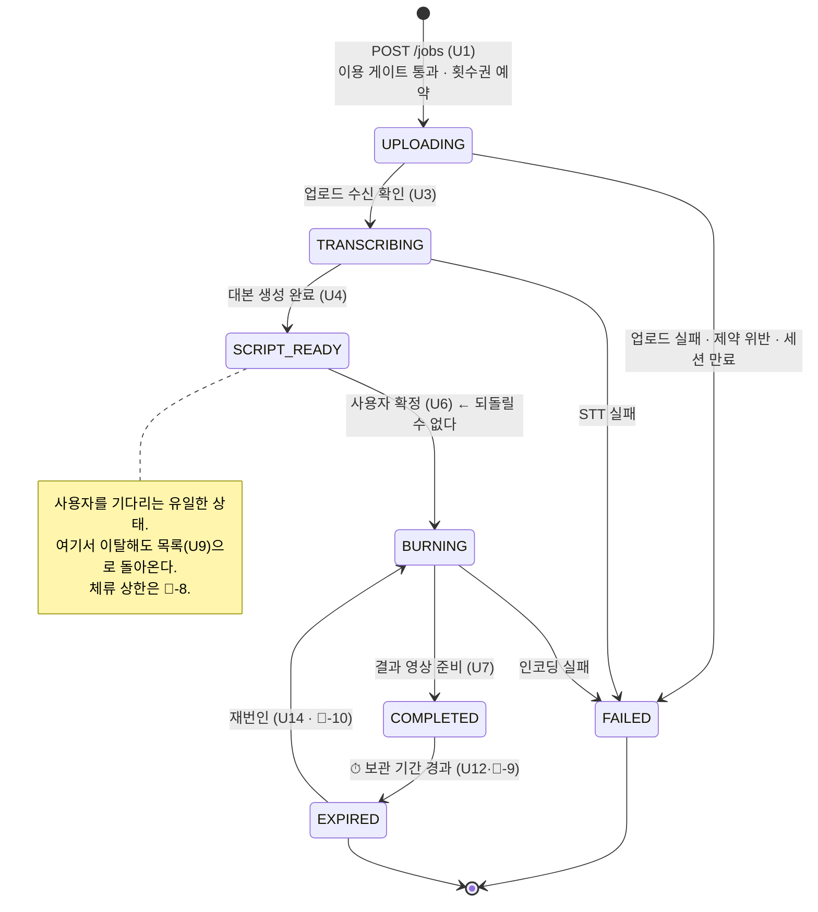

# 자막 생성 파이프라인 — 비즈니스 요구사항 설계서 (subtitle 도메인)

> **성격**: 사용자가 고른 영상에 **자막을 입혀 돌려주는 전 구간**. 이 서비스가 실제로 파는 것이 여기 있다.
> auth 는 "누구인가", payment 는 "쓸 수 있는가"까지 답했고, **"무엇을 받는가"는 이 도메인 몫**이다.
> 결제가 끝난 뒤에 시작되므로 **여기서 실패하면 사용자는 이미 돈을 낸 상태**다 — 그것이 이 도메인의
> 모든 규칙을 지배한다(§4-7).
>
> 비즈니스 요구사항: 2026-08-07 사용자 결정(mvp-v1 쟁점 1·2·6) + 2026-08-11 payment 확정(✅-4·✅-9·✅-17) · §9-1
> 근거: [mvp-v1.md](../../../docs/planning/mvp-v1.md) 1-2·1-4·1-6·1-7, 쟁점 2·6
> 관련: [auth.md](./auth.md) (v4) · [payment.md](./payment.md) (v1) · [error-handling.md](../rule/error-handling.md)
> 상태: **요구사항 초안 — §9-1 🔶 17건 확정 필요.** 확정 전에는 `/develop-design` 으로 넘어가지 않는다.

> ⚠️ **이 문서는 미확정 비율이 가장 높은 도메인 문서다.** auth·payment 는 플랫폼 스펙이 정해준 것이
> 많았지만, 여기는 **원가·처리 시간·저장 용량을 실측해야 정해지는 값**이 대부분이다
> (mvp-v1 스파이크 1~4가 전부 이 도메인에 걸려 있다). 🔶 를 억지로 닫지 않고 그대로 남긴다.

> 📌 **문서가 없어 대조하지 못한 것** — `docs/server/api-spec.md` 는 **아직 존재하지 않는다**
> (auth §10-7 이 생성 대상으로 남겨둔 상태). 따라서 §5 의 경로·스키마는 **선례 대조 없이 제안된 값**이고,
> 공통 규약(`/api/v1`·공통 헤더·인증 게이트)만 auth.md §5-1·§4-2 를 물려받는다.

---

## 용어

| 용어 | 의미 |
|---|---|
| **작업 (job)** | **영상 1편 = 자막 생성 요청 1건.** 이용권 소모·조회·보관·복구가 전부 이 단위다 |
| 대본 (script) | 작업 하나에 딸린 **자막 행의 묶음**. 사용자가 편집하는 대상 |
| 자막 행 (cue) | `시작 시각 · 종료 시각 · 텍스트` 한 줄. 대본의 최소 단위 |
| STT | 음성 → 텍스트 변환. **대본의 초안을 만드는 단계** |
| **번인 (burn-in)** | 대본을 영상 **픽셀에 굽는 것**. 결과 영상에서 자막을 되돌리거나 끌 수 없다 |
| **확정 (commit)** | 사용자가 대본 편집을 마쳤다고 선언하는 행위. **번인의 유일한 트리거**이고 되돌릴 수 없다 |
| **만료 (expired)** | 보관 기간이 지나 **영상 파일이 삭제된 상태**. 작업 자체와 대본은 목록에 남는다(§4-8) |
| 서버 귀책 실패 | 우리·외부 처리 실패. **횟수권을 되돌린다**(payment ✅-4ⓑ) |
| 사용자 귀책 반려 | 제약 위반 입력 등. **소모 자체가 일어나지 않는다**(§4-5) |

> ⚠️ **"작업"과 payment 의 "미결 주문"은 다른 개념이다.** 미결 주문은 *결제됐는데 지급이 안 끝난 주문*,
> 작업은 *지급된 이용권으로 시작한 처리 단위*다.

---

## 1. 배경 · 목적

- MVP 의 판매 약속은 **"폰만으로 기존 영상에 자막을 입혀 받는다"**(mvp-v1 1-1) 하나다.
  auth·payment 는 그 약속에 **닿기 위한 관문**이고, 약속을 실제로 이행하는 것은 이 도메인뿐이다.
- ⚠️ **여기서 "영상 생성"은 텍스트→영상 생성이 아니다.** 그것은 mvp-v1 §4 에서 **명시적으로 기각**됐다
  (원가·품질 리스크). 이 도메인이 생성하는 것은 **자막이 구워진 결과 영상** 하나다.
- **핵심 훅은 "이탈해도 돌아올 자리가 있다"** 이다. 업로드→STT→번인은 수십 초~수 분이 걸리는데
  미니앱은 토스 안이라 알림·전화로 이탈이 쉽다. 그래서 작업 목록은 아카이브가 아니라 **복구 장치**다
  (mvp-v1 쟁점 6). 이것이 없으면 **돈을 낸 사용자가 결과물을 잃는다.**
- ⚠️ **되돌릴 수 없는 지점이 둘 있다** — ① 대본 확정 이후의 번인 ② 보관 기간 경과 후의 영상 삭제.
  이 도메인의 정책 대부분은 이 두 지점을 사용자가 **모르고 지나치지 않게** 만드는 데 쓰인다.

---

## 2. 범위 결정 — 무엇을 하고 / 안 하는가

| 구분 | 포함 | 내용 |
|---|---|---|
| 작업 생성 · 입력 제약 서버 검증 | ✅ | 이용 게이트 통과 후 작업을 열고, **제약 위반은 처리 착수 전에 반려**(§4-3) |
| 원본 영상 수신 | ✅ | 업로드 경로 자체는 🔶-3. **수신 완료를 서버가 확인하는 것**은 확정 |
| STT 자막 생성 | ✅ | 타임스탬프가 붙은 대본 초안 산출 |
| 대본 조회 · 편집 · 확정 | ✅ | 행 텍스트 수정. **확정이 번인 트리거**(§4-6) |
| 자막 번인 · 결과 영상 제공 | ✅ | 프리셋 **1종 고정**(mvp-v1 1-4 제외 항목의 귀결) |
| 작업 상태 조회(폴링) · 작업 목록 | ✅ | **검수 "인터랙션 2초"의 직접 대응**(§4-2) · 이탈 복구(mvp-v1 쟁점 6) |
| 실패 시 횟수권 복구 요청 | ✅ | 판정은 이 도메인, **잔량 조작은 payment 몫**(§4-5) |
| 보관 기간 경과 시 영상 삭제 | ✅ | 기간·범위는 🔶-9 |
| 결제 · 이용권 잔량 관리 | ❌ | `payment` 몫. 이 도메인은 **게이트를 통과했는지만** 안다 |
| 사용자 식별 · 토큰 | ❌ | `auth` 몫(auth §4-2 게이트를 그대로 물려받는다) |
| **솔루션 목록 · 상세(S1·S2)** | ❌ | 🔶-16 — 별도 소유자 결정 필요. auth §4-2 는 이미 **공개 엔드포인트로 열거**해 놓았다 |
| 자막 스타일 커스터마이징 | ❌ | mvp-v1 1-4 제외 — 프리셋 1종. **선택지는 이탈 지점이다** |
| 번역 · 다국어 자막 | ❌ | mvp-v1 1-4 제외 |
| 폴더 · 검색 · 이름변경 | ❌ | mvp-v1 쟁점 6 ⓒ 기각 — 작업이 수십 개 쌓인 뒤의 문제 |
| 완료된 결과의 자막 재편집 | ❌ | §8 백로그. **번인은 되돌릴 수 없다**(§4-7) |
| 결과 영상의 갤러리 저장 **구현** | ✅(계약만) | 저장 수단은 클라 SDK 몫이고 **경로 자체가 미확인**(스파이크 4) → 🔶-11 |
| 처리 완료 푸시 알림 | ❌ | §8 백로그. MVP 는 **폴링으로만** 복귀를 지원한다 |

---

## 3. 기능 요구사항

| # | 요구 | 설명 |
|---|---|---|
| **U1** | 작업 생성 | 이용 게이트(payment §4-10) 통과 시 작업을 열고 **원본 업로드 자리**를 내준다. 이 호출이 **횟수권 예약 시점**이다(payment ✅-4ⓐ) |
| **U2** | 입력 제약 서버 검증 | 용량·해상도·형식이 상한을 넘으면 **처리 착수 전에 반려**한다. 프론트 사전 검사가 있어도 **서버가 다시 본다** — 클라 주장을 믿지 않는다(payment U2 와 같은 규율) |
| **U3** | 원본 수신 확인 | 업로드가 실제로 끝났음을 **서버가 확인한 뒤에만** 처리에 들어간다. 클라의 "다 올렸다"만으로 착수하지 않는다 |
| **U4** | 자막 대본 생성 | 음성에서 **타임스탬프가 붙은 대본**을 만든다. 무음 영상은 **대본 0행으로 끝날 수 있고, 그것을 성공으로 볼지 실패로 볼지는 미확정**(§4-4 · 🔶-17) |
| **U5** | 작업 상태 조회 | 진행 단계·진행률·실패 사유를 언제든 조회할 수 있다. **처리 API 는 결과를 기다리지 않고 즉시 응답한다**(§4-2) |
| **U6** | 대본 조회 · 편집 · 확정 | 사용자가 행 텍스트를 고치고 확정한다. **확정이 번인의 유일한 트리거**다(§4-6) |
| **U7** | 자막 번인 | 확정된 대본으로 결과 영상을 만든다. **프리셋 1종 고정** |
| **U8** | 결과 영상 수령 | 완료된 작업의 결과를 **본인만** 받을 수 있게 제공한다(§4-9) |
| **U9** | 작업 목록 | 최근 작업과 상태를 돌려준다. **이탈 복구가 목적**이지 아카이브가 아니다(mvp-v1 쟁점 6) |
| **U10** | 실패 시 횟수권 복구 | **서버 귀책 실패는 전부 복구**한다(payment ✅-4ⓑ·U8). 🔴 여기서 잃으면 **돈 내고 결과물이 없다** |
| **U11** | 진행 중 작업 보호 | 처리 도중 이용권이 만료·회수돼도 **그 작업은 끝까지 처리**한다(payment ✅-17 확정) |
| **U12** | 보관 · 만료 | 보관 기간이 지나면 **영상 파일을 삭제**하고 작업은 "만료됨"으로 남긴다. 대본은 유지한다(mvp-v1 쟁점 6 방향) |
| **U13** | 작업 소유권 | 작업·대본·결과는 **생성한 사용자만** 접근한다. 남의 작업은 **존재 자체를 알려주지 않는다**(§4-9) |
| **U14** | 만료 후 재번인 | 만료된 작업을 **보관된 대본으로 번인만 다시** 실행한다 — mvp-v1 쟁점 6 이 재사용 가치의 근거로 든 항목. **허용 여부·과금은 🔶-10** |

> **U1·U7 은 원가가 드는 유일한 행위다.** 나머지는 조회이고, payment §4-10 이 게이트 대상을
> "작업 생성"으로 한정한 근거가 여기 있다 — **이미 만든 결과물은 이용권 없이도 봐야 한다.**

---

## 4. 비즈니스 규칙 (정책 상세)

### 4-1. 작업 진행 상태 — 프론트 화면 분기의 근거 [계약]

**프론트는 이 상태 하나로 S5(처리 중)·S6(대본 편집)·S7(결과)·S8(목록)을 분기한다.**
따라서 상태 이름은 내부 구현이 아니라 **계약**이다 — 그래서 **아래 상태값 7종은 제안값이고 🔶-14 에 묶인다**
(§5-3 응답 `status` 필드의 값 그 자체다). **단계가 이렇게 나뉜다는 사실**은 mvp-v1 1-2 여정 ⑤~⑧ 의
귀결이라 확정이고, **미확정인 것은 이름과 개수**다.



| 상태 | 사용자에게 보이는 말 | 프론트 화면 | 폴링 |
|---|---|---|---|
| `UPLOADING` | 올리는 중 | S5 | ✅ |
| `TRANSCRIBING` | 자막 만드는 중 | S5 | ✅ |
| `SCRIPT_READY` | **내 확인 대기** | **S6 로 이동** | ❌ 멈춘다 |
| `BURNING` | 영상 만드는 중 | S5 | ✅ |
| `COMPLETED` | 완료 | S7 | ❌ |
| `EXPIRED` | 만료됨(영상 삭제) | S8 목록에만 | ❌ |
| `FAILED` | 실패 + 사유 | S8/S5 안내 | ❌ |

- ⚠️ **`SCRIPT_READY` 는 "처리 중"이 아니다.** 여기서 "잠시만 기다려주세요"를 띄우면
  **사용자가 영원히 기다린다** — 서버는 사용자를 기다리는데.
- **되돌아가는 전이는 없다**(재번인 제외). 대본 확정 후 되돌리기를 열면 번인 원가가 무제한이 된다 → §8.

### 4-2. 비동기 · 폴링 — 검수 "인터랙션 2초"의 직접 대응 [공통 승격 후보]

- **모든 API 는 처리 완료를 기다리지 않고 즉시 응답한다.** 업로드 수신·STT·번인은 전부 **작업 뒤편**에서
  돈다(mvp-v1 1-7). 이 규칙이 깨지면 **검수 반려 사유**다.
- 프론트는 상태 조회를 **주기적으로 반복**한다. 주기·타임아웃·백오프는 🔶-6.
- ⚠️ **폴링을 멈춰야 하는 상태를 프론트가 알아야 한다**(§4-1 표) — `SCRIPT_READY` 에서 계속 돌면
  사용자 대기 상태에 서버 부하만 쌓인다.
- ⚠️ **처리 시간 상한이 없으면 `TRANSCRIBING` 이 영원히 끝나지 않는 작업이 생긴다** → 🔶-7.

### 4-3. 입력 영상 제약 — 🔶 수치는 하나도 확정되지 않았다

**방향만 확정됐다**(mvp-v1 쟁점 2, 2026-08-07 사용자 결정):

| 확정된 방향 | 내용 |
|---|---|
| 기준 축 | **길이가 아니라 용량·해상도**로 제한한다 |
| 방향(가로/세로) | **둘 다 허용한다** |
| 2중 기준 | **안내는 길이로, 방어는 용량으로** — 용량은 사용자가 예측할 수 없기 때문 |
| 반려 시점 | **선택 직후 즉시.** 업로드 시작 후 실패는 최악의 UX |
| 앱 버전 하한 | **토스앱 5.261.0 이상**(`getAlbumItems` 하한). 미만은 안내 후 종료 |

- **수치(용량·해상도·길이·형식)는 전부 🔶-1** — mvp-v1 스파이크 1~3 결과가 나와야 정한다.
  ⚠️ **문서에 논의값(50MB·1080p·3분)이 적혀 있지만 확정된 적이 없다**(mvp-v1 1-6 명시).
- ⚠️ **클라 사전 검사는 UX 장치이고 방어가 아니다**(U2). 서버가 다시 본다.
- **다운스케일을 클라에서 할지 서버에서 할지도 미정**(🔶-2) — 이 선택이 **업로드 용량 상한의 의미를 바꾼다**
  (클라 다운스케일이면 상한은 "변환 후" 기준이 된다).

### 4-4. 대본이 비어 있는 경우 (U4) — 🔶-17

- 무음·음성 없는 영상은 **대본 0행**으로 끝난다. 이것을 **정상 완료로 볼지 실패로 볼지가 미확정**(🔶-17)이고,
  판정에 따라 **이용권 복구 여부(U10)가 정반대**가 된다.
- ⚠️ 어느 쪽이든 **사용자가 그 사실을 확정 전에 알아야 한다**(S6 에서 "인식된 음성이 없습니다").
  0행 대본으로 번인하면 **원본과 똑같은 영상에 이용권 1회를 쓴다.**
- 0행 상태에서 확정을 허용할지는 별개 결정이다 → 🔶-5.

### 4-5. 이용권 연동 — 무엇을 이 도메인이 하고 무엇을 payment 가 하나

**payment 가 이미 확정한 것**(2026-08-11, payment §9-1)을 그대로 물려받는다. **여기서 다시 정하지 않는다.**

| 축 | 확정값 | 출처 |
|---|---|---|
| 게이트 대상 | **작업 생성만.** 조회·목록·결과 수령은 게이트 없음 | payment §4-10 ✅-9 |
| 차감 시점 | **작업 생성 시 예약 → 완료 시 확정** | payment ✅-4ⓐ |
| 복구 범위 | **서버 귀책 실패는 전부 복구** | payment ✅-4ⓑ · U8 |
| 소모 순서 | **기간권 우선** — 구독 중에는 횟수권을 보존 | payment ✅-4ⓒ |
| 진행 중 만료 | **끝까지 처리한다** | payment ✅-17 |

- ✅-9 는 *"대상이 `subtitle` 엔드포인트라 그 문서와 함께 확정이 자연스럽다"* 고 적혀 있다 —
  **§5 의 엔드포인트 목록이 그 확정의 대상**이다.
- **이 도메인은 잔량을 직접 만지지 않는다.** "게이트를 통과했는가", "이 작업이 실패했는가"를
  payment 에 알릴 뿐이다. 방식(모듈 공개 API / 이벤트)은 **설계 몫**이다.
- 🔴 **U10 이 이 도메인 최대의 금전 리스크다.** 실패 통지가 유실되면 사용자는 **돈을 내고 결과물도 이용권도
  잃는다.** 반대 방향(실패인데 두 번 복구)은 무료 이용권 유출이다. 어느 쪽도 조용히 넘어가면 안 된다.
- ⚠️ **사용자 귀책 반려(§4-3 제약 위반)는 복구 대상이 아니라 애초에 소모가 없어야 한다** —
  게이트 통과 후 즉시 반려되는 경로라 **예약 자체를 하지 않는 것이 자연스럽다**. 순서는 설계 몫이지만
  **"반려됐는데 잔량이 줄었다"는 상태가 존재해서는 안 된다**는 것이 요구다.

### 4-6. 대본 편집 · 확정 (U6)

| 규칙 | 내용 |
|---|---|
| 편집 가능 대상 | **행 텍스트만.** 시각(start/end)·행 추가·삭제·병합은 **MVP 제외** → §8 |
| 편집 가능 시점 | `SCRIPT_READY` 에서만. 그 외 상태의 편집 요청은 거부(§7 `JOB_002`) |
| 확정 | **되돌릴 수 없다.** 확정 즉시 `BURNING` 으로 넘어간다 |
| 임시 저장 | 🔶-4 — 편집 중 이탈 시 수정분 보존 여부 |
| 검증 | 행 길이 상한·전체 행 수 상한 — 🔶-5 |
| 미편집 확정 | **허용한다.** STT 결과 그대로 번인하는 것이 정상 경로다 |

- ⚠️ **확정은 원가가 확정되는 순간이다.** 프론트는 확정 버튼에 **되돌릴 수 없음을 명시**해야 한다
  (다크패턴 금지 규정상 "CTA 만 보고 다음 행동을 예상할 수 없는 경우"는 출시 불가 사유 — payment §6-5).
- **확정 요청은 멱등해야 한다** — 같은 작업에 확정이 두 번 오면 두 번째는 **에러가 아니라
  현재 상태를 그대로 돌려준다**(payment §4-5 와 같은 원칙). 네트워크 재시도로 **번인이 두 번 돌면
  원가가 두 배**가 된다.

### 4-7. 되돌릴 수 없는 것 · 실패 분류 (U10)

| 분류 | 예 | 이용권 | 사용자 안내 |
|---|---|---|---|
| **사용자 귀책 반려** | 제약 위반 입력·업로드 세션 만료 | **소모 없음**(§4-5) | 사유 + 다시 시도 가능 |
| **서버 귀책 실패** | STT 실패·인코딩 실패·저장 실패 | **복구**(payment ✅-4ⓑ) | "실패했고 이용권은 돌려드렸다" |
| 외부 의존 실패 | STT 제공자 장애 | **복구** | 위와 같음 |
| 처리 시간 초과 | 상한(🔶-7) 초과 | **복구** | 위와 같음 |

- **자동 재시도 여부는 🔶-12.** 재시도가 없으면 일시적 장애가 전부 사용자 노출이 되고,
  있으면 원가가 배로 든다. **어느 쪽이든 이용권 복구와 이중 계산되지 않아야 한다**는 것이 요구다.
- ⚠️ **`BURNING` 실패는 특히 나쁘다** — 사용자가 이미 대본을 편집하는 **노동을 했다.**
  이 경우 **대본은 보존**해야 재시도가 노동을 반복시키지 않는다.

### 4-8. 보관 · 만료 (U12) — 🔶 기간·범위 전부 미확정

**방향만 확정**(mvp-v1 쟁점 6 ⓑ, 2026-08-07 사용자 결정):

- **영상 파일**(원본·결과)은 일정 기간 후 **자동 삭제**한다 — 스토리지 원가 + 개인정보 리스크.
- **작업 레코드와 대본은 유지**한다 — 텍스트 보관 비용이 사실상 0 이고, 만료 작업의 **재사용 근거**가 된다.
- 만료된 작업은 목록에서 **사라지지 않고 "만료됨"으로 남는다.**

**🔶 로 남은 것**: 원본/결과 각각의 보관 기간 · 대본 보관 기간 · 목록에 남길 작업 수 (🔶-9),
만료 후 재번인 허용 여부와 그때 이용권을 다시 받을지 (🔶-10).

- ⚠️ **원본과 결과의 보관 기간이 같을 이유가 없다.** 원본은 번인이 끝나면 **재번인(U14) 외에는 쓸 곳이 없고**,
  결과는 사용자가 받아 가야 하는 물건이다. 🔶-9 는 이 둘을 나눠 정한다.
- ⚠️ **사용자 업로드 영상은 개인 콘텐츠다.** 보관 기간은 원가 문제이기 전에 **약속의 문제**이므로,
  화면에 고지한 기간과 실제 삭제 시점이 달라서는 안 된다.
- ⚠️ **회원 탈퇴·삭제 요청 경로는 여전히 없다**(auth §8 이 "보관 정책 미확정이라 함께 미룬다"고 적어둔
  바로 그 항목이다). 🔶-9 가 닫히면 **auth 백로그도 함께 풀린다.**

### 4-9. 작업 소유권 (U13)

- 작업·대본·결과는 **생성한 사용자(auth 의 `userId`)만** 접근한다.
- **남의 작업 조회는 404 로 답한다** — 403 은 "그 작업이 존재한다"는 사실을 알려준다.
  payment U14(`orderId` 비노출)와 같은 규율이다.
- **결과 영상 링크는 추측 불가능하고 수명이 짧아야 한다.** 링크가 곧 영상 접근 권한이 되므로,
  링크 자체가 자격 증명이 된다는 사실을 계약에 명시한다(구체 방식은 🔶-3 과 함께).
- ⚠️ **익명키 유출 리스크(auth §4-1)가 여기서는 "남의 영상이 새는 것"으로 나타난다.**
  auth 가 감수하기로 한 리스크의 **실제 피해 지점이 이 도메인**이다 — 막을 수단은 여전히 없다.

### 4-10. 동시 작업 (🔶-13)

- 한 사용자가 동시에 여러 작업을 돌릴 수 있는지, 몇 개까지인지 미확정.
- ⚠️ **기간권(구독)은 무제한 이용권이라 상한이 없으면 한 사용자가 처리 자원을 전부 점유할 수 있다.**
  payment ✅-17 도 *"무제한이면 만료 직전 대량 투입 가능"* 을 리스크로 적어놨다.
- 처리 자원이 워커 1대 수준이면 **대기열 길이가 곧 사용자 대기 시간**이 된다 → 🔶-7 과 함께 정한다.

---

## 5. API 계약 (초안 — 확정 후 `docs/server/api-spec.md` 반영)

> 공통 규약은 auth.md §5-1 을 물려받는다 — 경로 prefix `/api/v1`, 인증 필요 엔드포인트는
> `Authorization: Bearer {access}`, 에러 본문 `{ "code", "message" }` 고정.
> **아래 경로·스키마·필드는 전부 제안값(🔶-14)** 이고, 프론트 계약이라 임의 확정하지 않는다.

**엔드포인트 목록과 게이트** — 이 표가 payment ✅-9 확정의 대상이다.

| # | 엔드포인트 | 인증 | 이용 게이트 | 비고 |
|---|---|---|---|---|
| 5-1 | `POST /api/v1/jobs` | ✅ | **✅ + 횟수권 예약** | 작업 생성 |
| 5-2 | `POST /api/v1/jobs/{jobId}/upload-complete` | ✅ | ❌ | 업로드 수신 통지 (🔶-3 에 종속) |
| 5-3 | `GET /api/v1/jobs/{jobId}` | ✅ | ❌ | 상태 폴링 |
| 5-4 | `GET /api/v1/jobs/{jobId}/script` | ✅ | ❌ | 대본 조회 |
| 5-5 | `PUT /api/v1/jobs/{jobId}/script` | ✅ | ❌ | **편집 + 확정** |
| 5-6 | `GET /api/v1/jobs/{jobId}/result` | ✅ | ❌ | 결과 수령 |
| 5-7 | `GET /api/v1/jobs` | ✅ | ❌ | 작업 목록 |

- **조회 계열에 게이트가 없는 이유**: *"이미 만든 결과물은 이용권 없이도 봐야 한다"*(payment §4-10).
  구독이 끊긴 뒤에도 **완료된 결과는 만료 전까지 받을 수 있어야 한다.**
- 리소스 이름을 `jobs` 로 둔 이유와 `subtitles` 대안은 🔶-14.

### 5-1. `POST /api/v1/jobs` — 작업 생성

```
POST /api/v1/jobs            Authorization: Bearer {access}
{ "sizeBytes": 41943040, "durationMs": 143000, "width": 1080, "height": 1920, "mimeType": "video/mp4" }
```

**응답 201**

```json
{ "jobId": "…", "status": "UPLOADING",
  "upload": { "url": "…", "method": "PUT", "expiresAt": "2026-08-12T12:40:00+09:00" } }
```

| 필드 | 의미 · 프론트 용도 |
|---|---|
| `jobId` | 이후 모든 호출의 키. **추측 불가능해야 한다**(§4-9) |
| `status` | §4-1 상태값. 생성 직후는 항상 `UPLOADING` |
| `upload` | **업로드 경로가 🔶-3 에 종속된다** — 서버 직접 수신이면 이 객체 자체가 사라지고 요청이 멀티파트가 된다 |

- 요청의 메타데이터는 **제약 검사용**이다(§4-3). ⚠️ **클라 신고값이므로 실제 파일과 다를 수 있다** —
  수신 후 서버가 다시 본다(U2).

### 5-3. `GET /api/v1/jobs/{jobId}` — 상태 폴링

```json
{ "jobId": "…", "status": "TRANSCRIBING", "progress": 42,
  "createdAt": "…", "failure": null, "expiresAt": null }
```

| 필드 | 의미 |
|---|---|
| `status` | §4-1 — **프론트 분기는 이 값 하나로** |
| `progress` | 0~100. 정확도보다 **멈춰 보이지 않는 것**이 목적 |
| `failure` | `FAILED` 일 때만 `{ reason, creditRestored }`. **이용권을 되돌렸는지 프론트가 알아야 안내 문구가 정해진다**(§4-7) |
| `expiresAt` | 만료 예정 시각(`COMPLETED` 이후). 🔶-9 확정 전에는 값이 정해지지 않는다 |

### 5-5. `PUT /api/v1/jobs/{jobId}/script` — 편집 + 확정

```
{ "cues": [ { "index": 0, "text": "안녕하세요" }, … ], "commit": true }
```

- `commit: false` = 임시 저장(🔶-4 가 부결되면 이 필드 자체가 사라진다), `commit: true` = **확정 → 번인 착수.**
- **시각(start/end)은 요청에 담지 않는다** — MVP 에서 편집 대상이 아니다(§4-6).
- **응답은 5-3 과 같은 상태 객체**로 통일한다(payment §5-3 의 "두 경로의 응답 모양이 같아야 한다" 선례).
- **확정 후 재확정은 200** — 멱등(§4-6).

### 5-6. `GET /api/v1/jobs/{jobId}/result` — 결과 수령

```json
{ "jobId": "…", "downloadUrl": "…", "expiresAt": "2026-08-12T13:10:00+09:00" }
```

- ⚠️ **`downloadUrl` 은 그 자체가 접근 권한**이다(§4-9). 수명은 짧게 두고 **로그에 남기지 않는다.**
- 만료된 작업은 **410 `JOB_005`** — 200 에 `null` 을 담지 않는다. 프론트 분기가 달라진다.
- ⚠️ **프론트가 이 URL 로 무엇을 하는지는 스파이크 4 에 걸려 있다**(🔶-11) — 갤러리 저장 경로가
  없으면 "받았는데 폰에 남길 방법이 없다"가 되어 **U8 이 사실상 미완성**이 된다.

### 5-7. `GET /api/v1/jobs` — 작업 목록

```json
{ "jobs": [ { "jobId": "…", "status": "COMPLETED", "createdAt": "…", "thumbnailUrl": null } ] }
```

- **최신순.** 개수 상한·페이지네이션 방식은 🔶-9 (목록에 남길 작업 수와 같은 결정이다).
- 썸네일 제공 여부도 🔶-9 에 묶는다 — 제공하면 만료 후에도 남길지가 함께 결정된다.

---

## 6. API 호출 흐름 (프론트 ↔ 백엔드)

### 6-1. 작업 생성 · 업로드 (S4 → S5)

```
[S4 영상 선택] SDK Device.getAlbumItems({ types:['VIDEO'] })
 ├─ 토스앱 5.261.0 미만 → 안내 후 종료 (서버 호출 없음)
 ├─ 프론트 사전 검사(용량·해상도 — 🔶-1) 위반 → 즉시 반려 안내 (서버 호출 없음)
 └─ 통과
     → POST /api/v1/jobs { 메타데이터 }
        ├─ 201 { jobId, upload } → 업로드 진행 → POST /jobs/{id}/upload-complete → S5
        │     └─ 업로드 실패/세션 만료 → 400 JOB_003 → "다시 시도" (이용권 소모 없음 — §4-5)
        ├─ 400 JOB_003 (서버 제약 검증 실패) → 사유 안내 + 다른 영상 선택. 소모 없음
        ├─ 403 PAY_001 (이용권 없음) → 결제 유도(S3). ❗401 과 다른 화면
        ├─ 403 PAY_007 (구독 상태 미확인) → payment §6-7 재확인 흐름. ❗결제 유도 금지
        ├─ 409 JOB_004 (동시 작업 초과 — 🔶-13) → 진행 중 작업으로 이동(S8)
        └─ 401 AUTH_004 → refresh 후 1회 재시도 (auth §6-2 인터셉터)
```

### 6-2. 처리 중 폴링 · 이탈 복귀 (S5 ↔ S8)

```
[S5] GET /api/v1/jobs/{jobId}   (주기 🔶-6)
 ├─ 200 UPLOADING/TRANSCRIBING/BURNING → 진행률 갱신, 폴링 계속
 ├─ 200 SCRIPT_READY → 폴링 중단 → S6 대본 편집으로 이동
 ├─ 200 COMPLETED   → 폴링 중단 → S7 결과
 ├─ 200 FAILED { failure } → 폴링 중단 → 사유 안내
 │      └─ failure.creditRestored:true → "이용권을 돌려드렸다" 안내 + payment §6-4 로 잔량 재조회
 ├─ 404 JOB_001 → 남의 작업이거나 없는 작업. 목록으로 복귀
 └─ 500 COMMON_002 → 백오프 재시도. ❗폴링을 멈추지 않는다 (진행 중 작업을 잃은 것이 아니다)

[앱 재진입 · S8 작업 목록] POST /api/v1/bootstrap (auth §6-1) → GET /api/v1/jobs
 ├─ 200 { jobs: [] }  → 빈 목록 안내. S1 배너 없음
 ├─ 200 { jobs }      → 최신순 렌더링. 진행 중 작업이 있으면 S1 에 배너 노출
 │                       → 탭하면 S5 로 복귀 (mvp-v1 1-3 S8 — 이탈 복구의 실체)
 ├─ 401 AUTH_004 → refresh 후 1회 재시도 / AUTH_001·002·005 → 부트스트랩 재로그인 (auth §6-2)
 └─ 500 COMMON_002 → 백오프 재시도. ❗빈 목록으로 그리지 않는다
                     (진행 중 작업이 있는데 없다고 그리면 사용자가 결과물을 잃었다고 판단한다)
```

- **목록에는 이 도메인 전용 에러 코드가 없다** — 조회이고 게이트도 없어(§5 표) 실패 경로가
  인증(`AUTH_*`)과 서버 오류(`COMMON_002`)뿐이다.

### 6-3. 대본 편집 · 확정 (S6 → S5 → S7)

```
[S6 진입] GET /api/v1/jobs/{jobId}/script
 ├─ 200 { cues: [] } (0행) → "인식된 음성이 없습니다" 안내 (§4-4). 확정 허용 여부 🔶-5
 ├─ 200 { cues } → 행별 편집 UI
 └─ 409 JOB_002 (SCRIPT_READY 아님) → 현재 상태 화면으로 이동

[확정] PUT /api/v1/jobs/{jobId}/script { cues, commit:true }
 ├─ 200 { status:"BURNING" } → S5 로 이동 + 폴링 재개
 ├─ 200 (이미 확정됨 — 멱등) → 현재 상태로 이동. ❗에러로 안내하지 않는다
 ├─ 400 COMMON_001 (행 길이·개수 위반 — 🔶-5) → 해당 행 표시
 ├─ 409 JOB_002 (상태 불일치) → 현재 상태 화면으로 이동
 └─ 401/500 → auth §6-2 · 백오프. ❗편집 내용을 화면에서 날리지 않는다
```

### 6-4. 결과 수령 (S7)

```
[S7] GET /api/v1/jobs/{jobId}/result
 ├─ 200 { downloadUrl, expiresAt } → 미리보기 → 저장/공유 (SDK 경로 🔶-11)
 │     └─ 저장 실패 → 재시도 가능해야 한다. ❗여기서 잃으면 다시 받을 방법이 없다(mvp-v1 쟁점 6-3)
 ├─ 410 JOB_005 (만료) → "보관 기간이 지났습니다" + 재번인 가능 여부 안내(🔶-10)
 ├─ 409 JOB_002 (아직 COMPLETED 아님) → S5 로 이동
 └─ 404 JOB_001 → 목록으로 복귀
```

### 6-5. 실패와 이용권 복구

```
[처리 실패 감지] 서버가 작업을 FAILED 로 바꾸고, 서버 귀책이면 횟수권을 되돌린다(U10)
 → 프론트는 6-2 폴링에서 FAILED 를 받는다
    ├─ creditRestored:true  → "실패 · 이용권 복구됨" + payment §6-4 로 잔량 재조회
    └─ creditRestored:false → 사용자 귀책 반려 (애초에 소모가 없었다 — §4-5)
```

---

## 7. 에러 코드 · 정책

**신규 5건.** 접두사는 🔶-15 (도메인명은 `subtitle` 이지만 리소스는 `job` 이다).

| 코드(제안) | HTTP | 의미 | 프론트 행동 |
|---|---|---|---|
| `JOB_001` | 404 | 작업 없음 **또는 남의 작업** | 목록으로 복귀. ❗**두 경우를 구분해 알려주지 않는다**(§4-9) |
| `JOB_002` | 409 | **현재 상태에서 허용되지 않는 요청** | 현재 상태 화면으로 이동. 재시도 무익 |
| `JOB_003` | 400 | **입력 영상 제약 위반**(§4-3) | 사유 안내 + 다른 영상 선택. **이용권 소모 없음** |
| `JOB_004` | 409 | 동시 작업 수 초과(🔶-13) | 진행 중 작업으로 이동 |
| `JOB_005` | 410 | **만료된 작업**(영상 삭제됨) | 재번인 안내(🔶-10) 또는 새 작업 |

- **기존 게이트가 그대로 적용된다** — 인증은 `AUTH_001/002/004/005`(auth §7), 이용권은
  `PAY_001`(결제 유도)·`PAY_007`(재확인). **이 도메인은 401·403 을 직접 만들지 않는다.**
- **처리 실패는 에러 코드가 아니라 상태다**(`FAILED` + `failure.reason`) — 실패는 비동기로 일어나므로
  요청에 대한 응답으로 전달될 수 없다.
- `JOB_003` 을 `COMMON_001` 로 합치지 않는 이유: 프론트 행동이 다르다 —
  **입력값 검증 실패는 "고쳐서 다시", 영상 제약 위반은 "다른 영상을 고르라"** 다.
- 네이밍 규약 정본: [error-handling.md](../rule/error-handling.md) · 코드 정본:
  [ErrorCode.java](../../src/main/java/kang20/ytcreator/shared/exception/ErrorCode.java).

---

## 8. 백로그 (이번 범위 제외)

| 항목 | 미루는 이유 |
|---|---|
| 자막 스타일 커스터마이징(폰트·색·위치) | mvp-v1 1-4 확정 제외. **선택지가 이탈 지점**이라 프리셋 1종으로 시작 |
| 번역 · 다국어 자막 | mvp-v1 1-4 — 1차 가치와 무관 |
| 대본 행 추가·삭제·병합·시각 조정 | 편집 UI 복잡도가 MVP 범위를 넘는다. **텍스트 수정만으로 대부분의 오인식이 해결**된다 |
| 완료 후 자막 재편집 · 재번인 | 번인은 되돌릴 수 없어 **사실상 새 작업**이다. 과금 정책이 먼저 정해져야 한다(🔶-10 과 다른 축) |
| 폴더 · 검색 · 이름변경 | mvp-v1 쟁점 6 ⓒ 기각 |
| 처리 완료 푸시 알림 | 스마트 발송 연동이 별도 축이다. MVP 는 폴링·배너로 복귀를 지원 |
| 작업 취소(사용자가 중간에 포기) | 취소 시 이용권 복구 여부가 정책 결정이고, **처리 도중 취소는 원가를 이미 쓴 뒤**다 |
| 여러 솔루션(자막 외) 확장 | MVP 는 1종. 다종이 되면 `jobs` 리소스에 종류 축이 생긴다(🔶-14 와 연결) |
| 회원 탈퇴 시 영상·대본 즉시 삭제 | auth §8 과 같은 이유 — **보관 정책(🔶-9)이 닫혀야 정의된다** |
| 결과 영상 워터마크 · 무료 체험 | payment ✅-2 가 무료 체험을 쓰지 않기로 확정 |

---

## 9. 결정 · 변경 이력

### 9-1. 결정 이력

> **확정 완료 — 이 문서가 새로 정한 것은 없다. 전부 다른 문서에서 물려받은 결정이다.**
>
> **(사용자 결정, 2026-08-07 — mvp-v1)**
> - ① **구독 게이트는 사용 앞에 둔다**(쟁점 1 ⓐ) — `목록 → 결제 → 사용`. 체험 구간 없음
> - ② **입력 제약은 용량·해상도 기준, 가로·세로 모두 허용**(쟁점 2 ⓓ). **수치는 미확정 → 🔶-1**
> - ③ **안내는 길이로, 방어는 용량으로**(쟁점 2). 초과는 **선택 직후 즉시 반려**
> - ④ **작업 목록을 둔다 — 폴더·검색은 없다**(쟁점 6 ⓑ). 목적은 아카이브가 아니라 **이탈 복구**
> - ⑤ **영상은 기간 후 삭제, 대본은 유지**(쟁점 6 방향). **기간·범위는 미확정 → 🔶-9**
> - ⑥ **토스앱 5.261.0 이상**(`getAlbumItems` 하한). 미만은 안내 후 종료
> - ⑦ **텍스트→영상 생성은 MVP 에서 기각**(mvp-v1 §4)
>
> **(사용자 결정, 2026-08-11 — payment §9-1, 이 도메인에 그대로 적용)**
> - ⑧ **차감은 작업 생성 시 예약 → 완료 시 확정**(✅-4ⓐ)
> - ⑨ **서버 귀책 실패는 이용권 전부 복구**(✅-4ⓑ · payment U8)
> - ⑩ **소모 순서는 기간권 우선**(✅-4ⓒ)
> - ⑪ **이용 게이트는 작업 생성에만**, 조회·결과 수령은 게이트 없음(✅-9 · payment §4-10)
> - ⑫ **진행 중 작업은 이용권이 끊겨도 끝까지 처리한다**(✅-17)

**🔶 미확정 (17건)** — 제안값은 **제안일 뿐 확정이 아니다.**

| # | 항목 | 제안값 | 근거 · 확정 조건 |
|---|---|---|---|
| 🔶-1 | **입력 제약 수치** — 용량·해상도·길이·허용 형식 | 논의값 50MB / 1080p / 3분 (mvp-v1 1-6) | ⚠️ **mvp-v1 이 "하나도 확정되지 않았다"고 명시.** 스파이크 1~3(웹뷰 메모리·업로드 시간·번인 CPU) 실측 후 확정 |
| 🔶-2 | 다운스케일 위치 (클라 / 서버) | **클라** | 서버가 하면 상한 초과 파일이 업로드 구간을 통과해야 한다 — 웹뷰 메모리·대역 부담이 그대로 남는다. 단 클라 인코딩 가능 여부가 스파이크 1 에 걸림 |
| 🔶-3 | **업로드 경로** — 서버 경유 / Object Storage 직업로드 | **직업로드(사전서명 URL)** | app VM 이 1 OCPU·8GB 한 대다. 수십 MB 를 서버가 받아 다시 올리면 **메모리·대역이 이중**으로 든다. 인프라 구성도 이미 Object Storage 직결을 상정. ⚠️ 채택 시 §5-1 의 `upload` 객체와 5-2 통지 API 가 계약에 남고, 부결 시 둘 다 사라진다 |
| 🔶-4 | 대본 편집 임시 저장 | **둔다** | 편집 중 이탈이 흔한 환경(토스 내부)이고, 잃으면 노동 반복이다. 다만 계약이 하나 늘어난다(§5-5 `commit:false`) |
| 🔶-5 | 대본 검증 규칙 — 행 길이·행 수 상한 · **0행 확정 허용 여부** | 0행 확정은 **막는다** | 0행 번인은 원본과 동일한 영상에 이용권 1회를 쓴다(§4-4). 행 길이·수 상한은 번인 렌더링 실측 필요 |
| 🔶-6 | 폴링 주기 · 타임아웃 · 백오프 | 2초 시작, 실패 시 지수 백오프 | 검수 "인터랙션 2초"는 응답 시간 기준이지 폴링 주기 기준이 아니다. 처리 시간(스파이크 2·3)이 나와야 적정 주기가 정해진다 |
| 🔶-7 | **처리 시간 상한** (STT·번인 각각) | — **제안 없음** | ⚠️ 실측 없이 숫자를 적으면 그 숫자가 근거 없이 굳는다(auth 🔶-3 와 같은 이유). 스파이크 2·3 후 확정. **상한이 없으면 끝나지 않는 작업이 생긴다**(§4-2) |
| 🔶-8 | `SCRIPT_READY` 체류 상한 | 보관 기간(🔶-9)과 동일하게 | 확정 전 원본을 계속 들고 있어야 하므로 **스토리지 원가에 직결**. 별도 상한을 두면 사용자가 "확인 대기 중인데 사라졌다"를 겪는다 |
| 🔶-9 | **보관 정책** — 원본 기간 · 결과 기간 · 대본 기간 · 목록 개수 · 썸네일 | — **제안 없음** | ⚠️ mvp-v1 이 *"스토리지 원가 산정 후 결정"* 으로 명시했다(1-7·쟁점 6). **원가 없이 제안하면 화면 고지 문구가 근거 없이 굳는다.** 닫히면 auth 백로그(탈퇴·삭제)도 함께 풀린다 |
| 🔶-10 | **만료 후 재번인(U14)** 허용 여부 · 이용권 재소모 여부 | 허용 · **이용권 재소모** | mvp-v1 쟁점 6 이 재사용 가치의 근거로 들었지만, 번인은 **원가가 다시 드는 행위**다. 무료로 열면 만료를 기다렸다 재번인하는 경로가 생긴다 |
| 🔶-11 | **결과 영상 수령 방식** (갤러리 저장 / 공유 시트 / 링크) | — **제안 없음** | ⚠️ **mvp-v1 스파이크 4 가 "SDK 경로가 있는지" 자체를 미확인**으로 남겨뒀다. 없으면 U8 이 사실상 미완성이 되고 §6-4 흐름이 통째로 바뀐다 |
| 🔶-12 | 서버 귀책 실패의 자동 재시도 | **하지 않는다**(사용자에게 알리고 이용권 복구) | 재시도는 원가가 배로 들고 **이용권 복구와 이중 계산될 위험**이 있다. 실패율이 실측으로 높게 나오면 재검토 |
| 🔶-13 | 동시 작업 수 상한 | **1인 1건** | 구독은 무제한이라 상한이 없으면 처리 자원을 한 사용자가 점유한다(payment ✅-17 이 같은 리스크를 지적). 워커 규모(🔶-7)와 함께 정한다 |
| 🔶-14 | **엔드포인트 경로·스키마 전반**(§5) + **§4-1 작업 상태값 7종**(`UPLOADING`·`TRANSCRIBING`·`SCRIPT_READY`·`BURNING`·`COMPLETED`·`EXPIRED`·`FAILED`) | §5·§4-1 제안값 (`/api/v1/jobs` 계열) | 프론트 계약이라 임의 확정 불가(payment ✅-15 와 같은 성격). 리소스명 `jobs` 대안은 `subtitles` — **솔루션이 늘면 `jobs` 가 유리**하고, 1종 고정이면 `subtitles` 가 명확하다. **상태값은 §5-3 응답 `status` 의 값이자 프론트 화면 분기 근거**라 이름 하나가 곧 계약이다 — 단계가 나뉜다는 사실(mvp-v1 1-2 ⑤~⑧)은 확정, **이름과 개수가 미확정** |
| 🔶-15 | 에러 코드 접두사 | **`JOB_`** | 도메인명은 `subtitle` 이라 규약대로면 `SUB_` 인데, **payment 의 subscription 과 혼동**된다. 규약([error-handling.md](../rule/error-handling.md))에서 벗어나는 선택이라 사용자 확정이 필요 |
| 🔶-16 | **솔루션 목록·상세(S1·S2)의 소유자** | 이 도메인 밖 (프론트 정적 콘텐츠) | MVP 솔루션이 1종이라 서버가 내려줄 내용이 사실상 고정이다. ⚠️ 단 **auth §4-2 가 이미 "솔루션 목록/상세 조회"를 공개 엔드포인트로 열거**해 서버 API 를 전제하고 있다 — 정하지 않으면 그 열거가 주인 없는 계약으로 남는다 |
| 🔶-17 | **무음 영상(대본 0행)이 성공인가 실패인가**(§4-4) | **정상 완료로 본다** | 실패로 처리하면 U10 에 따라 **이용권을 되돌려야 하는데 STT 원가는 이미 발생**했다. ⚠️ 반대로 성공으로 두면 **사용자는 "돈 냈는데 아무 일도 안 일어난 영상"** 을 받는다 — 어느 쪽도 손해가 있어 **사용자 판단이 필요하다.** 🔶-5(0행 확정 허용 여부)와 함께 정해야 조합이 성립한다 |

> ⚠️ **🔶-7·🔶-9·🔶-11 은 제안값을 붙이지 않았다.** 실측(스파이크 1~4)이 없으면 어떤 숫자를 적어도
> 근거가 없고, 근거 없는 숫자가 문서에 박히면 **그대로 확정처럼 굳는다.** auth 🔶-3 과 같은 판단이다.

### 9-2. 버전 이력

초안 단계라 버전을 매기지 않는다(→ [versioning.md](../../../.claude/skills/usecase/references/versioning.md)).

---

## 10. 다음 단계

1. [ ] **§9-1 🔶 17건 사용자 확정** — 특히 🔶-3(업로드 경로)·🔶-14(엔드포인트·상태값)는 **프론트 계약**이라
       먼저 닫아야 §5 가 명세가 된다
2. [ ] **mvp-v1 스파이크 1~4 실행** — 🔶-1·2·5·6·7·8·9·11·13 **9건이 실측(메모리·업로드 시간·번인 CPU·
       스토리지 원가·저장 SDK 경로)에 걸려 있다.** 나머지 8건(🔶-3·4·10·12·14·15·16·17)은
       **지금 바로 정할 수 있다**
3. [ ] payment **✅-9(이용 게이트 대상) 확정 대상이 §5 표**임을 payment.md 에 역참조 반영
4. [ ] `/develop-design subtitle` — 소프트웨어 설계(데이터 모델·모듈 매핑·워커 경계·동시성).
       **payment 와의 통지 방식(모듈 공개 API / 이벤트)을 여기서 정한다**
5. [ ] **`docs/server/api-spec.md` 신규 생성**(auth §10-7 과 동일 항목) — 이 도메인의 §5 가 두 번째 입주자
6. [ ] 구현 → `/docs-sync` — **서버 계약이 신설되므로 프론트 동기화 필수**
