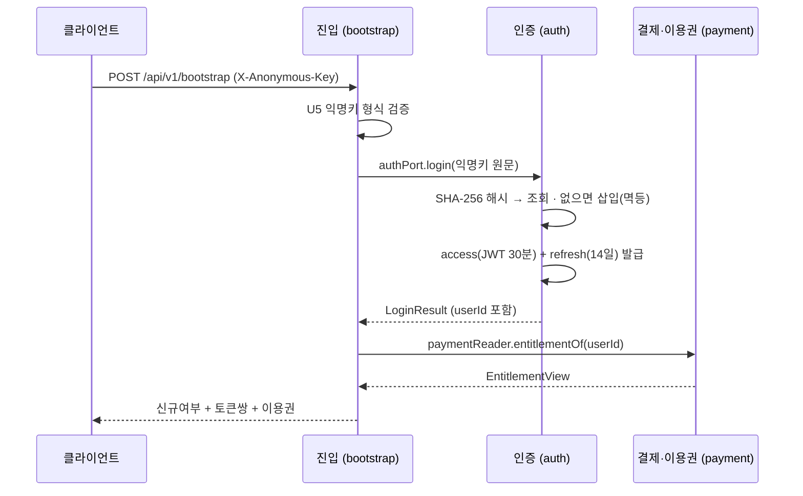
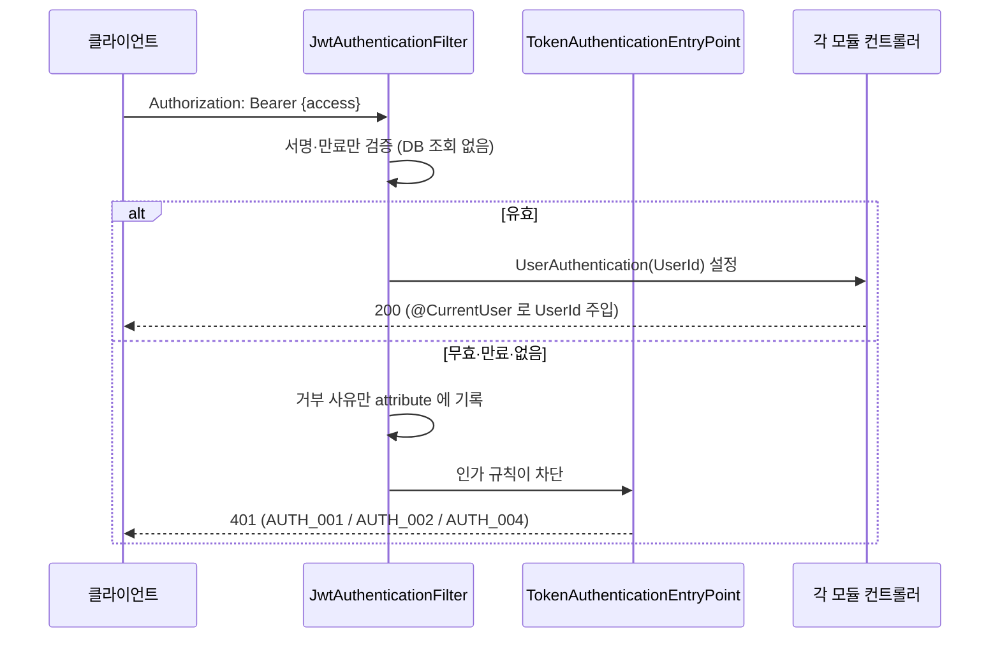

# 인증(auth) 상호작용

> **근거 커밋** `d2d5e26` · **갱신** 2026-08-13
> 그림 [master.md](master.md) · 노트 [auth-notes.md](auth-notes.md) · 상태 전이 [auth-state.md](auth-state.md)

## 흐름 ① 진입 = 로그인

⚠️ `login()` 은 **트랜잭션 밖에서** 불러야 한다. 바깥 트랜잭션을 열면 MySQL `REPEATABLE READ`
스냅샷에 갇혀 경쟁자 행을 재조회하지 못한다. **H2 에서는 재현되지 않고 운영에서만 터진다.**
불변식은 트랜잭션이 아니라 UNIQUE 제약이 지킨다.

**auth 왕복은 1회로 끝난다** — `login()` 이 돌려준 `UserId` 를 payment 에 그대로 넘기므로
payment 가 익명키를 다시 해석하지 않는다.

## 흐름 ② 게이트 통과

⚠️ 필터는 **어떤 경우에도 요청을 거부하지 않는다.** 공개 엔드포인트는 무효 토큰이 와도 200 을
줘야 하므로 필터가 끊으면 그 계약이 깨진다. 판정은 인가 규칙과 엔트리포인트 몫이다.

**DB 를 보지 않는 대가**: 강제 폐기가 access 수명(30분)만큼 지연된다 — 수용된 트레이드오프다.

**만료(`AUTH_004`)를 무효(`AUTH_002`)와 가르는 이유**: 프론트 행동이 다르다. 만료는 refresh 후
1회 재시도, 무효는 재시도 무익·재로그인. 섞이면 30분마다 전 사용자가 재로그인한다.

## 상호작용 요약

| 상대 | 방향 | 수단 | 왜 이 방식인가 |
|---|---|---|---|
| `bootstrap` | ← 호출당함 | `AuthPort.login()` | 진입 1회 왕복. `UserId` 를 받아 payment 에 그대로 넘긴다 |
| `config` | ← 조립당함 | 게이트 부품 (`SecurityConfig`·`WebConfig`) | 필터·엔트리포인트·리졸버를 체인에 꽂는다 |
| `payment` | ← 참조당함 | `UserId` · `auth :: dto` | 값만 가져간다. **auth 는 payment 를 모른다** (단방향 불변식) |
| 자기 자신 | 내부 | `AuthTokenController` → `AuthPort.refresh()` | `POST /api/v1/auth/refresh` — auth 의 유일한 HTTP 엔드포인트. **게이트 밖**이다(access 가 만료된 상태에서 부르는 API) |

**이벤트는 쓰지 않는다** — 현재 auth 는 도메인 이벤트를 발행·구독하지 않는다.
