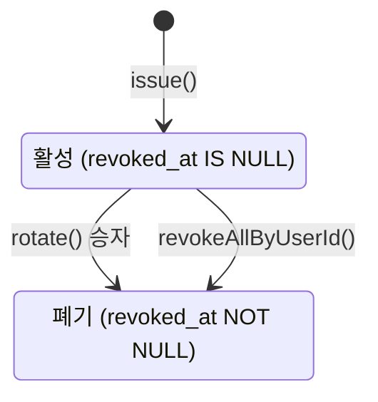

# 인증(auth) 상태 전이

> **근거 커밋** `d2d5e26` · **갱신** 2026-08-13
> 그림 [master.md](master.md) · 노트 [auth-notes.md](auth-notes.md) · 상호작용 [auth-flow.md](auth-flow.md)

상태 필드를 가진 엔티티는 `RefreshToken` 하나다. `User` 에는 상태가 없다 —
탈퇴·정지 개념이 없어 "사용자를 막는다"는 행위가 성립하지 않는다.

## `RefreshToken`

| 전이 | 트리거 | 부수효과 |
|---|---|---|
| `→ 활성` | `login()` · `refresh()` 성공 | 원문을 호출자에게 1회 반환 — 서버에는 해시만 남는다 |
| `활성 → 폐기` (회전) | `refresh()` 정상 경로 | 새 쌍 발급. **조건부 UPDATE 영향 행 수 1 = 승자** |
| `활성 → 폐기` (전체) | 폐기된 토큰 재제출 = 탈취 신호 | 그 사용자의 **활성 토큰 전부** 폐기 + `AUTH_005` |

## 상태와 섞으면 안 되는 축 — 만료

**만료는 상태 전이가 아니다.** `expiresAt <= now` 판정일 뿐 행은 변하지 않는다.

| | 폐기 | 만료 |
|---|---|---|
| 정체 | DB 에 저장된 **사실** (`revokedAt`) | 시각 **비교** (`expiresAt` vs now) |
| 바뀌는 것 | 행이 UPDATE 된다 | 아무것도 안 바뀐다 |
| 되돌아감 | 없음 — 종착역 | 없음 |

**폐기는 종착역이다** — 되살아나지 않고, 삭제되지도 않는다. 14일 만료가 자연 정리한다.
폐기 행을 지우면 재사용 감지가 죽는다 ([auth-notes.md](auth-notes.md) 참조).

## 실패가 전부 `AUTH_005` 하나인 이유

미존재·재사용·만료·경쟁 패배 — 프론트의 행동이 "부트스트랩 재로그인"으로 전부 같아서
구분할 이유가 없다. 코드를 쪼개면 프론트가 쓰지 않는 분기만 늘어난다.
