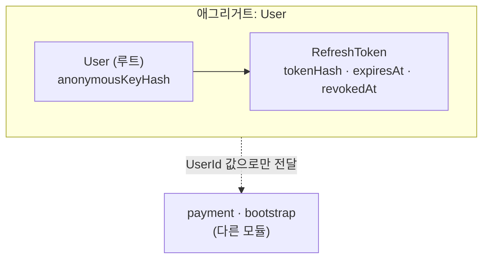
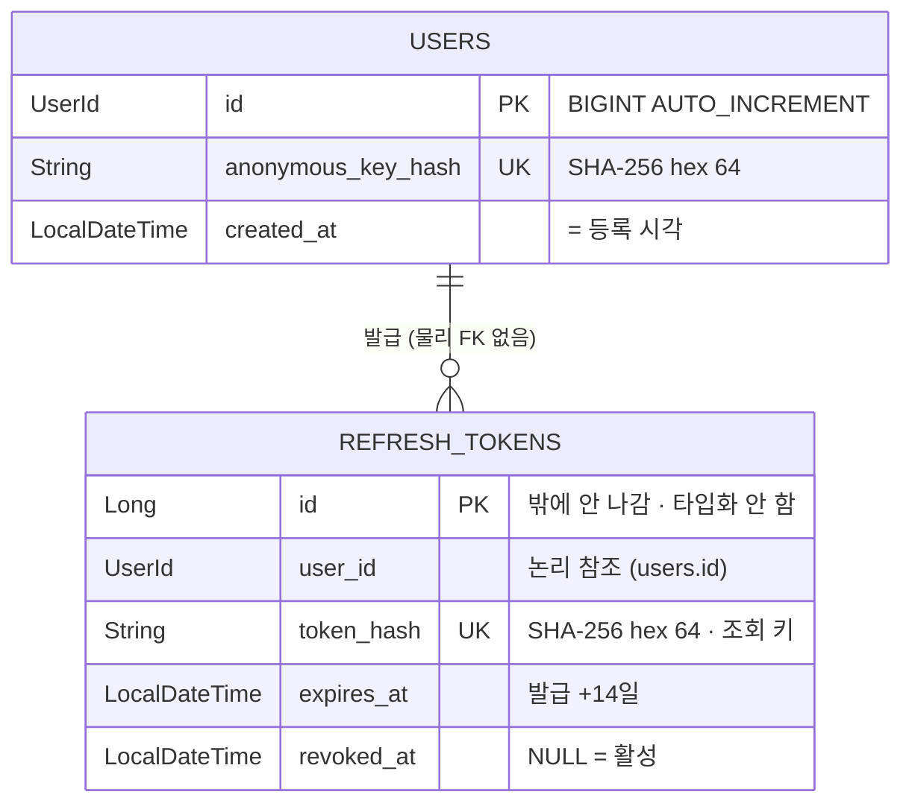
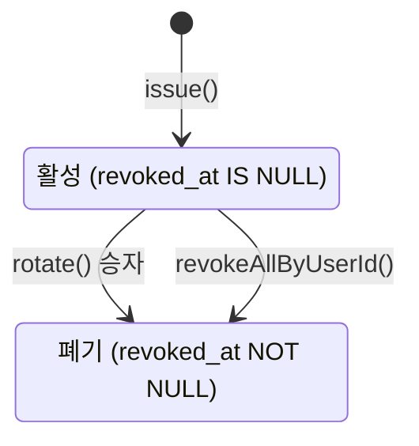
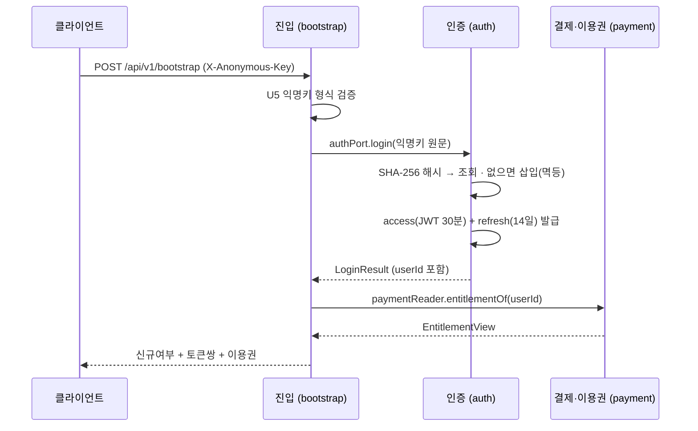
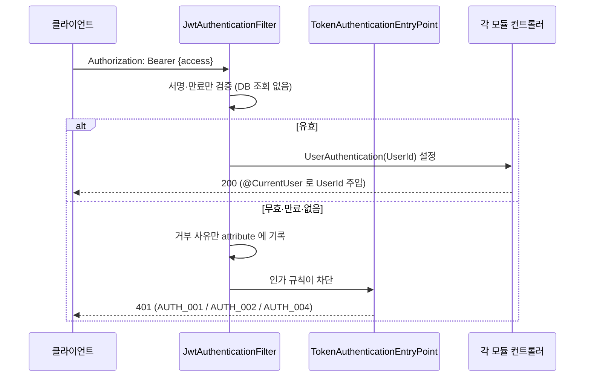

# 인증(auth) 모듈 도메인 모델

> **근거 커밋** `d2d5e26` · **갱신** 2026-08-13 · **작성** `/domain-model auth`
> 요구 [auth.md](../domain/auth.md) · 설계 [auth-design.md](../domain/auth-design.md) · 규칙 [architecture.md](../rule/architecture.md)
>
> ⚠️ 수기 문서다. 코드가 바뀌어도 자동으로 따라오지 않는다 — 엔티티·경계·모듈 간 호출이
> 바뀌면 `/domain-model auth` 로 갱신한다.

## §1 이 모듈은 무엇을 책임지는가

**"이 익명키의 사용자가 존재한다"는 사실**과 **토큰의 발급·검증·회전**에 권위를 갖는다.
결제·이용권·작업은 모른다.

익명키 원문도 refresh 원문도 **저장하지 않는다** — DB 에 남는 것은 SHA-256 hex 64자뿐이다.
사용자 식별은 해시 조회로만 이뤄지고, 원문은 요청·응답 순간에만 메모리에 존재한다.

- **모듈 타입** `CLOSED` (기본)
- **의존 허용** `allowedDependencies = {"shared"}` — ⚠️ **payment 를 영원히 참조하지 않는다**
  (`payment → auth` 단방향이 불변식)
- **밖에 노출한 것**
  | 분류 | 타입 |
  |---|---|
  | 포트 | `AuthPort` (`login` · `refresh`) |
  | 타입 ID | `UserId` · `UserIdJavaType` |
  | 게이트 부품 | `JwtAuthenticationFilter` · `TokenAuthenticationEntryPoint` · `UserAuthentication` · `CurrentUser` · `CurrentUserArgumentResolver` |
  | dto (`auth :: dto`) | `LoginResult` · `TokenPair` |

  게이트 부품이 `shared` 가 아니라 여기 있는 이유: 토큰 발급·검증은 auth 도메인이고
  `shared → auth` 는 순환이라 불가능하다. 이들은 HTTP 어댑터가 아니라 **`config` 가 조립하는
  공개 계약**이다.

## §2 애그리거트 지도

**애그리거트 1개.** `User` 가 유일한 루트이고 `RefreshToken` 은 그 구성 엔티티다.
사용자 없이 존재하는 토큰은 의미가 없고, 토큰 전체 폐기는 사용자 단위 조작이다.

| 애그리거트 | 루트 | 구성 | 경계 판단 근거 |
|---|---|---|---|
| `User` | `User` | `RefreshToken` | 토큰은 사용자 없이 존립하지 않는다 · `revokeAllByUserId()` 가 사용자 단위 일괄 폐기다 · 밖으로 나가는 식별자는 `UserId` 하나뿐이다 |

**경계 규칙**

- 밖으로 나가는 것은 **`UserId` 뿐이다.** `User`·`RefreshToken` 엔티티는 모듈을 떠나지 않는다
- 다른 모듈은 `UserId` 를 **값 컬럼**으로 저장한다. JPA 연관·JOIN 을 만들지 않는다
- 애그리거트 내부에도 **물리 FK 가 없다** — `refresh_tokens.user_id` 는 주석상의 참조다
  (`-- users.id (물리 FK 없음)`)
- ⚠️ **이 경계는 "설계 의도"이고 코드는 그것을 그대로 따르지 않는다.**
  `RefreshToken` 은 루트를 거치지 않고 직접 조회·수정되며 트랜잭션도 분리돼 있다.
  이는 실수가 아니라 **동시성 제어를 위한 의도적 이탈**이다 → 근거와 함께 [§8](#8-미확정--불일치-)에.

## §3 엔티티 관계 (ERD)

- 실선 = 애그리거트 **내부** 관계. 경계를 넘는 참조가 아니다
- 컬럼은 **식별자·상태·불변식에 관여하는 것만** 적었다. 전 컬럼은 DDL 이 정본이다
  → `backend/deploy/sql/auth-v1.sql` · `auth-v2.sql`
- `updatedAt` 은 `BaseTimeEntity` 공통 필드라 생략했다

**기본키 타입이 둘로 갈린 이유** — `User.id` 는 밖에 나가므로 `UserId` 로 타입화하고,
`RefreshToken.id` 는 모듈 밖으로 나가지 않는 내부 대리키라 원시 `Long` 이다.

## §4 엔티티 책임

| 엔티티 | 소속 | 책임 (한 줄) | 불변식 (코드가 강제) | 상태 |
|---|---|---|---|---|
| `User` | 애그리거트 루트 | **"이 익명키의 사용자가 존재한다"는 사실 하나**를 대변한다 | 익명키 해시는 **전역 유일**(`uk_users_anonymous_key_hash`) · 원문 미저장 · 생성 후 해시 불변(세터 없음) | 없음 |
| `RefreshToken` | 구성 엔티티 | 원문 없이 **토큰 유효성의 근거**를 남긴다 | 원문 미저장(SHA-256 만) · 토큰 해시 전역 유일 · `userId`·`tokenHash`·`expiresAt` 는 `updatable = false` · **폐기된 행을 지우지 않는다** | `revokedAt` |

**`User` 에 상태가 없는 것이 설계다.** 탈퇴·정지 개념이 없다 — 익명키가 곧 존재 증명이라
"사용자를 막는다"는 행위가 성립하지 않는다.

**폐기된 행을 지우지 않는 이유가 핵심 불변식이다.** 지우면 재사용 제출이 "미존재"와 구분되지
않아 탈취 감지가 죽는다. 죽은 행이 곧 감지의 근거다.

## §5 상태 전이 — `RefreshToken`

| 전이 | 트리거 | 부수효과 |
|---|---|---|
| `→ 활성` | `login()` · `refresh()` 성공 | 원문을 호출자에게 1회 반환 — 서버에는 해시만 남는다 |
| `활성 → 폐기` (회전) | `refresh()` 정상 경로 | 새 쌍 발급. **조건부 UPDATE 영향 행 수 1 = 승자** |
| `활성 → 폐기` (전체) | 폐기된 토큰 재제출 = 탈취 신호 | 그 사용자의 **활성 토큰 전부** 폐기 + `AUTH_005` |

**만료는 상태 전이가 아니다.** `expiresAt <= now` 판정일 뿐 행은 변하지 않는다.
폐기 상태(저장된 사실)와 만료(시각 비교)는 **다른 축**이다.

**폐기는 종착역이다** — 되살아나지 않고, 삭제되지도 않는다. 14일 만료가 자연 정리한다.

**실패가 전부 `AUTH_005` 하나인 이유**: 미존재·재사용·만료·경쟁 패배 — 프론트의 행동이
"부트스트랩 재로그인"으로 전부 같아서 구분할 이유가 없다.

## §6 다른 모듈과의 상호작용

### 핵심 흐름 ① 진입 = 로그인

⚠️ `login()` 은 **트랜잭션 밖에서** 불러야 한다. 바깥 트랜잭션을 열면 MySQL `REPEATABLE READ`
스냅샷에 갇혀 경쟁자 행을 재조회하지 못한다. **H2 에서는 재현되지 않고 운영에서만 터진다.**
불변식은 트랜잭션이 아니라 UNIQUE 제약이 지킨다.

### 핵심 흐름 ② 게이트 통과

⚠️ 필터는 **어떤 경우에도 요청을 거부하지 않는다.** 공개 엔드포인트는 무효 토큰이 와도 200 을
줘야 하므로 필터가 끊으면 그 계약이 깨진다. 판정은 인가 규칙과 엔트리포인트 몫이다.

**DB 를 보지 않는 대가**: 강제 폐기가 access 수명(30분)만큼 지연된다 — 수용된 트레이드오프다.

### 상호작용 요약

| 상대 | 방향 | 수단 | 왜 이 방식인가 |
|---|---|---|---|
| `bootstrap` | ← 호출당함 | `AuthPort.login()` | 진입 1회 왕복. `UserId` 를 받아 payment 에 그대로 넘겨 **auth 왕복을 1회로 끝낸다** |
| `config` | ← 조립당함 | 게이트 부품 (`SecurityConfig`·`WebConfig`) | 필터·엔트리포인트·리졸버를 체인에 꽂는다 |
| `payment` | ← 참조당함 | `UserId` · `auth :: dto` | 값만 가져간다. **auth 는 payment 를 모른다** (단방향 불변식) |
| 자기 자신 | 내부 | `AuthTokenController` → `AuthPort.refresh()` | `POST /api/v1/auth/refresh` — auth 의 유일한 HTTP 엔드포인트. **게이트 밖**이다(access 가 만료된 상태에서 부르는 API) |

**이벤트는 쓰지 않는다** — 현재 auth 는 도메인 이벤트를 발행·구독하지 않는다.

## §7 이 모듈을 건드릴 때 지켜야 할 것

- **`AuthService` 에 `@Transactional` 을 붙이지 마라.** 없는 것이 설계다(§6 흐름 ① 참조)
- **`UserWriter` 를 `AuthService` 로 합치지 마라.** 자기 호출은 프록시를 우회해 `REQUIRES_NEW`
  가 걸리지 않고, UNIQUE 위반이 호출자 트랜잭션을 rollback-only 로 오염시킨다
- **폐기된 `RefreshToken` 행을 삭제하는 배치를 만들지 마라.** 재사용 감지의 근거가 사라진다
- **예외 메시지·로그에 익명키·refresh 원문을 넣지 마라** (U6·U10). 필요하면 `AnonymousKeyFormat.mask`
- **해시에 솔트를 넣지 마라.** 비밀번호가 아니라 **조회 키**다 — 결정적이어야 UNIQUE·멱등이 성립한다
- **`UserId` 생성자에 검증을 넣지 마라.** Hibernate 하이드레이션이 이 생성자를 그대로 탄다
- **auth 가 payment 를 참조하게 만들지 마라.** 집계가 필요하면 `bootstrap` 이 한다

## §8 미확정 · 불일치 🔶

| 항목 | 상태 | 비고 |
|---|---|---|
| 애그리거트 경계 ↔ 코드 접근 경로 | ⚠️ **의도적 이탈** | 확정한 경계는 "`User` 루트 1개"인데, 코드는 `RefreshTokenRepository` 로 루트를 거치지 않고 `tokenHash` 직접 조회·수정한다. 트랜잭션도 분리돼 있다(`UserWriter` `REQUIRES_NEW` ↔ `RefreshTokenWriter` 별도). **이유**: 회전의 원자성을 락이 아니라 조건부 UPDATE 영향 행 수로 판정하기 위해서다. 루트를 경유하면 이 방식이 성립하지 않는다. → **고칠 대상이 아니라 기록해둘 예외다** |
| 설계서에 애그리거트 정의 없음 | ℹ️ 신규 | [auth-design.md](../domain/auth-design.md) 는 모듈 경계·포트 규약까지만 다루고 애그리거트를 정의한 적이 없다. **이 문서가 처음 정의한다** — 설계서와의 불일치가 아니라 공백을 메운 것이다 |

그 외 코드 ↔ 설계서 불일치는 발견되지 않았다.
