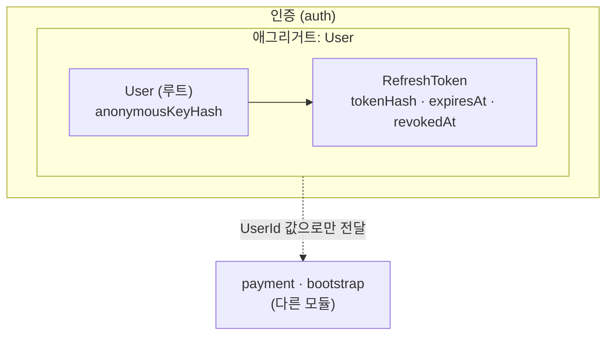
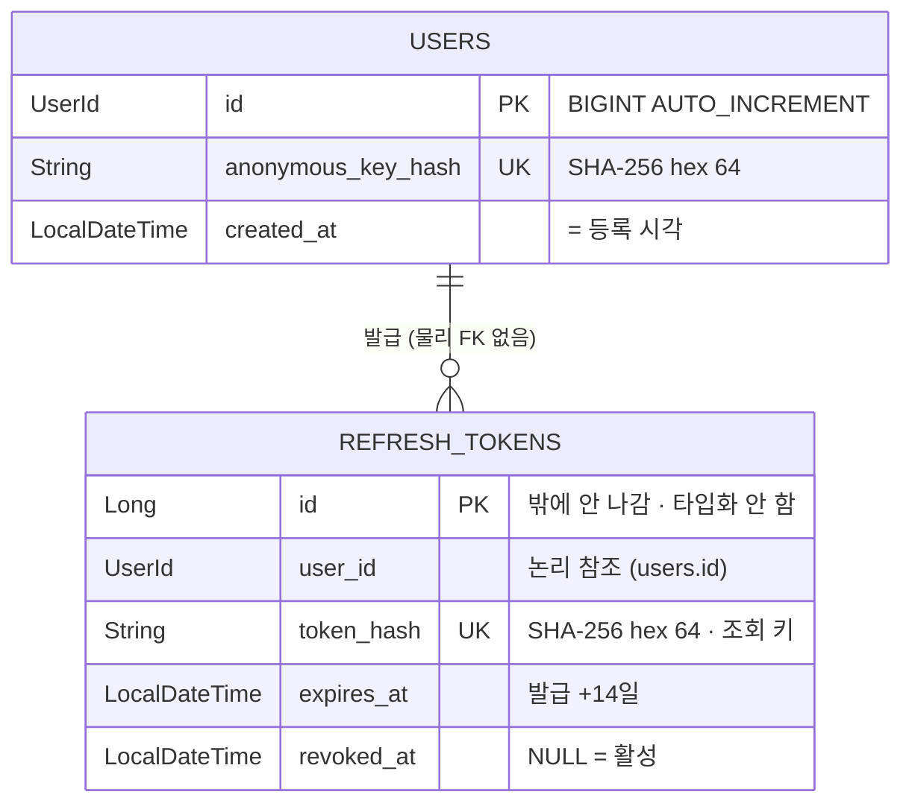

<!--
  전 모듈 도메인 모델 — /domain-model 이 관리한다.

  ⚠️ 이 파일에는 Mermaid 코드블록과 이런 HTML 주석 외에 아무것도 쓰지 않는다.
     제목·산문·표·링크 전부 금지. 설명이 필요하면 {module}-notes.md 로 뺀다.

  선 규약
    실선 ||--o{  애그리거트 내부 (같은 트랜잭션)
    점선 ||..o{  애그리거트·모듈 경계를 넘는 ID 참조 (물리 FK 없음 · JOIN 금지)

  ERD 컬럼은 식별자·상태·불변식에 관여하는 것만. 전 컬럼은 backend/deploy/sql/ 이 정본.
  createdAt·updatedAt(BaseTimeEntity 공통)은 생략한다.

  구역별 근거 커밋 · 갱신일
    auth    : d2d5e26 · 2026-08-13
    payment : (미작성 — /domain-model payment 로 추가)

  부연 문서({module}-notes/-state/-flow.md)는 요청 시에만 만든다. 현재 없음.
-->

