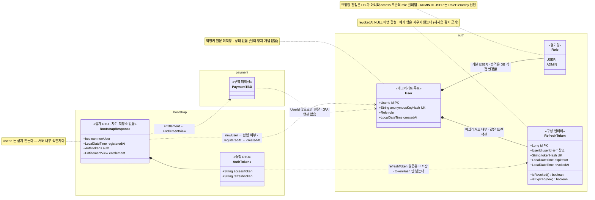

<!--
  전 모듈 도메인 모델 — /domain-model 이 관리한다.

  ⚠️ 이 파일에는 Mermaid 코드블록 하나와 이런 HTML 주석 외에 아무것도 쓰지 않는다.
     제목·산문·표·링크 전부 금지. 설명이 필요하면 {module}-notes.md 로 뺀다.
  ⚠️ 다이어그램을 쪼개지 않는다. 전 모듈이 한 그림 안에 있어야 경계가 보인다.

  classDiagram 을 쓴다 — 어트리뷰트가 클래스 박스 안에 한 줄씩 표처럼 쌓인다.
  flowchart 의   나열은 필드가 줄글이 되어 읽히지 않는다.

  namespace = Modulith 모듈. 한글 표시명 매핑
    auth → 인증 · payment → 결제·이용권 · bootstrap → 진입

  선 규약
    *--   애그리거트 내부 · 중첩 DTO (같은 트랜잭션에서 함께 산다)
    ..>   경계를 넘음 (물리 FK 없음 · JOIN 금지 · ID 값이나 DTO 로만)

  스테레오타입 <<...>> 이 역할을 밝힌다 — 애그리거트 루트 · 구성 엔티티 · 집계 DTO
    집계 컨텍스트 = 엔티티·저장소가 없고 다른 모듈 결과를 합치기만 하는 모듈.
    엔티티가 생기면 그건 집계가 아니라 새 도메인이다 — 라벨이 그 경계를 지킨다

  어트리뷰트는 식별자·상태·불변식에 관여하는 것만. 전 컬럼은 backend/deploy/sql/ 이 정본.
  집계 DTO 는 예외로 필드를 전부 적는다 — 프론트 계약이라 전부가 의미다.

  구역별 근거 커밋 · 갱신일
    auth      : d2d5e26 · 2026-08-13   (Role 반영: 2026-08-13)
    bootstrap : 37d31a6 · 2026-08-13   (집계 컨텍스트)
    payment   : (미작성 — /domain-model payment 로 추가)

  부연 문서({module}-notes/-state/-flow.md)는 요청 시에만 만든다. 현재 없음.
-->

