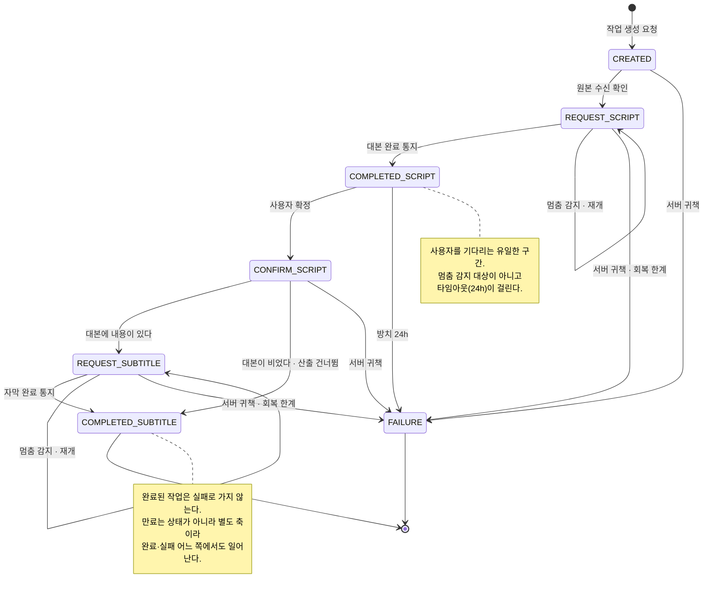

# Subtitle 도메인 정의서

> **버전 v1** · 상태: 구현 완료(2026-08-19)
> 🔶 6건 — '## 🔶 결정 필요' 참조 (요구 3 · 모델 3)
> 요구 3건은 **초기 개발 범위가 이미 정해진** 항목이라 구현을 막지 않는다.
> ~~이용권 연동은 구현을 막는다~~ → **해소 (2026-08-19 결정)** — 포트 이름은 `PaymentUsagePort` 로
> payment-v2 에 등록했고, **시그니처는 이 문서 '이용권 연동' 절이 정본이다.**
> 구현체는 결제 계열의 몫으로 이연 — 이 도메인은 인터페이스에 대고 개발한다.
>
> 근거 셋을 대조해 세웠다 — 기획 [mvp-v1.md](../../../../docs/planning/mvp-v1.md)(2026-08-07 사용자 결정),
> 레거시 [subtitle.md](../../domain/subtitle.md)(2026-08-11 요구 초안), 사용자가 제공한
> **설계 의사결정 기록**(2026-08-05, 로컬 HTML). 셋의 작성 시점이 다르고 서로 충돌하는 지점이 있어
> 충돌은 최신 결정으로 임의 정리하지 않고 🔶 로 올렸다.
>
> 🔴 **산출물은 자막 파일이다 (2026-08-18 사용자 결정).** 설계 의사결정 기록의 판단을 채택했고,
> 그 결과 **기획이 "기각한 안"으로 적어둔 것이 이 도메인의 확정 방향이 됐다.**
> 기획 문서와 레거시 요구서는 아직 번인(영상에 굽기)을 전제하므로 **함께 갱신돼야 한다.**
> 기각 당시의 근거였던 *"폰에서 자막 파일로 할 수 있는 일이 없다"* 에 대한 답은
> **"폰에서 대본을 고쳐 md 자막 파일로 받는다"** 이다 (2026-08-18 사용자 결정).
> 폰이 맡는 일은 **편집**이고, 받은 파일을 어디에 얹을지는 사용자의 몫으로 둔다.

## 자막 도메인

- What? : 이 서비스가 실제로 파는 것은 이 도메인이 만든다. 인증은 "누구인가", 결제는 "쓸 수 있는가"까지 답했고,
  **"무엇을 받는가"는 여기서만 답한다.**
- 목적: 이 도메인의 목적은 "영상을 처리하는 것"이 아니라
  **"돈을 낸 사용자가 어디서 이탈해도 결과물을 잃지 않게 하는 것"** 이다.

  - 여기는 결제 다음에 시작된다. 실패하면 사용자는 **이미 돈을 낸 상태**다.
  - 미니앱은 토스 앱 안에서 돌아 알림·전화 한 통으로 이탈하는데, 처리에는 수십 초에서 수 분이 걸린다.
  - 그래서 이 도메인이 지켜야 하는 것은 처리 성공률이 아니라 **돌아올 자리**다.
- [작업] : 사용자는 동영상을 업로드 하고 자막 생성을 요청할 수 있으며 이를 작업이라 한다.
  - 사용자 하나의 자막 [작업 진행 상태]는 다음과 같이 나뉜다
  - 생성 -> 대본 생성 요청 -> 대본 생성 완료 -> 대본 확정 및 자막 생성 요청 -> 자막 생성 완료 로 나뉜다.
- [작업 진행 상태]: 작업이 지금 어느 단계에 있는가. **프론트 화면 분기의 유일한 근거**다.
  - 생성(CREATED) : 사용자의 최초 작업 생성 - 이때 작업 생성 자격을 검토한다. 
    - 즉, 결제가 된 사용자인지 그리고 횟수권이면 차감을 할 수 있는지를 검토 후 이상이 없다면 생성
      - 결제 도메인에 이용을 호출 (실제 차감인지 예약인지는 결제 도메인에 위임)
    - 업로드가 실제로 끝났음을 **서버가 확인한 뒤에만** 처리에 들어간다. 클라이언트의 "다 올렸다"만으로 착수하지 않는다.
  - 대본 생성 요청(REQUEST_SCRIPT) : 워커에게 대본 생성 작업을 할당한 단계 - 
    - **비기능적 요구사항 : 자막 생성 요청은 메시지큐에 이벤트 유실에 대한 대처를 생각하며 설계해야한다**
    - 생성 상태나 - 대본 생성 요청 상태에서는 사용자가 조회하면 "잠시만 기다려 주세요 대본을 생성하고 있어요" 같은 멘트를 노출 시키도록 한다.
  - 대본 생성 완료(COMPLETED_SCRIPT) : 워커가 자막에 대해 생성을 완료한 상태 - 하지만 아직 대본의 확정을 짓지 못한 단계
    - 대본 생성 완료시에는 사용자가 조회하면 대본 파일의 URL 을 응답을 준다.
  - 대본 확정(CONFIRM_SCRIPT) : 사용자가 대본을 확정했고 해당 대본을 토대로 자막을 생성 하도록 워커에게 요청하는 단계
    - 사용자가 대본 수정이 완료된 단계
  - 자막 생성 요청(REQUEST_SUBTITLE) : 워커에게 정상적으로 자막 생성 작업을 할당한 단계
    - 이때 사용자가 조회를 하면 화면에 "자막 생성을 하는 중이에요 기다려 주세요!" 같은 문구를 표시한다.
  - 자막 생성 완료(COMPLETED_SUBTITLE) : 워커가 성공적으로 자막 생성을 완료한 단계
  - 백로그🔶 : 대본 생성 완료 및 자막 생성 완료 시 사용자가 인지할 수 있는 방법은 화면 새로고침 뿐이다(현재) 추후 메일 도입을 검토한다.
  - 작업 실패(FAILURE) : 시간 초과나 장애 그리고 예상치 못한 사건으로 발생한 작업 실패 단계
    - 위 모든 상태에서 해당 상태로 전이 될 수 있음
    - 서버나 워커의 장애로 인한 특정 작업이 장시간 전이되지 않은 경우(해당 작업을 회복을 해도 너무 늦은 경우)
    - 예상치 못한 에러나 장애로 인한 작업 실패는 결제 권한 이용을 보상한다.(서버의 잘못은 보상 트랜잭션)
      - 결제 도메인에 위임 결제 도메인에서 제공하는 포트만을 이용
    - 추가 작업을 요청하지 않고 시간이 오래 지난상태(ex. 대본을 확정안한지 오래된 경우)으로 인한 작업 타임아웃은 보상 트랜잭션을 가동하지 않는다.
      - [작업 타임아웃] : **24시간.** 그 안에 다음 행동이 없으면 작업을 실패로 닫는다
    - 단, 해당 예시처럼 장시간 타임아웃이 발생하지 않도록 설계할것이며, 자주 생겨서는 안되는 위험한 장애로 분류한다.
- [자막 파일]: 시각과 텍스트가 담긴 파일.
  - 비기능적 요구사항 : Object Cloud 에 비정규화된 데이터로 저장한다.
  - 파일 형식은 **md** 로 한다. 폰에서 별도 도구 없이 읽히고, 다른 도구로 옮겨 붙이기도 쉽다.
  - 각서비스(클라이언트-백엔드-워커) 사에서는 접근 URL 로만 데이터를 이동 시킨다.
  - 클라이언트는 사용자가 대본을 편집할때 파일의 내부 형식을 그대로 노출하지 말고 편집할 수 있게 제공해야한다.
- [대본]: 작업 하나에 딸린 자막 행의 묶음. 사용자가 편집하는 대상이다.
- [자막 행]: 시작 시각·종료 시각·텍스트 한 줄. 대본의 최소 단위다.
- [대본 초안]: 음성 인식이 만든 첫 대본. 사용자 편집 전 상태다.
  - 무음이거나 음성이 없는 영상은 **0행으로 끝날 수 있다.** 이것을 성공으로 응답하며 사용자가 음성이 없더라도 대본을 입력할 수 있게한다.
  - 하지만 대본 확정 후에도 대본의 자막 글자수가 0이면 자막 생성 작업을 실행하지 않고 자막 생성 성공으로 처리한다.
- **대본과 자막 파일의 교환 규격은 서비스가 정한다.** 클라이언트는 보기 좋게 시각화하고 편집만 한 뒤
  그 규격대로 돌려보낸다.
  - 규격을 클라이언트가 정하게 두면 편집 화면이 바뀔 때마다 서버 처리가 조용히 깨진다.
  - 대본이 규격 밖의 임의 형태로 오가면 **규격 자체가 유일한 검증 수단**이 된다.
- [편집 가능 범위]
  - 기획은 "타임스탬프별 대본 편집"까지만 적었고 범위를 가르지 않았다.
  - 편집 범위가 곧 편집 화면의 복잡도다. 산출물이 텍스트라 시각을 열어도 **원가는 늘지 않는다** —
    번인을 전제했을 때의 기각 근거는 여기서 성립하지 않는다.
  - 편집은 행, 타임스탬프 추가, 삭제 등등이 가능하도록 한다.(클라이언트의 책임)
- [편집 가능 시점]  [대본 생성 완료]에서만 허용한다. 다른 상태의 편집 요청은 거부한다.
- 편집하지 않고 그대로 확정하는 것은 정상 경로다. 인식 결과가 맞으면 손댈 이유가 없다.
- [확정]: 사용자가 편집을 마쳤다고 선언하는 행위. **자막 파일 산출의 트리거다.**
  - 확정 요청은 멱등하다. 같은 작업에 두 번 오면 오류가 아니라 현재 상태를 그대로 돌려준다.
    네트워크 재시도가 산출을 두 번 돌리면 같은 파일이 두 벌 생긴다.
  - **초기 개발에서는 확정을 되돌릴 수 없다.** 열면 "어느 파일이 정본인가"를 관리해야 한다.
    - 산출 원가가 낮아 원리상 가능하므로 **나중에 열 여지는 남긴다** 🔶.
- [영상 입력 제약]: 받을 수 있는 원본의 한계. **안내는 길이로, 방어는 용량으로** 한다.
  - 용량은 사용자가 예측할 수 없다 — 같은 30초라도 프레임률에 따라 두 배 이상 차이 난다.
    그래서 화면에 노출하는 것은 길이뿐이다.
  - 가로·세로 모두 받는다. 이미 찍어둔 영상에서 자막을 뽑는 서비스라 촬영 방향을 우리가 고를 수 없다.
  - 위반은 **선택 직후 즉시** 사유를 밝히고 반려한다. 업로드가 시작된 뒤의 실패는 최악의 경험이다.
  - **초기 개발에서는 수치 제약을 걸지 않는다.** 실측 전이라 어떤 숫자를 적어도 근거가 없고,
    근거 없는 숫자는 화면 안내 문구까지 함께 굳힌다. 상한을 두는 시점과 값은 나중에 정한다 🔶.
  - ⚠️ **해상도 제약의 근거가 사라졌다.** 해상도는 인코딩 원가 때문에 걸던 조건인데 인코딩을 하지 않는다.
    남는 근거는 웹뷰가 큰 파일을 다루다 죽지 않게 하는 것뿐이다.
  - 클라이언트의 사전 검사는 사용자 경험 장치이지 방어가 아니다. **서버가 다시 본다.**
- [이용 게이트]: **작업을 새로 여는 행위에만** 걸린다. 조회·목록·결과 수령에는 걸리지 않는다.
  - 이미 만든 결과물은 이용권 없이도 받을 수 있어야 한다. 구독이 끊긴 뒤에도 만료 전까지는 그렇다.
  - 게이트 판정과 잔량 조작은 **결제 도메인의 몫**이다. 이 도메인은 통과했는지만 안다.
- [소모]는 작업을 열 때, [회복]은 서버 귀책 실패에, [소모 확정]은 소모를 되돌리지 않는 쪽으로
  작업이 닫힐 때 결제 도메인을 호출한다.
  - 소모 확정이 없으면 예약이 영원히 예약으로 남아, "해제는 예약 상태일 때만"이라는
    이중 해제 방어가 무력해진다.
- [서버 귀책 실패]: 우리 처리나 외부 의존이 실패한 것. **이용권을 되돌린다.**
  - 이 통지가 유실되면 사용자는 **돈을 내고 결과물도 이용권도 잃는다.** 이 도메인 최대의 금전 리스크다.
  - 반대로 두 번 되돌리면 무료 이용권이 샌다. 어느 쪽도 조용히 넘어가면 안 된다.
- [사용자 귀책 반려]: 제약을 위반한 입력 등. **애초에 소모가 일어나지 않는다.**
  - "반려됐는데 잔량이 줄었다"는 상태는 존재해서는 안 된다. 되돌려 메우는 것과는 다른 요구다.
- 진행 중인 작업은 이용권이 만료·회수돼도 **끝까지 처리한다.**
  - 소모는 작업을 열 때 이미 일어났다. 중간에 끊으면 사용자는 이용권을 쓰고도 결과물을 못 받는다.
- 처리 실패는 요청에 대한 오류로 전달되지 않는다. 실패는 사용자가 앞에 없을 때 일어나므로
  **상태와 사유로만 남고**, 사용자는 되물어서 안다.
- 모든 요청은 처리 완료를 기다리지 않고 **즉시 응답한다.** 
  - 대본, 자막 생성 작업(워커의 작업 비용이 큼)은 사용자가 조회를 해도 현재 작업의 상태를 응답하여 워커의 작업을 동기식으로 기다리지 않는다.
  - 대본 확정(사용자가 언제 확정 할지 모름)은 사용자가 확정시 API를 호출하므로 동기식으로 기다리지 않는다.
- [폴링]: 사용자가 **상태 확인 화면에 머무는 동안** 클라이언트가 주기적으로 상태를 되묻는다.
  - 워커의 완료를 서버가 밀어서 알릴 경로가 없으므로, 화면에 있는 사용자에게는 되묻기가 유일한 갱신 수단이다.
  - **화면을 벗어나면 폴링도 끝난다.** 그 뒤의 완료를 알리는 수단은 아직 없다 — 위 백로그 항목이 그것이다.
  - 더 진행될 것이 없는 상태(대본 생성 완료 · 자막 생성 완료 · 작업 실패)에서는 **멈춘다.**
    대본 생성 완료는 서버가 사용자를 기다리는 구간이라, 계속 되물으면 오지 않을 변화를 기다리며 부하만 쌓는다.
  - **주기·타임아웃·백오프는 서버가 정하지 않는다.** 화면에 머무는 동안의 갱신 빈도는 클라이언트 재량이고
    서버 계약에 들어가지 않는다 — 서버는 언제 물어도 현재 상태를 답할 뿐이다.
- [멈춘 작업]: 어느 단계에서 진행이 끊긴 채 남은 작업. **방치되지 않는다.**
  - 작업의 진행 상태가 진실의 기준이다. 처리 요청이 유실돼도 **"상태가 진행되지 않음"으로 드러난다.**
  - 멈춘 작업은 **다음 단계로 넘기지 않고 멈춘 그 단계를 다시 시킨다** — 끝나지 않았기 때문에 멈춰 있는 것이다.
  - 재개가 원가를 두 번 태우지 않아야 한다. 같은 단계를 다시 돌려도 결과물은 한 벌이다.
  - 이것이 성립하려면 단계 구분이 촘촘해야 한다. 어디까지 갔고 그 단계가 끝났는지를 판정할 수 없으면
    재개 자체가 불가능하다.
  - ⚠️ [사용자 대기 구간]은 이 판정의 대상이 아니다. 시스템이 멈춘 것이 아니기 때문이다.
  - 처리 시간 상한이 없으면 영원히 끝나지 않는 작업이 생긴다.
- [작업 소유권]: 작업·대본·자막 파일은 **만든 사용자만** 접근한다.
  - 남의 작업은 **존재 자체를 알려주지 않는다.** "권한이 없다"는 답은 그 작업이 있다는 사실을 알려준다.
  - 결과물에 닿는 수단은 그 자체가 자격 증명이다. 추측할 수 없어야 하고, 수명이 짧아야 하며,
    로그에 남지 않아야 한다.
  - ⚠️ 익명키가 유출되면 이 도메인에서는 **남의 영상과 대본이 새는 것**으로 나타난다.
    인증이 감수하기로 한 리스크의 실제 피해 지점이 여기이고, 우리에게 막을 수단은 없다.
- [작업 목록]: 최근 작업과 상태를 돌려준다. **아카이브가 아니라 복구 장치다.**
  - 이탈했다 돌아온 사용자가 진행 중인 작업으로 되돌아가는 유일한 경로다.
    없으면 돈을 낸 사용자가 결과물을 잃는다.
  - 진행 중인 작업이 있는데 빈 목록으로 그리면 사용자는 결과물을 잃었다고 판단한다.
    **조회 실패와 빈 목록은 반드시 구분된다.**
  - 폴더·검색·이름변경은 두지 않는다. 작업이 수십 개 쌓인 뒤의 문제다.
- [만료]: 보관 기간이 지나 **원본 파일이 삭제된 상태.** 작업·대본·자막 파일은 남는다.
  - **[작업 진행 상태]의 값이 아니라 별도 축이다.** 상태로 두면 완료·실패와 배타가 되어
    "완료됐고 만료된" 작업을 표현할 수 없다.

  - 원본은 스토리지 원가이자 개인정보 리스크이고, 대본과 자막 파일은 텍스트라 보관 비용이 사실상 0이다.
  - ⚠️ **산출물이 텍스트가 되면서 만료가 사용자 손해가 아니게 됐다.** 원본이 지워져도 받을 것은 그대로 남는다.
    영상 산출을 전제한 레거시 요구서에서 만료는 결과물 상실이었다 — 그 전제가 바뀌었다.
  - 원본은 보관하고 있돼 기존 영상, 대본, 자막 생성된 영상의 보관기간이 설정되면 그때 처리하도록 한다.
  - 만료된 작업은 목록에서 **사라지지 않고 "만료됨"으로 남는다.** 사라지면 사용자는 우리가 지웠다는 사실조차 모른다.
  - ⚠️ 사용자가 올린 원본은 개인 콘텐츠다. 보관 기간은 원가 문제이기 전에 **약속의 문제**이므로,
    화면에 고지한 기간과 실제 삭제 시점이 달라서는 안 된다.

## 용어 사전

> 이 표의 **영문명이 코드 식별자의 계약이다.** 클래스·메서드·필드·에러코드는 여기 있는 말만 쓴다.
> 🔶 표시는 미확정 — `## 🔶 결정 필요` 참조.
>
> 결제 도메인에서 물려받은 말은 **여기서 다시 정의하지 않는다.** 정본은
> [payment-v2.md](../payment/payment-v2.md) 용어 사전이고, 이 표는 "이 도메인에서 그 말이 어떻게 쓰이는가"만 적는다.
> 같은 개념에 새 이름을 붙이면 두 도메인이 서로를 못 찾는다.

### 작업

| 용어 | 영문명 | 정의 |
|---|---|---|
| **작업** | `Job` | 영상 하나를 올려 자막 파일 하나를 받기까지의 처리 단위. 소모·조회·보관·소유권이 전부 이 단위다. ⚠️ 결제의 `PendingOrder`(미결 주문)와 다르다 — 그쪽은 *결제됐는데 지급이 안 끝난 주문*, 이쪽은 *지급된 이용권으로 시작한 처리*다 |
| **작업 진행 상태** | `JobStatus` | 작업이 지금 어느 단계에 있는가. **프론트 화면 분기의 유일한 근거**이므로 값 하나하나가 계약이다 |
| **워커** | `Worker` | 음성 인식과 자막 파일 산출을 실제로 수행하는 처리 주체. 백엔드가 직접 부르지 않고 작업을 넘겨주면 가져간다 |
| **멈춘 작업** | `stalled` | 어느 단계에서 진행이 끊긴 채 남은 작업. 상태가 나아가지 않는 것으로 드러난다. 결제의 `stale`(상태 미확인)과 **다른 말이다** — 그쪽은 "외부 상태를 모른다", 이쪽은 "우리 처리가 안 나아갔다" |
| **작업 타임아웃** | `JOB_TIMEOUT` | 사용자가 다음 행동을 하지 않은 채 작업이 방치될 수 있는 상한. **24시간 (2026-08-18 확정)**. 이 초과는 서버 잘못이 아니므로 이용권을 되돌리지 않는다 |
| 작업 목록 | `JobList` | 사용자의 최근 작업과 상태를 돌려주는 조회. **아카이브가 아니라 복구 장치**다 |
| **작업 소유권** | `ownership` | 작업·대본·자막 파일이 만든 사용자에게만 귀속되는 성질. 결제의 같은 말과 규율이 같다 — 남의 것은 **존재 자체를 알려주지 않는다** |
| **만료** | `expired` | 보관 기간이 지나 원본이 삭제된 것. **작업·대본·자막 파일은 남는다.** `JobStatus` 의 값이 **아니라 별도 축**이다 — 상태로 두면 완료·실패와 배타가 되어 "완료됐고 만료된" 작업을 표현할 수 없다 |

### 작업 진행 상태의 값

> 이 값들이 그대로 프론트 화면 분기의 기준이 된다. **영문명 체계는 2026-08-18 확정됐다** —
> `{동사}_{대상}` 으로 맞추고, 끝난 단계는 과거분사(`COMPLETED_`)를 쓴다.

| 용어 | 영문명 | 정의 |
|---|---|---|
| 생성 | `CREATED` | 작업이 열린 직후. 이용 자격을 검토하고 원본 수신을 기다리는 단계 |
| ├ 대본 생성 요청 | `REQUEST_SCRIPT` | 워커에게 대본 생성을 넘긴 단계 |
| ├ **대본 생성 완료** | `COMPLETED_SCRIPT` | 대본 초안이 나왔고 **사용자의 확정을 기다리는** 단계. 편집이 허용되는 유일한 시점이다 |
| ├ 대본 확정 | `CONFIRM_SCRIPT` | 사용자가 대본을 확정한 단계 |
| ├ 자막 생성 요청 | `REQUEST_SUBTITLE` | 워커에게 자막 파일 산출을 넘긴 단계 |
| ├ 자막 생성 완료 | `COMPLETED_SUBTITLE` | 자막 파일이 나온 단계. 사용자가 받아 갈 수 있다 |
| └ 작업 실패 | `FAILURE` | 장애·시간 초과로 끝난 단계. **모든 상태에서 이리로 전이될 수 있다** |
| **사용자 대기 구간** | — | 시스템이 아니라 **사용자를 기다리는** 구간. 지금은 `COMPLETED_SCRIPT` 하나가 여기 해당한다. 경과 시간으로 이상을 판정하면 안 되는 자리라 이름을 따로 둔다. **코드 식별자가 되지 않는다** — 상태값이 가리키는 성질이지 그 자체로 저장되는 값이 아니다 |

### 대본과 자막

| 용어 | 영문명            | 정의 |
|---|----------------|---|
| **대본** | `Script`       | 작업 하나에 딸린 자막 행의 묶음. **사용자가 편집하는 대상**이고, 자막 파일의 원천이다 |
| ├ **자막 행** | `Cue`          | 시작 시각·종료 시각·텍스트 한 줄. 대본의 최소 단위 |
| └ 대본 초안 | `ScriptDraft`  | 음성 인식이 만든 첫 대본. 사용자 편집 전 상태다. **0행일 수 있고 그것도 성공이다** |
| **자막 파일** | `SubtitleFile` | 이 도메인의 **유일한 산출물.** 영상과 분리돼 있어 사용자가 다른 도구에 얹는다. 만드는 원가가 사실상 0이다 |
| 자막 파일 형식 | `SubtitleFileFormat` | 파일 내부의 규격. **md 로 확정 (2026-08-18)** — 폰에서 별도 도구 없이 읽히고 다른 도구로 옮겨 붙이기 쉽다 |
| **확정** | `confirm`      | 사용자가 편집을 마쳤다고 선언하는 행위. **자막 파일 산출의 트리거**다. ⚠️ 결제의 `commit`(소모 확정)과 **다른 말이다** — 그쪽은 잔량을 되돌릴 수 없게 만드는 것이고, 이쪽은 대본을 넘기는 것이다 |
| 편집 가능 범위 | —              | 사용자가 대본에서 고칠 수 있는 것. 행 텍스트·타임스탬프·행 추가·삭제까지 열려 있다. **코드 식별자가 되지 않는다** — 화면 구성이 클라이언트 책임이라 서버가 부를 이름이 없다 |
| 편집 가능 시점 | —              | 편집이 허용되는 상태. `COMPLETED_SCRIPT` 하나뿐이고 다른 상태의 편집 요청은 거부한다. **코드 식별자가 되지 않는다** — `JobStatus` 값 비교로 표현되지 별도 이름을 갖지 않는다 |
| 교환 규격 | —              | 대본과 자막 파일이 서비스 사이를 오갈 때의 형식. **서비스가 정하고 클라이언트는 따른다** — 클라이언트가 정하면 편집 화면이 바뀔 때마다 서버 처리가 조용히 깨진다. 이름은 위 `SubtitleFileFormat` 으로 흡수되고 **따로 갖지 않는다** |

### 입력

| 용어 | 영문명 | 정의 |
|---|---|---|
| 원본 | `source` | 사용자가 올린 영상. 음성 인식이 끝나면 자막 파일을 만드는 데 더는 쓰이지 않는다 |
| **영상 입력 제약** | — | 받을 수 있는 원본의 한계. **안내는 길이로, 방어는 용량으로** 한다 — 용량은 사용자가 예측할 수 없기 때문이다. **초기 개발에서는 걸지 않는다** 🔶. 묶음 자체는 코드 식별자가 되지 않고, **이름을 갖는 것은 개별 상한 상수**다 — 그 이름은 수치가 정해질 때 함께 정한다 |

### 이용권 연동 — 결제 도메인이 정본이다

> 이 절의 말은 전부 [payment-v2.md](../payment/payment-v2.md) 가 정의한 것이다. **여기서 이름을 새로 짓지 않는다.**

| 용어 | 영문명 | 정의 |
|---|---|---|
| **이용 게이트** | `AccessGate` | "지금 유료 기능을 쓸 수 있는가"의 판정. **작업을 새로 여는 행위에만** 걸리고 조회·수령에는 걸리지 않는다. 판정은 결제 도메인이 하고 이 도메인은 통과 여부만 안다 |
| **소모** | `consume` | 작업을 열 때 결제 도메인을 불러 이용권을 쓰는 것. **예약인지 즉시 차감인지는 결제 도메인에 위임**한다 |
| **소모 확정** | `commit` | 소모를 되돌릴 수 없게 만드는 것. 이 도메인의 `confirm`(대본 확정)과 **다른 말이다.** 자막 생성 완료와 방치(`ABANDONED`) 실패에서 부른다 |
| **회복** | `release` | 작업이 실패해 소모를 되돌리는 것. 요구 섹션이 "회복"이라 부르는 것의 정본 이름이 `release` 다 — **환불이 아니다** |
| **이용 포트** | `PaymentUsagePort` | 소모·소모 확정·회복이 드나드는 **유일한 표면.** 이름의 정본은 payment-v2 용어 사전이고(2026-08-19 등록), **시그니처의 정본은 이 문서 '이용권 연동' 절이다.** 구현체는 결제 계열의 몫 — 이 도메인은 인터페이스만 안다 |

### 실패와 복구

| 용어 | 영문명       | 정의 |
|---|-----------|---|
| **서버 귀책 실패** | `SERVER_FAULT` | 우리 처리나 외부 의존이 실패한 것. **이용권을 되돌린다.** 통지가 유실되면 사용자는 돈을 내고 결과물도 이용권도 잃는다 |
| **사용자 귀책 반려** | `USER_FAULT` | 제약을 위반한 입력 등. **애초에 소모가 일어나지 않는다** — 되돌려 메우는 것과 다르다 |
| **폴링** | `polling` | 사용자가 상태 확인 화면에 머무는 동안 클라이언트가 주기적으로 상태를 되묻는 것. **화면을 벗어나면 끝난다.** 주기·타임아웃·백오프는 **클라이언트 재량**이라 서버 계약에 없다 |

### 에러 코드

| 용어 | 영문명 | 정의 |
|---|---|---|
| **에러 코드 접두사** | `SUBTITLE_` | 이 도메인이 쓸 에러 코드의 앞자리 (2026-08-18 확정). 명명 규약은 [error-handling.md](../../rule/error-handling.md) 가 정본이다. 줄임말 `SUB_` 는 **`subscription` 모듈과 혼동**되므로 도메인 이름을 줄이지 않고 그대로 쓴다. 개별 코드는 요구 섹션에 실패 경로가 정해진 뒤 여기 등록한다 |

## 도메인 모델

> **애그리거트는 1개다** — 작업. 이 도메인의 모든 상태 변화가 작업 한 단위에 수렴하기 때문이다.
> 나눌 후보였던 대본과 자막 파일은 **실물이 저장소에 있고 우리가 들고 있는 것은 위치뿐**이라,
> 그 위치가 바뀌는 순간이 곧 작업의 상태가 바뀌는 순간이다 — 나누면 두 행을 언제나 함께 써야 한다.
> 결제 도메인이 넷으로 갈린 것은 지급·웹훅·소모가 서로 다른 것에 의해 바뀌기 때문이었다.
> 여기는 그렇지 않다.
>
> **자막 행도 구성요소가 아니다.** 대본의 내부 구조는 워커와 클라이언트가 규격대로 주고받고,
> 우리는 위치만 저장한다 — 행 단위로 조회하거나 고치는 경로가 없어 구조를 들고 있을 이유가 없다.
> 다만 **"비어 있는가"는 우리가 판정한다.** 그 답이 산출을 건너뛸지를 정하기 때문이다.
>
> 사용자는 언제나 `UserId` 로만 표현한다 — 이 도메인은 `User` 엔티티를 알지 못한다.
> 이용권도 마찬가지다. **잔량도 구독 상태도 보지 않고 "쓸 수 있는가"만 묻는다.**

---

### [작업 애그리거트]

### 작업(Job)

_Aggregate Root_

#### 속성

- `jobId`: `JobId` : 기본키이자 식별자
- `userId`: `UserId` 소유자
- `status`: `JobStatus` 진행 상태
- `source`: `StorageKey` 원본 위치
- `script`: `StorageKey` 대본 위치. 워커가 만들기 전에는 비어 있다
- `subtitle`: `StorageKey` 자막 파일 위치
- `failureCause`: `FailureCause` 실패했을 때만 채워진다
- `lastTransitionedAt`: 마지막으로 상태가 바뀐 시각. **멈춘 작업 판정의 유일한 근거**
- `expiredAt`: 원본을 지운 시각. 상태와 **다른 축**이라 따로 둔다

#### 행위

- `static open()`: 이용 자격이 확인된 뒤 작업을 연다. 원본 수신 전 상태로 태어난다
- `receiveSource()`: 원본 수신이 확인되면 대본 생성 요청으로 넘어간다
- `attachScript()`: 워커가 만든 대본을 달고 사용자 확인 대기로 넘어간다
- `confirmScript()`: 사용자가 확정한 대본을 달고 자막 생성 요청으로 넘어간다
  - 대본이 비어 있으면 워커를 거치지 않고 곧장 완료로 간다 — 만들 것이 없다
- `attachSubtitle()`: 산출된 자막 파일을 달고 완료로 넘어간다
- `fail()`: 사유와 함께 실패로 닫는다
- `stalled()`: 시스템 구간에서 임계 시간을 넘겨 진행이 멈췄는지 판정한다
- `abandoned()`: 사용자 대기 구간에서 타임아웃을 넘겼는지 판정한다
- `ownedBy()`: 이 작업이 해당 사용자의 것인지 판정한다
- `expire()`: 원본을 지운 사실을 기록한다

#### 규칙

- open() 
  - application service 는 `PaymentUsagePort.consume` **하나로** 자격 판정과 소모를 함께 요청한다 —
    묻는 것과 쓰는 것을 갈라 부르지 않는다. (기간권인가 횟수권인가에 따른 처리는 결제 도메인의 책임)
  - 작업 열기와 소모는 **한 트랜잭션**이다. 소모가 거부되면 작업도 태어나지 않는다 —
    "반려됐는데 잔량이 줄었다"는 상태를 만들지 않는다.
  - application service는 성공적으로  객체 스토리지의 presigned url 을 응답한다.
  - JobStatus.CREATED 로 생성된다.
- JobStatus 상태는 정해진 순서로만 나아가고 되돌아가지 않는다. 되돌리기를 열면 어느 산출물이 정본인지 알 수 없다
- receiveSource()
  - 사용자가 원본을 저장하고 작업을 시작하는 요청을 하면 호출된다. 
  - application service 는 전이 전에 `StorageInspector.exists` 로 원본 실물을 확인한다 —
    클라이언트의 "다 올렸다"만으로 착수하지 않는다 (2026-08-19 확정, B1 해소).
  - 원본 url 이 저장되면 JobStatus.REQUEST_SCRIPT 로 전이한다.
  - application service 는 워커의 작업 큐에 이벤트를 넣는다. (해당 이벤트는 최소 At-Least-Once 를 보장해야한다.)
- attachScript()
  - 워커가 대본 생성 작업을 완료하면 호출된다.
  - 워커가 생성한 임시 대본 url 로 수정하고 COMPLETED_SCRIPT 상태로 전이한다.
  - 해당 대본 url 은 확정전까지 수정 가능하게 권한을 줘야한다.
- confirmScript()
  - 사용자가 대본을 확정하면 호출된다.
  - 대본이 비었는지는 application service 가 `StorageInspector.scriptEmpty` 로 판정해 넘긴다 —
    "비어 있는가"의 판정 주체는 우리다 (2026-08-19 확정, B1 해소).
  - 확정 대본 url 을 저장한다.
  - 확정이 되면 대본 객체 수정 접근 권한을 막는다.
  - CONFIRM_SCRIPT로 상태를 전이하고 워커에게 자막을 생성하는 이벤트를 작업 큐에 넣는다(해당 이벤트는 최소 At-Least-Once 를 보장해야한다.)
  - 이벤트를 성공적으로 보냈으면 REQUEST_SUBTITLE로 전이한다(해당 전이는 이벤트 전달을 어떻게 구현하냐에 따라 없에도 됨)
- attachSubtitle()
  - 워커가 자막을 생성하면 호출된다.
  - 산출된 자막 파일 url 을 저장한다.
- COMPLETED_SUBTITLE 로 닫히면(워커 완료 통지든 빈 대본 건너뜀이든) application service 는
  `PaymentUsagePort.commit` 으로 소모를 확정한다.
- fail()
  - 배치가 완료 state 가 아닌 state 중 (currentAt - lastTransitionedAt) > [작업 타임아웃]이면 호출한다.
  - FAILURE 상태 전이한다.
  - `FailureCause` 가 `SERVER_FAULT` 면 application service 는 `PaymentUsagePort.release` 를,
    `ABANDONED` 면 `PaymentUsagePort.commit` 을 부른다 — 방치도 소모가 확정되는 사건이다.
    어느 쪽도 부르지 않고 닫히는 경로는 없다.
- 같은 단계의 완료 통지가 두 번 와도 상태는 한 번만 나아간다 — 워커 재시도와 재전송이 **정상적으로**
  중복을 만든다. 중복을 오류로 만들면 재개 자체가 깨진다
- 확정은 사용자 대기 구간에서만 받는다. 그 밖의 상태에서 온 확정은 거부한다 —
  이미 만들고 있는 중이면 반영될 자리가 없다
- 확정이 두 번 오면 두 번째는 오류가 아니라 현재 상태를 돌려준다. 산출을 두 번 돌리면 파일이 두 벌 생긴다
- 실패(fail)는 어느 상태에서든 일어난다. 다만 **완료된 작업은 실패로 가지 않는다** — 이미 건넨 결과를 되뺏는 셈이다
- 마지막 전이 시각은 **상태가 바뀔 때만** 갱신한다. 조회로 갱신하면 멈춘 작업이 영원히 안 잡힌다
- 만료는 상태가 아니다. **완료된 작업도 실패한 작업도 만료될 수 있다** — 한 축으로 합치면
  "완료됐고 만료된" 작업을 표현할 수 없다
  - 원본과 대본 그리고 자막 영상은 한달동안만 보관한다 (단, 배치를 돌려 한달 지난 작업의 만료는 백로그로 남긴다.)
- 사용자 대기 구간의 체류는 멈춘 것이 아니다. 여기에는 재개가 아니라 타임아웃이 걸린다 —
  섞으면 사용자를 기다리는 작업을 시스템이 계속 다시 돌린다
- 소유자는 한 번 정해지면 바뀌지 않는다

### 작업 진행 상태(JobStatus)

_Enum_

#### 상수

- `CREATED`: 작업이 열렸고 원본 수신을 기다린다
- `REQUEST_SCRIPT`: 대본 생성을 워커에게 넘겼다
- `COMPLETED_SCRIPT`: 대본이 나왔고 **사용자의 확정을 기다린다**
- `CONFIRM_SCRIPT`: 사용자가 확정했다
- `REQUEST_SUBTITLE`: 자막 파일 산출을 워커에게 넘겼다
- `COMPLETED_SUBTITLE`: 자막 파일이 나왔다
- `FAILURE`: 장애·시간 초과로 닫혔다

#### 규칙

- 값 하나가 곧 프론트 화면 분기다. 이름을 바꾸면 계약이 깨진다
- **사용자를 기다리는 구간은 `COMPLETED_SCRIPT` 하나뿐이다.** 나머지는 전부 시스템이 도는 구간이고,
  둘은 이상 판정 기준이 다르다 — 이 구분을 잃으면 어느 쪽도 제대로 감시할 수 없다
- **아래 표에 없는 전이는 없다.** 전이의 정본은 이 표이고, 위 `작업` 의 규칙은 그 전이가 왜 그런지를 말한다

**전이가 아닌 입력** — 오류로 만들지 않는다.

| 입력 | 처리                               |
|---|----------------------------------|
| 이미 지난 단계의 완료 통지 | 무시하고 현재 상태를 돌려준다                 |
| 확정 재요청 | 오류가 아니라 현재 상태를 돌려준다              |
| 남의 작업 · 없는 작업 요청 | 권한이 없다는 예외 응답을 한다.               |
| 보관 기간 경과 | `expiredAt` 만 기록하고 **상태는 그대로 둔다** |

- 모든 조건의 첫 항목이 **현재 상태**다. 읽어서 확인한 뒤 쓰면 동시에 도착한 완료 통지 두 개가
  둘 다 통과해 상태가 두 칸 뛴다
- `FAILURE` 로 가는 두 경로의 결과가 **정반대**다 — 서버 귀책은 이용권을 되돌리고 타임아웃은 되돌리지 않는다.
  `FailureCause` 하나가 돈의 방향을 정한다
- ⚠️ **`CONFIRM_SCRIPT` 는 머무는 상태가 아니다.** 확정과 동시에 다음 갈래로 갈라지므로 이 값으로 남아
  있는 시간이 없거나 아주 짧다 — 전이 이력을 남기려고 두는 자리다

### 실패 사유(FailureCause)

_Enum_

#### 상수

- `SERVER_FAULT`: 우리 처리나 외부 의존이 실패했다 — 이용권을 되돌린다
- `ABANDONED` : 사용자가 다음 행동을 하지 않아 상한을 넘겼다 — 되돌리지 않는다

#### 규칙

- **이 값 하나가 이용권을 되돌릴지를 정한다.** 분류를 틀리면 한쪽은 돈을 낸 사람이 잃고,
  다른 쪽은 무료 이용권이 샌다
- 방치는 우리가 멈춘 것이 아니라 사용자가 다음 행동을 하지 않은 것이다. 그래서 되돌리지 않는다
- ⚠️ **입력 반려(`USER_FAULT`)는 여기 없다.** 그것은 작업이 열리기 전에 거절되는 것이라
  실패 사유가 아니라 오류 코드다 — **"소모가 일어나지 않았다"와 "소모를 되돌리지 않는다"는 다른 사건**이고,
  한 이름으로 묶으면 잔량이 맞는지 확인할 길이 사라진다

### 저장소 키(StorageKey)

_Value Object_

#### 속성

- `value`: 저장소 안에서 실물이 있는 위치

#### 규칙

- 우리가 들고 있는 것은 위치뿐이다. 실물은 저장소에 있고 우리 저장소를 거치지 않는다
- **이 값을 그대로 내려주지 않는다.** 내려주는 것은 수명이 짧은 링크이고 위치는 우리 안에 남는다
- 로그·예외 메시지에 싣지 않는다

### 자막 파일 형식(SubtitleFileFormat)

_Enum_

#### 상수

- `MARKDOWN`: 자막 파일의 내부 형식

#### 규칙

- 지금은 값이 하나뿐이다. 그래도 이름을 두는 이유는 이 형식이 **워커·클라이언트와의 계약**이라서다 —
  이름 없이 암묵으로 두면 세 쪽이 각자 다른 형식을 가정한다
- 플레이어가 자막 트랙으로 읽는 형식이 아니다. **사용자가 읽고 옮겨 쓰는 것**이 이 파일의 쓰임이다

### 작업 타임아웃(JOB_TIMEOUT)

_Policy Constant_

#### 규칙

- 사용자가 다음 행동을 하지 않은 채 작업이 살아 있을 수 있는 상한. **24시간**
- 우리가 정한 정책이다. 처리가 오래 걸린다는 사실과 다른 것이므로 멈춘 작업의 임계 시간과 섞지 않는다
- 이 상한을 넘겨 닫힌 작업은 이용권을 되돌리지 않는다

### 보관 기간(RETENTION) 

_Policy Constant_

#### 규칙

- 원본을 지우기까지의 기간. 한달로 한다.
- 정해지기 전까지는 지우지 않는다. 지우는 시점을 추측으로 정하면 화면에 고지한 기간과 어긋난다

### 재개 임계(STALL_THRESHOLD)

_Policy Constant_

#### 규칙

- 시스템 구간에서 이 시간을 넘겨 전이가 없으면 멈춘 것으로 판정한다. **30분 (2026-08-19 확정, B2 해소)**
- `JOB_TIMEOUT`(사용자 대기 상한)과 **다른 축이다** — 섞으면 사용자를 기다리는 작업을 시스템이 계속 다시 돌린다
- 실측 전 추정치다. 워커 처리 시간이 쌓이면 재조정한다

### 재개 한계(REDISPATCH_LIMIT)

_Policy Constant_

#### 규칙

- 같은 단계를 다시 시키는 횟수의 상한. **3회 (2026-08-19 확정, B2 해소)** — 초과하면
  `SERVER_FAULT` 로 닫고 이용권을 되돌린다
- 상태도의 "회복 한계"가 가리키는 것이 이 값이다. 이용권의 회복(`release`)과 **다른 말이라** 이름을 갈랐다

### 처리 의뢰(WorkDispatcher)

_Domain Service_

#### 행위

- `dispatch()`: 워커가 가져갈 수 있도록 작업을 넘긴다

#### 규칙

- 워커를 직접 부르지 않는다. 넘겨 두면 워커가 **자기 여유에 맞춰 가져간다** —
  직접 부르면 워커가 쉬는 동안의 요청이 그대로 사라진다
- **넘긴 것은 사라질 수 있다.** 그래서 넘겼다는 사실이 아니라 **작업의 상태**가 진실의 기준이다
- 같은 작업을 다시 넘겨도 결과물은 한 벌이어야 한다. 재개가 원가를 두 번 태우면 안 된다

### 단명 링크 발급(SignedUrlIssuer)

_Domain Service_

#### 행위

- `issue()`: 저장소 키로 수명이 짧은 접근 링크를 만든다

#### 규칙

- **링크 자체가 자격 증명이다.** 받은 사람은 누구든 그 파일을 볼 수 있다
- 수명을 짧게 둔다. 길면 한 번 새어 나간 링크가 오래 살아 있다
- 로그에 남기지 않는다

### 저장소 조회(StorageInspector)

_Domain Service_

#### 행위

- `exists()`: 저장소 키의 실물이 실제로 있는지 확인한다
- `scriptEmpty()`: 대본 실물을 읽어 자막 글자수가 0인지 판정한다

#### 규칙

- **"우리가 판정한다"의 수단이다 (2026-08-19 확정, B1 해소).** 업로드 완료 확인과 빈 대본 판정이 여기로 온다
- 실물은 여전히 저장소에 있다. 이 서비스는 **읽기만 하고** 내려받아 보관하지 않는다
- 저장소 장애가 여기서 드러난다 — 확인에 실패하면 전이하지 않는다. 믿고 전이하면
  "업로드가 끝났음을 서버가 확인한 뒤에만"이 무너진다

### 이용권 연동(PaymentUsagePort)

_Port — 소유는 결제 도메인, 시그니처 정본은 이 절_

> ~~부를 대상이 아직 없다~~ → **해소 (2026-08-19 결정).** 이름은 payment-v2 용어 사전에 등록했고,
> **구현체 없이 인터페이스만 먼저 나간다** — 이 도메인은 인터페이스에 대고 개발하고,
> 테스트는 대역으로 채운다. 코드 위치는 `payment` 모듈 루트다(다른 모듈이 import 하는 것만 루트).

#### 행위 (인터페이스)

- `consume(userId, jobRef)`: 쓸 수 있는지 묻고 쓰겠다고 알리는 **한 호출.** 통과하지 못하면
  결제 계열의 오류로 거부된다 — 이 도메인의 오류 코드가 아니다
- `commit(jobRef)`: 소모를 되돌릴 수 없게 확정한다
- `release(jobRef)`: 소모를 되돌린다

#### 규칙

- 잔량도 구독 상태도 직접 보지 않는다. **판정과 조작은 전부 결제 계열의 몫**이고,
  이 도메인은 통과했는지만 안다
- 물어보는 것과 쓰겠다고 알리는 것이 갈라지면 그 사이에 잔량이 사라진다.
  **둘을 갈라 부르지 않는다** — `consume` 하나다
- `jobRef` 는 작업 식별자다. 결제 계열에는 **불투명 문자열**로 넘어가고(payment-v2 `externalRef`),
  소모·확정·해제의 **멱등 키**가 이것이다 — 재시도가 두 번 되돌리면 무료 이용권이 샌다
- 예약인지 즉시 차감인지는 구현체가 정한다. 즉시 차감이면 `commit` 은 무동작이어도 된다 —
  부르는 쪽은 구분하지 않는다
- **구현체가 오기 전까지는 전부 거부하는 임시 어댑터로 조립한다** — 부팅을 깨뜨리지 않으면서,
  게이트 없는 개방보다 안전한 쪽으로 눕는다

---

### [읽기 모델]

### 작업 목록(JobList)

_Read Model_

#### 규칙

- 조회 시점에 조립한다. **테이블도 애그리거트도 아니다**
- **진행 중인 작업이 있는지가 이 목록의 첫 쓸모다** — 이탈했다 돌아온 사용자가 여기서 복귀한다
- 만드는 동안 저장소를 부르지 않는다. 목록에 실물은 필요 없고, 저장소 장애가 목록 화면으로 번지면 안 된다
- 조회에 실패한 것과 작업이 없는 것을 같은 모양으로 내려주지 않는다.
  진행 중인 작업이 있는데 빈 목록으로 보이면 사용자는 결과물을 잃었다고 판단한다

---

### 오류 코드(ErrorCode)

_Enum_

#### 상수

- 없는 작업이거나 남의 작업이다
- 지금 상태에서는 할 수 없는 요청이다
- 원본이 받을 수 있는 한계를 넘었다

#### 규칙

- **없는 작업과 남의 작업은 같은 코드다.** 갈라 답하면 "그 작업이 있다"는 사실이 새어 나간다
- 상태 불일치와 입력 거절은 다른 코드다. 앞은 다시 시도해도 소용없고 뒤는 고쳐서 다시 할 수 있다
- 이용권이 없어 거부하는 것은 **이 도메인의 코드가 아니다.** 결제 계열이 답한다
- **처리 실패는 오류 코드가 아니라 상태와 사유다.** 실패는 사용자가 앞에 없을 때 일어나므로
  요청에 대한 응답으로 전달될 수 없다
- 오류 메시지에 저장소 키와 접근 링크를 싣지 않는다

---

## 🔶 결정 필요

### 요구 🔶

> 셋 다 **초기 개발 범위는 이미 정해졌다** — 남은 것은 "나중에 열 것인가, 그때 어떤 값인가"다.
> 그래서 이 셋은 구현을 막지 않는다.

- **확정을 되돌려 다시 편집할 수 있게 열 것인가** — 제안: 초기 개발에서는 열지 않는다.
  근거: 산출 원가가 낮아 원리상 가능하지만, 열면 "어느 파일이 정본인가"를 관리해야 한다.
  쓰는 사람이 실제로 되돌리고 싶어 하는지를 보고 정한다. 위치: [확정]
- **입력 제약을 언제 어떤 값으로 걸 것인가** — 제안: 초기 개발에서는 걸지 않는다.
  근거: 실측 전에 적은 숫자는 근거가 없고, 근거 없는 숫자가 화면 안내 문구까지 함께 굳힌다.
  실제 업로드 크기와 처리 시간이 쌓인 뒤에 정한다. 위치: [영상 입력 제약]
- **화면을 벗어난 사용자에게 완료를 어떻게 알릴 것인가** — 제안: 지금은 알리지 않는다(메일 검토).
  근거: 폴링은 화면에 머무는 동안만 돈다. 벗어난 사용자는 다시 들어와 목록에서 확인해야 하는데,
  처리가 길어질수록 그 마찰이 커진다. 위치: [작업 진행 상태] 백로그 항목

